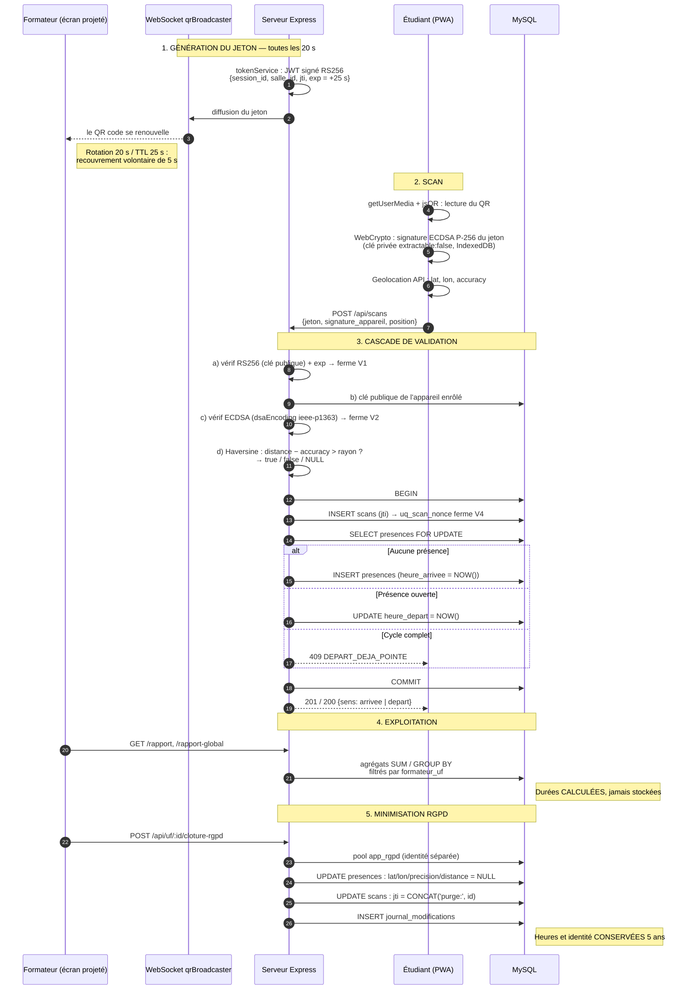

# ANALYSE_CODE.md

Document vivant. Mis à jour à chaque étape avec le détail de ce qui a été créé, où, pourquoi, et selon quels choix d'architecture/sécurité. Objectif : que tu puisses relire n'importe quelle ligne du dépôt sans avoir à me redemander pourquoi elle existe.

---

## Corrections actées suite à la revue de cohérence (avant Étape 0)

Cinq points de dérive identifiés entre le mémoire figé (chap. 2-4) et le discours de sprint ont été corrigés. Ils sont consignés ici pour qu'aucune implémentation future ne les réintroduise.

| # | Point | Erreur évitée | Règle qui fait foi |
|---|---|---|---|
| 1 | TTL du jeton | Ne pas coder `exp = iat + 20s` | Rotation **20 s**, TTL **25 s** (recouvrement de 5 s pour ne pas rejeter un scan en cours de rotation). Paramètre à câbler tel quel dans `tokenService.js` à l'étape suivante. |
| 2 | Rôle du nonce | Ne pas dire/coder que le nonce empêche le partage de capture (SMS/photo) | Le nonce ferme **V4** (rejeu d'une requête réseau déjà acceptée). C'est l'**expiration** du jeton qui ferme **V1** (partage). Deux mécanismes, deux vecteurs distincts — ne jamais les fusionner dans le code ni dans la documentation. |
| 3 | Géofence | Ne pas la traiter comme une option | Composant obligatoire de la cascade (RF-13) : c'est le seul mécanisme qui ferme **V2**. Sans lui, seuls 3 des 4 vecteurs sont couverts. |
| 4 | Mode dégradé | Ne pas l'omettre du plan / de la stack | RF-15/16 et QR1 (connectivité instable) en dépendent entièrement : Service Worker + file IndexedDB + resynchronisation avec re-vérification de fraîcheur. Traité comme brique à part entière, pas comme un détail de la PWA. |
| 5 | Contexte sécurisé (HTTPS) | Ne pas le reporter en fin de projet | WebCrypto, `getUserMedia`, Geolocation et Service Worker refusent de s'exécuter hors contexte sécurisé. Le TLS doit être présent dès le premier déploiement (proxy dans `docker-compose.yml`), pas ajouté après coup. **Non traité dans cette Partie 1** (seul le service `mysql` est monté ici) — sera introduit dès l'ajout du proxy/backend à l'étape suivante, pas repoussé au-delà.

Deux précisions de modélisation à respecter dans tout le code futur :
- Le **polygone de géofence est un attribut de `Salle`**, jamais de `Séance` — sinon il est dupliqué à chaque ouverture de séance dans la même pièce (violation de normalisation, source d'incohérence si le polygone est corrigé).
- Le **délai de 14 jours d'ENORApp** est une référence pour le workflow de **correction** (RF-17/18, cible < 24h), **pas** pour la génération des attestations. Ne jamais coder de minuteur/délai sur le service d'attestation.

---

## Étape 0 — Partie 1 : Scaffolding, sécurité, base de données

### Vue d'ensemble

Objectif de cette sous-étape : poser les fondations du monorepo (arborescence, secrets, clés cryptographiques, persistance MySQL) **sans lancer de serveur applicatif**. Rien n'est encore exécutable comme "produit" ; tout ce qui suit est de l'infrastructure et de la configuration.

### Arborescence créée

```
.
├── .gitignore
├── .env.example
├── .env                    (non versionné)
├── generate_keys.sh
├── docker-compose.yml
├── ANALYSE_CODE.md
├── backend/                (vide pour l'instant, .gitkeep)
├── pwa/                    (vide pour l'instant, .gitkeep)
└── keys/                   (non versionné)
    ├── private.pem         (non versionné)
    └── public.pem          (non versionné)
```

`backend/` et `pwa/` contiennent chacun un `.gitkeep` : Git ne suit pas les dossiers vides, seulement les fichiers. Sans ce fichier, ces deux dossiers n'apparaîtraient pas dans le dépôt tant qu'aucun fichier applicatif n'y est ajouté — ce qui aurait rendu l'arborescence invisible à un tiers clonant le dépôt à ce stade.

### 1. `.gitignore`

**Rôle** : empêcher que des secrets ou des artefacts non pertinents n'entrent jamais dans l'historique Git — une fois qu'un secret est commité, sa suppression ultérieure ne l'efface pas de l'historique sans réécriture (`filter-repo`/`BFG`), donc la prévention prime absolument sur la correction.

**Choix de contenu, justifiés ligne par ligne** :
- `keys/`, `*.pem`, `*.key` : la clé privée RS256 signe les jetons de séance et les attestations. Sa fuite permettrait à quiconque de forger une présence ou une attestation opposable en justice — c'est la pierre angulaire de la valeur probante (Loi 1985, art. 114) et de l'intégrité RGPD (art. 32). Double filtre (nom de dossier **et** extension) pour survivre à un déplacement accidentel d'une clé hors de `keys/`.
- `.env`, `.env.local`, `.env.*.local` : mots de passe MySQL et chemins de clés. Seul `.env.example` (sans valeurs réelles) est versionné.
- `node_modules/`, `**/node_modules/` : dépendances reconstructibles via `npm install`, inutiles en historique et volumineuses.
- `mysql-data/`, `*.sqlite*` : anticipation du volume de données MySQL si jamais un bind-mount local est utilisé au lieu d'un volume nommé Docker.
- `dist/`, `build/`, `.cache/`, `coverage/` : anticipation des builds PWA et des rapports de test des étapes suivantes.
- Section OS/éditeurs : hygiène standard, évite le bruit de fichiers `.DS_Store`/`Thumbs.db`/config d'IDE dans les diffs.

### 2. `.env.example` et `.env`

**Rôle** : `.env.example` documente le contrat de configuration sans exposer de secret — c'est le fichier que tout nouveau contributeur (ou moi, à la prochaine étape) copie pour démarrer. `.env` contient les valeurs réelles locales et n'est jamais commité.

**Variables et pourquoi elles existent déjà à ce stade** :
- `JWT_PRIVATE_KEY_PATH` / `JWT_PUBLIC_KEY_PATH` : chemins vers les clés générées par `generate_keys.sh`. Déclarées maintenant même si aucun service ne les consomme encore, pour que le contrat d'environnement soit stable dès le premier commit — le service jeton de l'étape suivante n'aura qu'à les lire, pas à les inventer.
- `MYSQL_ROOT_PASSWORD`, `MYSQL_DATABASE`, `MYSQL_USER`, `MYSQL_PASSWORD` : consommées directement par l'image officielle `mysql:8.0` dans `docker-compose.yml`.
- `MYSQL_DATABASE=db_logs` : l'image officielle ne crée automatiquement qu'**une seule** base au premier démarrage. La seconde base (`db_attestations`) et surtout la **séparation stricte des privilèges** (l'utilisateur applicatif standard ne doit avoir aucun droit d'écriture sur `db_attestations` — seul le service d'attestation y écrit, conformément à la séparation logs/attestations de 2.2.5/4.4) seront provisionnées par un script d'initialisation SQL dédié à l'étape "modèle de données". **Volontairement non traité ici** pour ne pas préempter une décision qui appartient à la brique suivante ; le signaler évite qu'on découvre l'écart plus tard en pensant à un oubli.
- `MYSQL_HOST=mysql` : anticipe la résolution DNS interne au réseau Docker (le service s'appellera `mysql` dans `docker-compose.yml`) — le backend de l'étape suivante n'aura pas à connaître d'adresse IP.
- `NODE_ENV`, `PORT` : préparés pour le service backend, non consommés à ce stade.

Les valeurs dans `.env` (`dev_root_pw_2026`, etc.) sont des mots de passe de convenance pour poste de développement local uniquement — explicitement commentées comme telles dans le fichier. À durcir avant tout déploiement partagé.

### 3. `generate_keys.sh`

**Rôle** : produire la paire de clés RS256 utilisée pour deux usages distincts déjà actés au chapitre 2 (2.3.3) — signer les JWT de séance (RF-04) et signer les attestations de présence (RF-19). Une seule paire suffit pour le prototype : les deux usages partagent la même autorité de signature serveur.

**Pourquoi RS256 côté serveur (et pas HMAC, pas ECDSA ici)** :
- **RS256 est asymétrique** (RSA + SHA-256) : la clé privée signe, la clé publique vérifie. C'est ce qui permet à un tiers — l'auditeur externe (SPF Emploi, jury de délibération) — de vérifier l'authenticité d'une attestation en ne détenant **que** la clé publique, sans jamais avoir accès au serveur ni à un secret partagé. C'est la traduction technique directe de l'exigence de valeur probante de la Loi de 1985 (RNF-14).
- **HMAC (HS256)** a été explicitement écarté : un schéma symétrique exigerait que le vérificateur détienne le même secret que l'émetteur, ce qui est incompatible avec une vérification par un tiers sans accès au système.
- **ECDSA** est réservé côté **client** (enrôlement d'appareil, section 2.3.3/2.3.5) — clé non extractible générée dans le navigateur via WebCrypto. Les deux mécanismes de signature asymétrique servent deux frontières de confiance différentes et ne doivent pas être confondus : RS256 authentifie une émission **serveur** vérifiable par tous ; ECDSA authentifie un **appareil** auprès du seul serveur.

**Détails d'implémentation** :
- RSA 2048 bits : taille standard recommandée, compromis sécurité/performance adapté à un usage de signature (pas de chiffrement de gros volumes).
- Garde-fou `if [[ -f "$PRIVATE_KEY" ]]; then exit 1; fi` : empêche l'écrasement accidentel d'une clé déjà en service — une régénération silencieuse invaliderait tous les jetons et attestations déjà signés, cassant la vérifiabilité de tout ce qui a été émis avant.
- `chmod 600` (privée) / `644` (publique) : la clé privée ne doit être lisible que par le propriétaire du processus ; la clé publique est, par nature, destinée à être diffusée. **Limite observée dans cet environnement d'exécution** : le point de montage utilisé pour partager les fichiers avec ton poste ne persiste pas les bits de permission Unix fins (le `chmod` s'exécute sans erreur mais `stat` renvoie systématiquement `700` pour les deux fichiers). Ce n'est pas un défaut de conception du script — sur un système de fichiers standard (ce sera le cas dans le conteneur Docker et sur ta machine), les permissions demandées s'appliqueront normalement. La garantie de sécurité réelle à ce stade repose sur l'exclusion Git (`keys/` dans `.gitignore`), pas sur les bits de permission de ce point de montage particulier.
- Exécuté une fois : `keys/private.pem` (2048 bits) et `keys/public.pem` générés et vérifiés (`openssl rsa -pubin -text -noout` confirme une clé RSA 2048 bits valide).

### 4. `docker-compose.yml`

**Rôle** : démarrer uniquement la persistance MySQL à ce stade, sans backend ni proxy — conformément au périmètre explicite de cette Partie 1.

**Choix justifiés** :
- `image: mysql:8.0` : version stable, alignée avec la stack visée au chapitre 4 (composants) — pas de raison de cibler une version plus récente non testée avec le reste de l'architecture.
- **Aucun port publié vers l'hôte** (`ports:` volontairement absent) : dans l'architecture de déploiement (4.3), MySQL n'est jamais exposé en dehors du réseau Docker interne — seul le proxy TLS l'est. Publier `3306:3306` dès maintenant créerait une habitude à corriger plus tard ; autant respecter la contrainte dès l'infra, comme demandé pour le contexte sécurisé. Pour une inspection ponctuelle en développement, `docker compose exec mysql mysql -u root -p` reste disponible sans exposer le port.
- `volumes: mysql_data:/var/lib/mysql` avec un volume nommé (`driver: local`) plutôt qu'un bind-mount : les données survivent à `docker compose down` (mais pas à `docker compose down -v`), sans dépendre d'un chemin hôte spécifique — portable entre ta machine et un futur serveur de déploiement.
- `healthcheck` : permet aux services qui dépendront de MySQL (backend, à l'étape suivante, via `depends_on: condition: service_healthy`) d'attendre que le serveur soit réellement prêt à accepter des connexions, pas seulement que le conteneur soit démarré — évite une classe d'erreurs de démarrage en cascade classique avec MySQL (le process écoute avant que l'initialisation des tables système soit terminée).
- Toutes les valeurs sensibles sont injectées via `${VARIABLE}` depuis `.env` — aucun secret en dur dans un fichier versionné.

**Validation effectuée** : syntaxe YAML vérifiée par parsing (`yaml.safe_load`), structure conforme. Docker n'étant pas disponible dans cet environnement d'exécution sandboxé, le démarrage réel du conteneur (`docker compose up`) est à valider sur ta machine ou lors du déploiement — c'est la seule vérification qui n'a pas pu être faite ici, à noter avant de considérer cette brique "testée en conditions réelles".

### 5. Dépôt Git local

**Rôle** : préparer le dépôt à être poussé vers GitLab dès que la connexion sera établie (voir échange en cours dans la conversation).

**Particularité d'environnement à connaître pour la suite** : le dossier de travail partagé avec ton poste (celui où vivent tous les fichiers ci-dessus) ne supporte pas de façon fiable la création/suppression de certains fichiers internes à Git (verrous `.git/index.lock`, fichiers `.git/HEAD`, etc. — `git init` classique y échoue silencieusement puis bloque au premier commit). Contournement appliqué : le répertoire Git interne (`GIT_DIR`) est hébergé hors de ce point de montage, à `/sessions/loving-serene-bardeen/repo.git` dans l'environnement d'exécution, tandis que l'arborescence de travail (`GIT_WORK_TREE`) reste le dossier partagé avec toi. Concrètement, toute commande Git dans les étapes suivantes devra être invoquée avec ces deux options :

```bash
git --git-dir=/sessions/loving-serene-bardeen/repo.git \
    --work-tree=/sessions/loving-serene-bardeen/mnt/outputs \
    <commande>
```

Ceci est une particularité de l'environnement d'exécution où je travaille, pas de ton projet ni de ta machine : une fois le dépôt poussé sur GitLab et cloné sur un poste standard (le tien, ou un runner CI/CD), ce contournement n'a plus lieu d'être — un `git clone` classique y fonctionnera normalement, sans configuration particulière.

**État actuel** : premier commit réalisé.
- Commit : `Etape 0 - Partie 1: scaffolding, securite, base de donnees (mysql)`
- Fichiers suivis : `.gitignore`, `.env.example`, `docker-compose.yml`, `generate_keys.sh`, `backend/.gitkeep`, `pwa/.gitkeep`
- Fichiers correctement exclus (vérifié par `git status` avant commit) : `.env`, `keys/private.pem`, `keys/public.pem`
- Branche : `master`
- Remote : aucun pour l'instant — en attente de la configuration GitLab (URL du projet + méthode d'authentification), voir échange dédié.

---

## Étape 0 — Partie 2 : Proxy HTTPS, backend minimal, orchestration complète

### Vue d'ensemble

Objectif : rendre le réseau Docker opérationnel de bout en bout — un backend Express répondant derrière un proxy HTTPS — sans encore implémenter de logique métier (jeton, validation, géofence). Cette partie ferme le point de vigilance n°5 de la revue de cohérence (« contexte sécurisé à traiter dès l'infra ») et complète le `docker-compose.yml` amorcé en Partie 1.

### Pourquoi le HTTPS est obligatoire dès le premier jour (et pas seulement « une bonne pratique »)

Trois API navigateur indispensables au projet refusent de s'exécuter hors contexte sécurisé (HTTPS), au sens strict de la spécification W3C Secure Contexts :

- **Web Cryptography API** (2.3.5) : sans elle, impossible de générer la paire de clés ECDSA non extractible qui enrôle l'appareil étudiant (RF-07) — le mécanisme qui ferme V3.
- **`getUserMedia`** (2.3.9) : sans elle, impossible d'accéder à la caméra pour scanner le QR (RF-10).
- **Service Worker** (2.3.8) : sans lui, impossible d'implémenter le mode dégradé (RF-15/16, QR1) — pas de file locale, pas de synchronisation différée.

Un navigateur qui charge la PWA en HTTP simple ne proposera littéralement pas ces API au code JavaScript (elles sont `undefined`, pas seulement « déconseillées »). Poser le HTTPS maintenant, avant tout code applicatif qui en dépend, évite de découvrir cette contrainte bloquante au moment de coder la PWA — ce qui aurait forcé une reprise d'architecture a posteriori.

**Nuance importante, à ne pas perdre de vue pour la suite** : les navigateurs traitent nativement `http://localhost` (et `127.0.0.1`) comme une origine « potentiellement de confiance », donc comme un contexte sécurisé, **même sans TLS**. Le test HTTPS mis en place ici sur `localhost`/`api.localhost` valide donc la mécanique du proxy Caddy et le routage `/api/*` vers le backend — mais il ne valide pas encore, à lui seul, la contrainte réelle du terrain : un téléphone étudiant qui rejoint le serveur via une adresse du réseau local de l'établissement (une IP ou un nom d'hôte qui n'est pas littéralement `localhost`) n'aura **pas** ce contexte sécurisé automatique et exigera un certificat TLS valide pour cette origine précise. Cette validation-là n'aura de sens qu'à l'étape PWA (scan caméra depuis un vrai appareil sur le LAN) — à traiter explicitement à ce moment-là, pas oubliée ici.

### Fichiers créés ou modifiés

```
.
├── Caddyfile               (nouveau)
├── docker-compose.yml      (complété : services backend, proxy, réseau, volumes Caddy)
├── README.md                (nouveau)
├── TESTING.md               (nouveau)
└── backend/
    ├── package.json         (nouveau)
    ├── package-lock.json    (nouveau, généré par npm)
    ├── server.js             (nouveau)
    └── Dockerfile            (nouveau)
```

### 1. `Caddyfile`

**Rôle** : point d'entrée HTTPS unique du système. Termine le TLS avant que le trafic n'atteigne le backend, et route `/api/*` vers le service `backend` sur le réseau Docker interne.

**Choix justifiés** :
- `tls internal` : indique explicitement à Caddy d'agir comme sa propre autorité de certification locale plutôt que de tenter d'obtenir un certificat public (Let's Encrypt), impossible pour un nom d'hôte non public comme `localhost`. Le certificat émis est cryptographiquement valide (chaîne de confiance complète, algorithmes standards) mais son autorité n'est pas préinstallée dans le magasin de confiance du système d'exploitation hôte — d'où l'avertissement navigateur documenté dans `TESTING.md`. Rendre ce choix explicite (plutôt que de laisser Caddy le déduire implicitement du nom d'hôte) documente l'intention dans le fichier de configuration lui-même.
- Deux noms d'hôte déclarés (`localhost`, `api.localhost`) : `localhost` pour un accès direct simple, `api.localhost` en anticipation d'une convention de nommage plus proche de ce qui sera utilisé en LAN (`api.<etablissement>.local` ou équivalent) — sans avoir à modifier la structure du Caddyfile plus tard, seulement les noms d'hôte.
- `handle /api/*` / `handle` (bloc par défaut) : sépare explicitement le trafic applicatif (relayé au backend) de tout le reste (réponse informative), plutôt qu'un `reverse_proxy` global qui masquerait une éventuelle mauvaise route.
- `encode gzip` : compression standard, coût de configuration nul, bénéfice direct sur la taille des réponses JSON une fois l'API plus riche.
- `log { output stdout }` : les logs du proxy sortent sur la sortie standard du conteneur, consultables par `docker compose logs proxy` — pas de fichier de log à gérer manuellement pour un prototype.
- `admin off` : désactive l'API d'administration locale de Caddy (port 2019), qui n'a aucune utilité ici et n'a pas à être exposée, même en interne — réduction de surface par défaut, cohérente avec la posture de sécurité du projet.

### 2. `backend/server.js`, `backend/package.json`, `backend/Dockerfile`

**Rôle de `server.js`** : premier service applicatif du système, strictement limité à une route `GET /api/health`. Sert à valider la chaîne complète — client → Caddy (HTTPS) → réseau Docker interne → backend → réponse — avant d'y ajouter la moindre logique métier (jeton, cascade de validation). Aucune connexion MySQL, aucune route liée au chapitre 5 : volontairement minimal, conformément à la mission.

**Pourquoi Express** : c'est le choix déjà acté dans l'architecture des composants (chapitre 4.2, package backend Node.js/Express) — pas une redécouverte, une continuité. Express 5 (version installée par `npm install express`, la dernière stable disponible) est rétro-compatible avec ce besoin minimal ; aucune des ruptures de compatibilité de la version 5 (gestion des erreurs asynchrones, syntaxe des routes à paramètres) n'affecte une route simple sans paramètre comme `/api/health`.

**`package.json`** : `main` pointé sur `server.js` (pas le `index.js` par défaut de `npm init -y`, corrigé pour refléter le fichier réel) ; script `start` ajouté pour un lancement homogène (`npm start`), utilisé implicitement par le `CMD` du Dockerfile.

**`Dockerfile` (mode développement)** :
- `node:20-alpine` : image légère, aucune dépendance native dans ce projet (pas de compilation requise), donc pas besoin d'une image `-slim` ou complète.
- `COPY package*.json ./` suivi de `RUN npm install` **avant** `COPY . .` : exploite le cache de layers Docker — tant que les dépendances ne changent pas, `npm install` n'est pas ré-exécuté à chaque modification de `server.js`, ce qui accélère les reconstructions pendant le développement itératif des prochaines briques.
- `EXPOSE 3000` : documentaire (n'ouvre aucun port vers l'hôte à lui seul — c'est `docker-compose.yml` qui décide de publier ou non un port). Cohérent avec le choix de ne publier aucun port pour `backend` : seul Caddy est joignable depuis l'extérieur du conteneur hôte.
- `CMD ["node", "server.js"]` : lancement direct, sans `nodemon` ni rechargement à chaud — volontairement minimal pour cette étape ; un outillage de développement plus confortable pourra être ajouté sans changer la structure si le besoin se fait sentir.

**Test effectué hors Docker** (Docker n'étant pas disponible dans l'environnement où j'exécute ces commandes) : `node server.js` lancé directement, `curl http://localhost:3000/api/health` a retourné exactement `{"status":"ok","message":"Backend is running securely"}` — la logique applicative est donc validée indépendamment de la conteneurisation. Le test en conditions réelles (via Docker et le proxy HTTPS) est à effectuer sur ta machine, protocole détaillé dans `TESTING.md`.

### 3. `docker-compose.yml` — services `backend` et `proxy`, réseau `presence_net`

**Service `backend`** :
- `build: { context: ./backend, dockerfile: Dockerfile }` : construit l'image depuis le Dockerfile ci-dessus plutôt que d'utiliser une image publique — c'est notre code, pas un service tiers.
- Variables d'environnement injectées : `PORT`, `NODE_ENV`, et déjà les variables MySQL (`MYSQL_HOST`, `MYSQL_PORT`, `MYSQL_DATABASE`, `MYSQL_USER`, `MYSQL_PASSWORD`) — non consommées par `server.js` à ce stade, mais déclarées maintenant pour que le contrat d'environnement du service soit stable avant l'étape « modèle de données », qui n'aura qu'à les lire.
- `depends_on: mysql: condition: service_healthy` : le backend n'est démarré qu'une fois MySQL réellement prêt (grâce au `healthcheck` défini en Partie 1) — anticipe la connexion à la base qui sera ajoutée à l'étape suivante, évite une classe d'erreurs de démarrage en cascade.
- Aucun port publié : seul Caddy est joignable depuis l'hôte, conformément au diagramme de déploiement (4.3).

**Service `proxy`** :
- `image: caddy:2-alpine` : image officielle, légère.
- `ports: ["80:80", "443:443"]` : seul point d'entrée externe du système, cohérent avec l'architecture (4.3) où le proxy est le seul composant exposé.
- `volumes` : le `Caddyfile` est monté en lecture seule (`:ro`) — Caddy ne doit jamais pouvoir modifier sa propre configuration depuis l'intérieur du conteneur. Deux volumes nommés supplémentaires, `caddy_data` et `caddy_config`, persistent l'autorité de certification interne et les certificats émis : sans eux, Caddy régénérerait une nouvelle CA à chaque redémarrage du conteneur, ce qui obligerait à re-approuver un nouveau certificat dans le navigateur à chaque fois — une gêne inutile en développement itératif.
- `depends_on: backend` : ordre de démarrage logique (le proxy route vers le backend, autant qu'il existe déjà au démarrage), bien que Caddy gère de toute façon les erreurs de connexion en amont avec retries.

**Réseau `presence_net`** : réseau bridge nommé explicitement plutôt que de laisser Docker Compose créer un réseau par défaut sans nom clair — les trois services s'y résolvent par leur nom de service (`mysql`, `backend`, `proxy`), ce qui est déjà ce qu'utilise `Caddyfile` (`reverse_proxy backend:3000`) et ce que backend utilisera pour joindre MySQL (`MYSQL_HOST=mysql`) à l'étape suivante.

**Validation effectuée** : syntaxe YAML vérifiée par parsing, trois services bien déclarés (`mysql`, `backend`, `proxy`). Docker n'étant pas disponible dans cet environnement d'exécution, le démarrage réel (`docker compose up -d`) reste à valider sur ta machine — protocole complet dans `TESTING.md`.

### 4. `README.md`

**Rôle** : point d'entrée minimal pour quiconque clone le dépôt, conformément à RNF-15 (déploiement sans compétence d'administration avancée). Prérequis (Docker, Git), commande unique (`docker compose up -d`), et l'avertissement de certificat local anticipé explicitement — pour qu'il ne soit jamais interprété comme un échec de déploiement.

### 5. `TESTING.md`

Nouveau fichier séparé de `ANALYSE_CODE.md` : celui-ci explique les choix d'architecture (le « pourquoi »), `TESTING.md` est un protocole opérationnel (le « comment vérifier ») — les deux publics et les deux usages sont différents, d'où deux fichiers plutôt qu'une section de plus dans un document déjà long. Contenu détaillé dans le fichier lui-même.

---

## Étape 1 — Modélisation de la base de données et connexion backend

### Vue d'ensemble

Objectif : faire exister le modèle de données du chapitre 4.4 sous forme de vraies tables MySQL, les peupler d'un jeu de démonstration, et prouver que le backend peut réellement les interroger — via une nouvelle route `/api/db-health` qui ne se contente pas de vérifier « le tuyau réseau » mais valide schéma + données en une seule requête.

### Fichiers créés

```
database/
├── 01-schema.sql          (nouveau)
├── 02-seed.sql             (nouveau)
└── 03-privileges.sh        (nouveau)
backend/
├── src/config/db.js         (nouveau)
├── package.json              (modifié : + mysql2)
└── server.js                  (modifié : + route /api/db-health)
docker-compose.yml            (modifié : volume d'init DB, variables attestations)
.env.example / .env           (modifiés : variables MYSQL_ATTESTATIONS_*)
```

### Pourquoi SQL brut (`mysql2/promise`) et aucun ORM — choix architectural fort

C'est la décision la plus structurante de cette étape, à défendre explicitement devant le jury. Quatre arguments, pas une préférence de style :

**1. Contrôle exact des contraintes qui ferment les vecteurs de fraude.** La contrainte `UNIQUE(jti, etudiant_id)` sur `scans` (fermeture de V4, section 2.3.4/4.4) et la colonne générée `actif_key` sur `appareils_enroles` (émulation d'un index unique partiel pour RF-09, fermeture de V3) sont des mécanismes SQL avancés — colonnes générées `STORED`, index composites — que la plupart des ORM (Sequelize, TypeORM, Prisma) expriment mal ou pas du tout nativement, obligeant soit à sortir de l'abstraction (SQL brut *quand même*, mais caché derrière une couche supplémentaire), soit à migrer la contrainte côté application (perte de la garantie *au niveau du moteur*, donc contournable par un bug applicatif). Écrire le DDL à la main donne un accès direct à toute la richesse de MySQL, sans négociation avec un traducteur générique.

**2. Traçabilité exigée par le Décret de 1991 et la Loi de 1985.** Chaque requête SQL de ce projet doit être auditable — au sens propre : un tiers doit pouvoir lire *exactement* ce qui est exécuté contre la base, sans deviner ce qu'un générateur de requêtes a produit à partir d'un DSL objet. Le SQL brut rend cette lecture directe : `03-privileges.sh` contient littéralement les `GRANT`/`REVOKE` appliqués, `db.js` contient littéralement les requêtes envoyées. Un ORM interpose une couche de traduction (souvent optimisée pour la commodité, pas pour la lisibilité du SQL final) entre l'intention et l'exécution — un obstacle inutile pour une soutenance où chaque choix doit être justifiable ligne à ligne.

**3. Cohérence avec le principe de minimisation des dépendances (RNF-15).** Un ORM ajoute une surface de code tierce non négligeable (dialecte SQL généré, système de migrations propriétaire, couche de mapping objet-relationnel) pour un bénéfice quasi nul sur un schéma de neuf tables qui ne changera pas de moteur de base de données. `mysql2/promise` est un driver, pas un framework : il traduit des appels JavaScript en connexions TCP et en résultats de requêtes, rien de plus. Moins de dépendances, moins de surface de mise à jour de sécurité, moins de comportement « magique » à expliquer en défense.

**4. Séparation infra/application déjà actée (voir confirmation ci-dessous).** Le schéma vit dans `database/`, provisionné par Docker au démarrage — un ORM aurait naturellement tiré cette responsabilité vers le code applicatif (migrations versionnées dans le repo backend, exécutées au boot ou via une CLI dédiée), ce qui aurait dilué la frontière nette actuellement en place entre « ce que l'infrastructure garantit » et « ce que l'application interroge ».

**Limite assumée, à ne pas cacher** : sans ORM, il n'y a pas de protection automatique contre l'injection SQL par construction — c'est la responsabilité du code applicatif d'utiliser systématiquement des requêtes paramétrées (`pool.query(sql, [valeurs])`, jamais de concaténation de chaînes). Cette discipline sera appliquée dès la première requête paramétrée du chapitre 5 (aucune requête de ce projet, à ce jour, n'interpole une valeur utilisateur directement dans une chaîne SQL) et documentée à chaque brique où elle s'applique.

### Comment la séparation physique logs/attestations est garantie — pas seulement documentée

La séparation actée en 2.2.5/4.4/4.8 est mise en œuvre à **trois niveaux indépendants**, pas un seul :

1. **Deux bases logiques distinctes** (`CREATE DATABASE db_attestations` dans `01-schema.sql`, en plus de `db_logs` déjà créée par l'image officielle) — pas deux schémas dans la même base, deux bases MySQL à part entière.
2. **Aucune contrainte `FOREIGN KEY` entre elles** — `attestations.etudiant_id` et `attestations.uf_id` sont des colonnes `CHAR(36)` ordinaires, sans `REFERENCES` vers `db_logs.etudiants`/`db_logs.uf` (MySQL ne le permettrait de toute façon pas nativement entre deux bases, mais c'est surtout un choix délibéré, pas une limite technique subie). Conséquence directe et vérifiable : la purge de `db_logs` en fin d'UF (RF-20, future étape) ne peut **structurellement** jamais échouer à cause d'une contrainte d'intégrité référentielle vers `db_attestations`, et ne peut pas non plus supprimer en cascade une attestation déjà émise — il n'existe simplement aucun lien technique par lequel une suppression pourrait se propager.
3. **Deux utilisateurs MySQL aux privilèges disjoints** (`03-privileges.sh`) : `app_attestations` ne reçoit `SELECT, INSERT` que sur `db_attestations.*` ; `app_logs` (utilisateur du pool applicatif principal, `db.js`) ne reçoit **aucun** privilège sur `db_attestations` — en MySQL, l'absence de `GRANT` vaut refus total, il n'y a rien à révoquer explicitement pour l'interdire. Un bug ou une injection SQL réussie contre le pool applicatif standard ne pourrait donc, au pire, atteindre que `db_logs` : `db_attestations` resterait hors de portée même dans ce scénario dégradé, par construction du système de privilèges MySQL, pas par une vérification applicative contournable.

Un bénéfice de sécurité supplémentaire, obtenu avec ces `GRANT` explicites en cascade : `app_logs` part d'une base `SELECT, INSERT` sur **l'ensemble** de `db_logs.*`, puis ne regagne `UPDATE, DELETE` que sur les deux tables qui en ont réellement besoin aujourd'hui (`seances` pour la clôture RF-02, `appareils_enroles` pour la révocation de clé RF-08). `scans` et `corrections` restent donc en écriture seule (`INSERT` uniquement, jamais `UPDATE`/`DELETE`) — implémentation concrète, au niveau moteur, de l'exigence RF-18 (« le journal des corrections est en lecture seule ») et de l'auditabilité RNF-13 : même un bug applicatif ne peut pas altérer ou effacer une ligne de ces deux tables.

**Note de révision (correction post-implémentation)** : la première version de `03-privileges.sh` tentait un `REVOKE UPDATE, DELETE ON db_logs.scans FROM app_logs` ciblé, en partant du privilège `ALL PRIVILEGES` que l'image officielle accorde par défaut à `MYSQL_USER` au niveau de la *base* (`db_logs.*`). MySQL refuse ce `REVOKE` : une révocation doit cibler exactement le même niveau de granularité que l'octroi (`ERROR 1147`, *"There is no such grant defined ... on table"*), or le privilège avait été accordé au niveau base, pas table. La stratégie a été inversée : plutôt que « tout accorder puis révoquer étroit » (bloqué par cette règle), le script réduit d'abord `app_logs` à zéro privilège (`REVOKE ALL PRIVILEGES, GRANT OPTION`), accorde `SELECT, INSERT` sur l'ensemble de `db_logs.*`, puis regagne `UPDATE, DELETE` explicitement, table par table, uniquement là où c'est nécessaire. Le résultat est équivalent pour `scans`/`corrections`, et *plus strict* pour le reste (`etudiants`, `uf`, `salles`, `inscriptions` perdent aussi `UPDATE`/`DELETE`) — sans régression : aucune fonctionnalité codée à ce jour n'écrit autre chose que des `INSERT`/`SELECT` sur ces tables. Point de vigilance pour la suite : toute future exigence de modification de ces tables depuis le pool applicatif nécessitera un `GRANT UPDATE` explicite, à ajouter à ce script.

### 1. `database/01-schema.sql`

Traduction directe de l'ERD (4.4), table par table — voir le fichier lui-même pour le détail commenté de chaque table. Trois choix méritent d'être isolés ici :

- **`polygone_geojson` en type `JSON` natif, pas `SPATIAL`/`GEOMETRY`.** L'algorithme de géofencing retenu au chapitre 4 est PNPOLY (ray casting), exécuté côté application (Node.js) — pas une requête spatiale MySQL (`ST_Contains`). Stocker du GeoJSON pur conserve le format natif produit par la `Geolocation API` du navigateur, sans conversion vers/depuis un type binaire propriétaire, et reste directement lisible (`SELECT polygone_geojson`) pour une démonstration en défense — un `GEOMETRY` afficherait un binaire illisible sans fonction de conversion supplémentaire.
- **`appareils_enroles.actif_key`, colonne générée `STORED`.** MySQL ne supporte pas nativement la syntaxe `UNIQUE ... WHERE` (index unique partiel) qu'offre PostgreSQL. La colonne générée `IF(statut = 'actif', etudiant_id, NULL)` combinée à un index `UNIQUE` sur cette colonne est l'équivalent fonctionnel exact : MySQL autorise plusieurs `NULL` dans un index unique (jamais considérés en doublon) mais refuse deux lignes `actif` pour le même étudiant. RF-09 est ainsi garanti par le moteur de la base, pas seulement vérifié dans le code applicatif avant insertion (qui resterait contournable par un accès concurrent).
- **`corrections.scan_id` obligatoire (`NOT NULL`), sans exception.** Traduction littérale de l'ERD, qui ne montre pas ce champ comme nullable. Conséquence assumée : corriger une absence pour un étudiant qui n'a produit aucune tentative de scan nécessitera de créer d'abord une ligne `scans` de `resultat = 'manuel'` (le mécanisme déjà prévu par RF-22 pour la procédure de secours), puis la correction s'y rattache. Aucune présence ni absence corrigée n'existe donc jamais « hors sol », sans scan associé — cohérent avec l'exhaustivité exigée par le Décret de 1991 (S-J6).

### 2. `database/02-seed.sql`

Jeu de données de démonstration explicitement autorisé par le périmètre du prototype (3.1.2 : « jeu de données de démonstration provisionné au déploiement »). Choix délibéré d'UUID **fixes** plutôt que générés (`11111111-...`, `22222222-...`, `33333333-...`) : reproductibles à chaque déploiement, faciles à citer tels quels dans `TESTING.md` ou lors d'une démonstration, sans avoir à interroger la base au préalable pour retrouver un identifiant généré aléatoirement. Contenu : 1 UF (« Anglais - Niveau 2 »), 1 salle avec un polygone GeoJSON réel (rectangle englobant, cohérent avec la marge assumée documentée en 4.8), 4 étudiants fictifs, 4 inscriptions.

### 3. `database/03-privileges.sh`

Détaillé dans la section « séparation physique » ci-dessus. Un point d'implémentation à noter : ce fichier est un `.sh`, pas un `.sql`, précisément parce qu'il doit interpoler des secrets (`MYSQL_ATTESTATIONS_PASSWORD`) depuis les variables d'environnement du conteneur — un `.sql` exécuté par l'entrypoint officiel est transmis tel quel au client `mysql`, sans substitution de shell. C'est le mécanisme documenté par l'image officielle pour tout provisioning nécessitant un secret, pas un contournement improvisé.

La logique de privilèges applique un principe de liste blanche (*whitelist*) plutôt que liste noire (*blacklist*) : `app_logs` est ramené à zéro privilège (`REVOKE ALL PRIVILEGES, GRANT OPTION`), puis reçoit explicitement `SELECT, INSERT` sur toute `db_logs.*`, et enfin `UPDATE, DELETE` uniquement sur `seances` et `appareils_enroles`. Ce choix n'est pas qu'une préférence de style : une tentative initiale de liste noire (accorder tous les privilèges puis révoquer `UPDATE`/`DELETE` table par table sur `scans`/`corrections`) échouait avec `ERROR 1147` — MySQL exige qu'un `REVOKE` cible exactement le même niveau de granularité que l'octroi d'origine, or le privilège initial de `MYSQL_USER` est accordé au niveau base par l'image officielle, pas au niveau table. La liste blanche contourne cette contrainte nativement, puisque `GRANT` ne la subit pas.

### 4. `docker-compose.yml` — volume d'initialisation

Ajout d'un seul volume sur le service `mysql` : `./database:/docker-entrypoint-initdb.d:ro`. Monté en lecture seule — le conteneur MySQL ne doit jamais pouvoir modifier les scripts qui l'ont initialisé. Les deux nouvelles variables (`MYSQL_ATTESTATIONS_USER`, `MYSQL_ATTESTATIONS_PASSWORD`) ne sont injectées que dans l'environnement du service `mysql` (consommées par `03-privileges.sh`), jamais dans celui du `backend` — le pool applicatif principal n'a et n'aura aucune raison de les connaître.

### 5. `backend/src/config/db.js`

Pool de connexions `mysql2/promise`, pas une connexion unique partagée : chaque requête HTTP emprunte une connexion le temps de sa requête SQL puis la restitue. Une connexion unique partagée entre requêtes concurrentes mélangerait des résultats entre requêtes parallèles (un risque réel dès que plusieurs étudiants scannent simultanément, cas nominal de ce projet) ; ouvrir/fermer une connexion TCP à chaque requête serait inutilement coûteux. `connectionLimit: 10` est un choix de dimensionnement de prototype (largement suffisant pour l'échelle visée, ~150 étudiants, cf. RNF-09), ajustable sans changer la structure du code.

Le pool se connecte avec les identifiants `app_logs` (base `db_logs`) — **pas** avec `app_attestations` : ce pool est le pool applicatif général, `db_attestations` reste hors de sa portée par construction (cf. séparation ci-dessus). La connexion à `db_attestations` sera ajoutée avec le futur service d'attestation (RF-19), pas avant — pas de connexion prématurée à une base que rien n'utilise encore.

### 6. `backend/server.js` — route `GET /api/db-health`

Choix délibéré de ne **pas** se limiter à un `SELECT 1` : `SELECT COUNT(*) FROM etudiants` valide trois choses en une seule requête — (1) le pool atteint réellement MySQL à travers le réseau Docker interne, (2) `01-schema.sql` a bien créé la table, (3) `02-seed.sql` a bien inséré ses lignes. Un `SELECT 1` n'aurait prouvé que le point (1), laissant planer un doute sur l'exécution effective des scripts d'initialisation.

Gestion d'erreur explicite (`try/catch`) : si MySQL est injoignable, la route répond `500` avec un JSON structuré (`{"status":"error","database":"unreachable","message":...}`) plutôt que de laisser le processus Node planter ou de renvoyer une erreur HTML par défaut. **Testé sans Docker** dans l'environnement où ce code a été écrit (MySQL absent) : la route a répondu exactement `500 {"status":"error","database":"unreachable","message":"connect ECONNREFUSED 127.0.0.1:3306"}` — comportement défensif confirmé avant même le test en conditions réelles sur ta machine.

## Étape 2 — Backend cœur : jeton RS256, rotation, diffusion WebSocket

### Vue d'ensemble

Première brique du cœur métier : ouverture d'une séance (RF-01), génération de jetons signés RS256 (RF-04), et leur diffusion temps réel vers l'affichage formateur avec rotation stricte (RF-05/RF-06). Aucune validation de scan n'est encore implémentée à ce stade — cette étape produit et diffuse des jetons, elle ne les consomme pas encore (ce sera l'objet de la cascade de validation, étape suivante).

### Fichiers créés ou modifiés

```
backend/
├── src/services/tokenService.js      (nouveau)
├── src/services/qrBroadcaster.js      (nouveau)
├── src/controllers/seanceController.js (nouveau)
├── src/routes/seanceRoutes.js          (nouveau)
├── server.js                            (modifié : http.createServer, express.json, montage routes+WS)
├── package.json                          (modifié : + jsonwebtoken, uuid, ws)
└── .dockerignore                          (nouveau)
docker-compose.yml                        (modifié : volume keys/ sur le service backend)
```

### Pourquoi le TTL (25s) diffère de la rotation (20s) — le recouvrement n'est pas une marge de confort, c'est une nécessité

Ces deux constantes répondent à deux questions différentes, et les confondre serait une erreur de conception, pas seulement de vocabulaire :

- **La rotation (`ROTATION_INTERVAL_SECONDS = 20`)** gouverne l'affichage : combien de temps un jeton reste visible à l'écran du formateur avant d'être remplacé par le suivant. C'est la variable qui borne l'exploitation de V1 (partage de capture) — plus la fenêtre est courte, moins une photo transmise par SMS a de chances d'être encore valide au moment où le destinataire la scanne.
- **Le TTL (`TOKEN_TTL_SECONDS = 25`)** gouverne la validation côté serveur : combien de temps ce jeton précis reste acceptable, indépendamment de ce qui est actuellement affiché à l'écran.

Sans recouvrement (TTL = rotation = 20s), un étudiant qui scanne légitimement au moment exact de la rotation — capture de l'image à t≈19,9s, décodage + requête HTTP arrivant côté serveur à t≈20,3s à cause de la latence réseau documentée sur le terrain (S-T1, WiFi instable de l'ESA Namur) — se ferait rejeter un scan pourtant honnête, simplement parce que le jeton qu'il a capturé a expiré 0,3 seconde avant que sa requête n'arrive. Les 5 secondes de recouvrement (25 − 20) couvrent exactement ce délai capture → soumission, sans affaiblir la fermeture de V1 : un jeton reste visible 20s maximum, et n'est acceptable que 5s de plus après avoir disparu de l'écran — pas 5 minutes, pas indéfiniment.

**Point de conception à souligner** : ce recouvrement n'est implémenté nulle part comme un mécanisme dédié (pas de logique « accepter aussi le jeton n-1 »). Il émerge naturellement du fait que chaque jeton porte sa propre expiration indépendante (`exp = iat + 25s`, fixé par `tokenService.js` au moment de sa génération) et que la validation — future étape — ne vérifiera jamais que « l'horodatage actuel est antérieur à `exp` », sans notion de jeton « courant » ou « précédent ». À t=24s par exemple, le jeton émis à t=0 (encore valide 1s) et celui émis à t=20 (valide encore 21s) sont *tous les deux* acceptables simultanément — c'est exactement le comportement voulu, obtenu sans code supplémentaire. Moins de logique dédiée signifie moins de surface de bug sur un mécanisme de sécurité.

### 1. `backend/src/services/tokenService.js`

**Vocabulaire — `jti` plutôt que `nonce` littéral.** La mission de cette étape désigne le champ comme « nonce (UUID v4) », mais l'implémentation retient la revendication JWT standard **`jti`** (RFC 7519, *JWT ID*), déjà utilisée dans tout le reste du projet : RF-04 (« un nonce unique (jti) »), RF-14 (« couple (jti, étudiant) »), et la colonne `scans.jti` du schéma construit à l'Étape 1. Nommer littéralement le champ `nonce` dans le payload aurait créé une divergence de vocabulaire avec une base de données et une documentation déjà figées — le code de la cascade de validation (étape suivante) aurait dû lire `payload.nonce` pour l'insérer dans une colonne `jti`, sans raison. `jti` est produit via l'option native `jwtid` de `jsonwebtoken`, qui l'ajoute au payload exactement comme `iat`/`exp` sont ajoutés via `expiresIn` — aucune revendication n'est construite manuellement.

**`algorithm: 'RS256'` explicite dans `jwt.sign()` — non négociable.** Sans cette option, `jsonwebtoken` retombe sur `HS256` par défaut, quel que soit le type de clé fournie. Un `HS256` appliqué à une clé privée RSA reviendrait à traiter cette clé comme un secret partagé HMAC — exactement la classe de vulnérabilité connue sous le nom d'*algorithm confusion* sur les JWT (un jeton HS256 peut ensuite être forgé par quiconque connaît, ou obtient, la clé « secrète » utilisée pour le vérifier ; ici la clé publique RSA, publique par définition). Testé explicitement (voir section Tests ci-dessous) : une vérification en `HS256` avec la clé publique comme secret est bien rejetée par `jsonwebtoken`, confirmant que l'algorithme signé (`RS256`, encodé dans l'en-tête du JWT) est correctement contraint des deux côtés.

**Lecture de la clé au chargement du module, pas à chaque appel.** La clé privée est lue une seule fois (`fs.readFileSync` au niveau module, hors de toute fonction) : elle ne change jamais en cours d'exécution, et une lecture disque par jeton généré serait un coût inutile, potentiellement fréquent (une rotation toutes les 20s, pour chaque séance active en parallèle). Si la clé est absente, le module lève une exception **au chargement** (`require('./tokenService')` échoue), pas à la première utilisation : le backend refuse de démarrer plutôt que de démarrer « à moitié » et de planter au premier formateur qui ouvre une séance. Message d'erreur explicite renvoyant vers `./generate_keys.sh`.

**Résolution du chemin de la clé.** `JWT_PRIVATE_KEY_PATH` (`.env` : `./keys/private.pem`) est résolu par `path.resolve()`, qui l'interprète relativement à `process.cwd()` — en conteneur, `WORKDIR /app` (Dockerfile), donc `/app/keys/private.pem`, exactement le point de montage ajouté au `docker-compose.yml` cette étape (voir plus bas). En l'absence de variable d'environnement (exécution locale hors Docker), repli sur un chemin relatif au fichier lui-même (`__dirname/../../../keys/private.pem`, soit la racine du dépôt) — un développeur lançant `node server.js` sans configurer son `.env` obtient tout de même un comportement correct.

### 2. `backend/src/controllers/seanceController.js` + `src/routes/seanceRoutes.js`

**Génération de l'identifiant côté application, pas via le `DEFAULT (UUID())` du schéma.** Détail technique précis à noter : `01-schema.sql` définit `id CHAR(36) DEFAULT (UUID())`, qui s'applique quand la colonne `id` est omise de l'`INSERT` — mais `mysql2` (comme tout driver MySQL) n'expose l'identifiant généré côté serveur que via `result.insertId`, un champ réservé aux colonnes `AUTO_INCREMENT`, toujours vide pour une valeur par défaut de type expression. Sans génération applicative, retourner l'`id` de la séance créée dans la réponse HTTP aurait nécessité une requête de lecture supplémentaire immédiatement après l'insertion — elle-même fragile en cas d'insertions concurrentes (quelle ligne relire ?). La solution retenue (`uuidv4()` généré en Node, inséré explicitement) est plus simple, sans requête supplémentaire, et cohérente avec la génération du `jti` du jeton par le même mécanisme.

**Distinction 400 / 500 sur l'échec d'insertion.** Une contrainte `FOREIGN KEY` violée (`uf_id` ou `salle_id` inexistant) produit le code d'erreur `ER_NO_REFERENCED_ROW_2` côté MySQL — capturé explicitement pour renvoyer un `400` avec un message clair, plutôt qu'un `500` générique qui masquerait une erreur de saisie du client derrière une apparence de panne serveur.

### 3. `backend/src/services/qrBroadcaster.js`

**Chemin WebSocket sous `/api/ws/seances/<id>`, pas sous une racine `/ws/` séparée.** Le `Caddyfile` actuel (Étape 0.2) ne relaie que `/api/*` vers le backend ; tout le reste tombe dans le bloc `handle` par défaut. Placer le WebSocket sous `/api/` évite une modification du `Caddyfile` à cette étape — Caddy relaie nativement les upgrades WebSocket à travers `reverse_proxy` sans configuration supplémentaire, une seule règle de routage à maintenir (`/api/*` vers `backend:3000`) plutôt que deux.

**`salle_id` lu en base à la connexion, jamais fourni par le client WebSocket.** C'est le point de conception le plus important de ce fichier. Le formateur pourrait théoriquement fournir n'importe quelle valeur dans l'URL ou une query string — mais le `salle_id` embarqué dans chaque jeton signé est précisément la donnée que la future vérification de géofencing (RF-13) comparera à la position GPS de l'étudiant. Faire confiance à une valeur fournie par le client à cet endroit romprait la garantie même que le géofencing est censé apporter : un jeton pourrait prétendre appartenir à une salle différente de la séance réellement ouverte. La requête `SELECT salle_id, statut FROM seances WHERE id = ?` au moment de la connexion fait de la base de données la seule autorité sur cette valeur.

**Effet de bord positif : `RF-02` (aucun jeton après clôture).** La même requête vérifie `statut = 'ouverte'` et rejette (HTTP 409) toute connexion à une séance close ou inexistante (HTTP 404). Une séance clôturée cesse ainsi de recevoir de nouveaux jetons — cohérent avec RF-02, même si RF-02 porte formellement sur le rejet des *scans* après clôture (étape suivante) plutôt que sur l'arrêt de la diffusion elle-même.

**`clearInterval` systématique à la fermeture.** Chaque connexion WebSocket ouvre son propre minuteur de rotation (`setInterval`). Sans nettoyage explicite au `close`/`error`, chaque rechargement de la page formateur ou coupure réseau laisserait un minuteur orphelin tourner indéfiniment côté serveur : fuite mémoire, et génération continue de jetons RS256 qui ne seront plus jamais ni affichés ni scannés — un gaspillage silencieux qui s'aggraverait à chaque reconnexion.

**Simplification assumée : un minuteur par connexion, pas un minuteur partagé par séance.** Si plusieurs onglets formateur se connectent à la même séance, chacun reçoit son propre flux de jetons, avec des `jti` différents et une phase de rotation non synchronisée (chaque flux tourne indépendamment toutes les 20s à partir de l'instant de sa propre connexion). Ce n'est pas un problème de sécurité — chaque jeton reste individuellement valide et fermera V4 indépendamment — mais un onglet dupliqué afficherait un QR différent de l'écran de projection principal. Non traité ici : le cas d'usage nominal du prototype est un unique écran de projection par séance (chapitre 3, CU-1). Un minuteur unique par séance, partagé entre connexions (modèle pub/sub), serait l'évolution naturelle si le multi-écran devenait un besoin réel.

### 4. `docker-compose.yml` — volume `keys/` sur le service `backend`

**Gap corrigé, pas seulement ajouté.** Le service `backend` ne montait jusqu'ici aucun accès au dossier `keys/` — un oubli resté sans conséquence tant qu'aucun code ne lisait la clé privée (Étapes 0-1). Cette étape l'aurait rendu bloquant : `tokenService.js` aurait échoué au chargement du module dans le conteneur (fail-fast volontaire, cf. plus haut), empêchant tout le backend de démarrer. Le volume est monté en lecture seule (`:ro`) — le conteneur backend n'a et n'aura jamais de raison d'écrire dans ce dossier.

### 5. `backend/.dockerignore`

Ajouté à cette étape car désormais réellement utile : `npm install jsonwebtoken uuid ws` exécuté localement (pour les tests décrits ci-dessous) a créé un `node_modules/` sur la machine où ce code est écrit. Sans `.dockerignore`, `COPY . .` dans le `Dockerfile` copierait ce `node_modules` hôte par-dessus celui fraîchement installé par `RUN npm install` À L'INTÉRIEUR du conteneur (la séquence du `Dockerfile` fait `RUN npm install` puis `COPY . .` — dans cet ordre, un `node_modules` présent dans le contexte de build écrase silencieusement le résultat de l'installation conteneurisée). Aucune des dépendances actuelles n'a de binaire natif (toutes sont du JavaScript pur), donc ce risque n'aurait probablement pas provoqué de crash immédiat sur ce projet précis — mais c'est le genre de désynchronisation silencieuse (version installée ≠ version de `package-lock.json`) qui ne se découvre qu'au pire moment. Corrigé maintenant, pas laissé pour plus tard.

### Tests effectués sans Docker (MySQL indisponible dans cet environnement, `sudo` bloqué — impossible d'installer un serveur MySQL local pour un test bout-en-bout complet)

- **`tokenService.js`, avec les vraies clés générées à l'Étape 0.1** : jeton signé puis vérifié avec la clé publique seule → payload conforme (`session_id`, `salle_id`, `jti` UUID, `iat`, `exp`), **`exp − iat = 25` confirmé exactement**. Vérification avec une mauvaise clé → rejetée. Vérification en forçant `algorithms: ['HS256']` avec la clé publique comme secret → rejetée (confusion d'algorithme bloquée dans les deux sens). Deux appels consécutifs → deux `jti` distincts.
- **`POST /api/seances`, serveur réel lancé en local (Node, hors Docker), MySQL injoignable** : requête valide → `500` propre avec message clair (pas de crash) ; requête sans `uf_id`/`salle_id` → `400` avec message de validation, sans jamais atteindre la base.
- **WebSocket, même serveur** : connexion à `/api/ws/seances/<uuid>` avec MySQL injoignable → upgrade rejeté avec `500` HTTP explicite (le client WS reçoit un `unexpected-response`, pas un crash serveur) ; connexion à un chemin ne correspondant pas au pattern (`/api/ws/n-importe-quoi`) → connexion fermée immédiatement, sans réponse.

Le test du chemin nominal complet (créer une séance réelle, se connecter en WebSocket, observer la rotation toutes les 20s avec des jetons portant le bon `salle_id` lu en base) nécessite un MySQL réel et reste à effectuer sur ta machine — protocole détaillé dans `TESTING.md`.

---

## Stratégie de test et pipeline CI/CD

### Vue d'ensemble

Cette étape ne livre aucune nouvelle exigence fonctionnelle : elle instrumente ce qui existe déjà (Étapes 1 et 2) avec des tests automatisés, et branche une pipeline GitLab CI qui les exécute à chaque `push` vers `dev`/`main` et à chaque Merge Request. Objectif direct : qu'une régression sur le TTL du jeton, la structure du payload, ou la connexion à la base soit détectée par la machine avant une relecture humaine — pas après.

### Correction rétroactive : `uuid` remplacé par `crypto.randomUUID()` (Étapes 2 corrigée)

**Le premier bénéfice concret de cette étape est arrivé avant même que les tests ne soient poussés** : écrire `tokenService.test.js` a immédiatement fait échouer Jest avec `SyntaxError: Unexpected token 'export'`, à l'intérieur de `node_modules/uuid/dist-node/index.js`. Cause précise : la version 14 du paquet `uuid` (installée à l'Étape 2) déclare `"type": "module"` et son build "node" (`dist-node/index.js`) est écrit en syntaxe ESM native (`export { ... } from './max.js'`). Node.js 22 sait charger ce fichier via `require()` grâce à son support natif (et récent) du chargement synchrone de modules ESM — c'est pourquoi le script de test manuel de l'Étape 2 (exécuté directement via `node`, hors Jest) fonctionnait sans erreur. Jest, lui, implémente son propre système de résolution et de transformation de modules (`jest-resolve`/`jest-runtime`), indépendant de celui de Node, et n'applique aucune transformation aux fichiers situés dans `node_modules` par défaut : il se heurte donc directement à la syntaxe `export`, qu'il ne sait pas interpréter.

Trois options existaient : contourner via `transformIgnorePatterns` dans `jest.config.js` (fragile, un correctif de configuration pour un problème qui n'aurait jamais dû exister) ; revenir à une version antérieure de `uuid` dotée d'un build CommonJS classique (fige une dépendance à une version obsolète pour des raisons accidentelles) ; ou supprimer la dépendance. **`crypto.randomUUID()`** — fonction native de Node.js depuis la version 14.17, stable depuis longtemps, disponible dans l'image `node:20-alpine` du `Dockerfile` sans rien installer — génère exactement le même format (UUID v4, RFC 4122) sans aucune des trois options précédentes. Remplacé dans les deux points d'usage : `tokenService.js` (génération du `jti`) et `seanceController.js` (génération de l'`id` de séance). Le paquet `uuid` est retiré de `package.json` (`npm uninstall uuid`) : une dépendance externe en moins, cohérent avec le principe de minimisation déjà invoqué pour justifier l'absence d'ORM (Étape 1) — et zéro risque résiduel de ce type d'incompatibilité, puisqu'il n'y a plus de paquet tiers à faire évoluer sous nos pieds.

Ce n'est pas un détail anecdotique : c'est la démonstration, dès le premier test écrit, de ce pour quoi une suite de tests automatisés existe.

### Pourquoi Jest + Supertest pour le backend (et pas un autre framework)

**Jest** est retenu comme exécuteur de tests unitaires et d'intégration : intégré (assertions, mocks, couverture, watch mode) sans empiler des paquets séparés (Mocha + Chai + Sinon + nyc, par exemple), ce qui correspond au même principe de minimisation des dépendances déjà appliqué à `mysql2`/pas-d'ORM. **Supertest** s'y branche naturellement : il sait interroger directement un objet `app` Express (`request(app).get(...)`) sans jamais ouvrir de socket sur un port réel — chaque requête de test instancie et referme son propre serveur HTTP éphémère en interne. C'est ce qui a motivé le refactor de `server.js` (voir plus bas) : sans un `app` exporté indépendamment de l'appel à `.listen()`, Supertest n'aurait rien à quoi s'attacher.

### E2E différé à l'Étape 7 — pas oublié, pas encore pertinent

Aucun test de bout en bout (parcours navigateur complet : ouverture de séance, affichage du QR, scan par un étudiant) n'est mis en place ici, et ce n'est pas un oubli. Un test E2E exercerait une interface qui n'existe pas encore : ni la PWA étudiante (scan, WebCrypto, mode dégradé), ni l'interface de projection formateur ne sont construites à ce stade — seules des routes HTTP/WebSocket nues existent. Écrire des tests Playwright contre une interface non développée reviendrait soit à tester des pages qui n'existent pas, soit à construire des interfaces jetables uniquement pour les besoins du test, un gaspillage d'effort double. **Playwright** est retenu par anticipation (peut piloter un vrai navigateur, y compris les API contraintes au contexte sécurisé HTTPS comme `getUserMedia`/WebCrypto — essentiel pour tester la PWA) mais son introduction est explicitement reportée à l'Étape 7, une fois la PWA et l'interface formateur codées (chapitre 5, dernières briques). Jest/Supertest couvrent d'ici là très largement la logique serveur, seule chose qui existe.

### Fichiers créés ou modifiés

```
backend/
├── jest.config.js                  (nouveau)
├── tests/
│   ├── tokenService.test.js         (nouveau)
│   └── health.test.js                (nouveau)
├── server.js                          (modifié : app/httpServer exportés, garde require.main)
├── src/services/tokenService.js       (modifié : uuid -> crypto.randomUUID())
├── src/controllers/seanceController.js (modifié : uuid -> crypto.randomUUID())
└── package.json                        (modifié : + jest, supertest ; script "test" ; - uuid)
database/03-privileges.sh              (modifié : -h "${MYSQL_HOST:-localhost}")
.gitlab-ci.yml                          (nouveau)
```

### 1. `backend/server.js` — refactor pour rendre le backend testable

**Changement structurel, pas additif.** Avant cette étape, `server.js` créait l'application, l'attachait au serveur HTTP, et appelait `httpServer.listen(PORT, ...)` de façon inconditionnelle, sans rien exporter. Un tel fichier ne peut pas être `require()`-é par un test : soit l'import démarre un vrai serveur en écoute sur le port applicatif (conflit si plusieurs suites de test tournent, port déjà occupé si un vrai backend Docker tourne en parallèle), soit il ne donne accès à rien d'exploitable par Supertest.

Deux ajouts minimaux, sans toucher à la logique métier existante :
- `if (require.main === module) { httpServer.listen(...) }` : `require.main === module` n'est vrai que lorsque `server.js` est le point d'entrée direct du process (`node server.js`, ou le `CMD` du `Dockerfile`) — faux lorsqu'il est importé depuis `tests/health.test.js` via `require('../server')`. Le comportement de production (`docker compose up`) est strictement inchangé.
- `module.exports = { app, httpServer };` : expose l'objet Express à Supertest sans jamais avoir besoin d'un port réseau réel.

### 2. `backend/jest.config.js`

- `testEnvironment: 'node'` : explicite, pas laissé au défaut historique de Jest (`jsdom`, pensé pour du code front-end) — ce projet n'a ni DOM ni navigateur côté backend.
- `testMatch: ['**/tests/**/*.test.js']` : le motif par défaut de Jest aurait de toute façon trouvé ces fichiers, mais l'expliciter documente l'intention sans obliger un lecteur à connaître les conventions internes de Jest.
- `detectOpenHandles: true` : signale explicitement toute connexion, socket ou minuteur non refermé en fin de suite — le complément direct de la règle d'or de cette étape (« gérer proprement le teardown »). Ce réglage ne corrige rien lui-même, il rend visible tout oubli futur.
- `testTimeout: 10000` : borne la durée d'un test individuel — un MySQL qui ne répond jamais en CI ne doit pas faire tourner la pipeline indéfiniment.
- **Volontairement pas de `forceExit: true`** : cette option masquerait un teardown incomplet plutôt que de le signaler, exactement le contraire de ce que `detectOpenHandles` cherche à révéler. Le teardown réel (`pool.end()` explicite dans `health.test.js`) est la solution retenue, pas un contournement.

### 3. `backend/tests/tokenService.test.js` — test unitaire, aucune dépendance DB

Sept assertions, toutes contre le payload décodé avec la seule clé publique (jamais la clé privée) :
- **`exp - iat === 25` exactement** (`toBe`, pas une comparaison approximative) : c'est la règle métier explicitement demandée par cette mission, testée au sens strict.
- Présence et format d'un `jti` de type UUID v4 (le « nonce » du cahier des charges — voir Étape 2 pour la justification du choix de nom de revendication).
- Unicité du `jti` entre deux appels successifs.
- Fidélité de `session_id`/`salle_id` au payload.
- Rejet si l'algorithme est forcé à `HS256` avec la clé publique comme secret (protection anti *algorithm confusion*, déjà testée manuellement à l'Étape 2 — désormais automatisée et rejouée à chaque `push`).
- Erreur explicite si `sessionId`/`salleId` manquant.
- Cohérence des constantes `ROTATION_INTERVAL_SECONDS`/`TOKEN_TTL_SECONDS` et de leur écart de 5 secondes.

**Exécuté dans l'environnement où ce code est écrit (Docker indisponible, mais aucune dépendance DB requise) : 7/7 tests passent.**

### 4. `backend/tests/health.test.js` — test d'intégration Supertest

Deux suites : `GET /api/health` (aucune dépendance DB, doit toujours passer) et `GET /api/db-health` (nécessite un MySQL réellement joignable, avec le schéma et le seed chargés). L'assertion `etudiants_count === 4` n'est pas un chiffre arbitraire : c'est la valeur exacte du seed (`02-seed.sql`, Étape 1) — une valeur différente signalerait soit un seed non chargé, soit une modification du seed sans mise à jour de ce test, dans les deux cas un signal utile plutôt qu'une assertion permissive (`toBeGreaterThan(0)`) qui masquerait le problème.

`afterAll(() => pool.end())` : le pool `mysql2` est créé au chargement de `src/config/db.js`, importé transitivement via `require('../server')`. Sans cette fermeture explicite, le handle TCP resterait ouvert après la fin des tests — exactement ce que `detectOpenHandles: true` est configuré pour révéler.

**Exécuté dans l'environnement où ce code est écrit, sans MySQL disponible (`sudo` bloqué, impossible d'en installer un — même limite que les étapes précédentes)** : `GET /api/health` passe (1/1) ; `GET /api/db-health` échoue avec un écart clair et attendu (`Expected: 200, Received: 500`), Jest se termine en 0,65s sans avertissement de handle ouvert ni blocage. C'est le comportement correct compte tenu de l'absence de base de données ici, pas un défaut du test ni du code — la validation complète (200 attendu, `etudiants_count: 4`) nécessite un MySQL réel et se fera soit sur ta machine (`docker compose up` puis `npm test`), soit automatiquement dans la pipeline GitLab CI décrite ci-dessous.

### 5. `database/03-privileges.sh` — ajout de `-h "${MYSQL_HOST:-localhost}"`

Modification d'une seule ligne, nécessaire pour que ce même script soit rejouable tel quel contre le service MySQL éphémère de la CI (voir ci-dessous), sans dupliquer sa logique dans un fichier séparé. Par défaut (`localhost`), le comportement en développement local (exécution à l'intérieur du conteneur MySQL via `docker-entrypoint-initdb.d`, où `MYSQL_HOST` n'est pas défini) est strictement inchangé.

### 6. `.gitlab-ci.yml` — documentation détaillée

**Déclenchement (`rules`)** : trois conditions en alternative (`OR` implicite entre les entrées d'une liste `rules`) — pipeline de Merge Request (`$CI_PIPELINE_SOURCE == "merge_request_event"`), push sur `dev`, push sur `main`. Exactement le périmètre demandé, rien de plus (pas de déclenchement sur des tags ou d'autres branches).

**`services: mysql:8.0`** : le mécanisme natif de GitLab CI pour lier un conteneur de service au job — reachable depuis le script via son `alias` (`mysql`) comme nom d'hôte, résolu par le DNS interne du job. **Différence essentielle avec `docker-compose`, à ne pas manquer** : les `services` GitLab ne supportent pas le montage de volumes hôte. Le mécanisme `/docker-entrypoint-initdb.d/` qui initialise automatiquement MySQL en local (Étape 1) ne s'applique donc *pas* ici — c'est pourquoi le `before_script` exécute explicitement `01-schema.sql`/`02-seed.sql`/`03-privileges.sh` comme des étapes de script, connectées au service par le réseau (`mysql -h "$MYSQL_HOST" ...`), plutôt que de compter sur un mécanisme d'auto-initialisation qui n'existe pas dans ce contexte.

**`command: ["--default-authentication-plugin=mysql_native_password"]`** sur le service : force le plugin d'authentification historique de MySQL plutôt que `caching_sha2_password` (par défaut depuis MySQL 8.0). Risque ciblé : le client `mysql` installé via `apt` dans l'image `node:20` (paquet `default-mysql-client`, généralement fourni par MariaDB sur Debian) a un historique documenté de mauvaise négociation de `caching_sha2_password`. Ce réglage ne concerne que ce client en ligne de commande utilisé pour l'initialisation — `mysql2` (utilisé par l'application et par Jest) supporte nativement les deux plugins, sans configuration particulière.

**Variables (`variables:`)** : valeurs de test jetables (`ci_root_test_pw`, etc.), sans aucun rapport avec les secrets de développement local (`.env`, jamais commité) ni un futur environnement de production — trois jeux de secrets pour trois contextes, jamais partagés. `JWT_PRIVATE_KEY_PATH`/`JWT_PUBLIC_KEY_PATH` sont construits en chemins **absolus** via la variable prédéfinie `$CI_PROJECT_DIR`, précisément pour éviter toute ambiguïté de résolution : le `before_script` s'exécute à la racine du dépôt (génération des clés), tandis que `script` se déplace dans `backend/` (`npm test`) — un chemin relatif aurait été résolu différemment selon l'étape où `tokenService.js` le lit.

**`before_script` — reprise systématique de l'existant plutôt qu'une réimplémentation pour la CI** :
1. Installation du client `mysql` (absent de `node:20` par défaut).
2. `./generate_keys.sh` : génère une paire de clés RS256 **strictement éphémère**, propre à cette exécution de pipeline, jamais persistée au-delà du job. Aucune clé réelle (développement ou production) ne transite jamais par la CI — il n'en existe d'ailleurs aucune dans le dépôt Git, par construction (`.gitignore`, Étape 0.1).
3. Boucle d'attente active (`mysqladmin ping`, 30 tentatives × 2s) : contrairement à `docker-compose` (`depends_on: condition: service_healthy`), les `services` GitLab CI ne bloquent pas le job tant que le service n'est pas prêt à accepter des connexions — cette boucle remplace ce que le `healthcheck` fait automatiquement en local.
4. Exécution de `01-schema.sql`, `02-seed.sql`, `03-privileges.sh` **tels quels** (à l'option `-h` près, ajoutée ci-dessus) : la CI valide donc la configuration réelle du projet, jamais une copie qui pourrait diverger silencieusement à mesure que le schéma évolue dans les étapes suivantes.

**`script`** : `cd backend && npm ci && npm test`. `npm ci` plutôt que `npm install` : installation stricte à partir de `package-lock.json` (déjà committé), plus rapide et déterministe — le comportement standard attendu d'une CI, jamais de résolution de version « la plus récente compatible » qui pourrait varier d'une exécution à l'autre.

### Risque accepté : vulnérabilités `npm audit` dans les dépendances de développement

`npm install --save-dev jest supertest` signale 19 vulnérabilités « high » lors de l'audit — toutes situées profondément dans l'arbre de dépendances de Jest lui-même (`brace-expansion` via `minimatch` via `glob` via `@jest/reporters`/`@jest/core`), jamais dans le code exécuté en production. Le correctif proposé par `npm audit fix --force` rétrograderait `jest` à la version `25.0.0` — cinq versions majeures en arrière, une régression inacceptable pour gagner la suppression d'un avertissement portant sur un outillage de test, dont la vulnérabilité (déni de service via un motif "glob" conçu pour être pathologique) suppose un attaquant capable de contrôler la configuration de test elle-même, un scénario hors de propos ici. Risque documenté et accepté tel quel, à réévaluer si une mise à jour mineure de Jest la corrige nativement (à vérifier périodiquement, pas à ce stade).

---

## Fix critique : `JWT_PRIVATE_KEY_PATH`/`JWT_PUBLIC_KEY_PATH` absentes de `docker-compose.yml`

### Symptôme observé

Après un incident local (`git clean -fd` ayant supprimé `.env` et `keys/` non suivis par Git), le conteneur `backend` entrait en crash-loop au démarrage réel via `docker compose up -d --build` :
```
Error: [tokenService] Impossible de lire la cle privee RS256 (/keys/private.pem) : ENOENT: no such file or directory, open '/keys/private.pem'.
```
Le chemin `/keys/private.pem` (sans `/app`) était le premier signal anormal : le volume de la clé est monté sur `/app/keys` (`docker-compose.yml`, fix de l'Étape 2), jamais sur `/keys` à la racine du système de fichiers du conteneur.

### Cause exacte, vérifiée par calcul

`tokenService.js` résout le chemin de la clé ainsi : utiliser `process.env.JWT_PRIVATE_KEY_PATH` s'il est défini, sinon retomber sur `path.resolve(__dirname, '../../../keys/private.pem')` — un chemin de secours pensé pour une exécution locale directe (`node server.js` lancé depuis un clone du dépôt, où `backend/src/services/` remonte bien de trois niveaux jusqu'à la racine du dépôt).

Le bug : `docker-compose.yml` montait déjà `./keys:/app/keys:ro` sur le service `backend` depuis l'Étape 2, mais **n'injectait jamais `JWT_PRIVATE_KEY_PATH`/`JWT_PUBLIC_KEY_PATH` dans l'environnement de ce service** — un oubli au moment d'ajouter ce volume. Résultat : dans le conteneur, la variable est toujours vide, et le chemin de secours s'active systématiquement. Or dans le conteneur, `__dirname` vaut `/app/src/services` (le `Dockerfile` ne copie que le contenu de `backend/`, pas le dépôt entier) ; remonter de trois niveaux depuis `/app/src/services` atterrit à la racine du système de fichiers (`/`), pas à `/app` — d'où `/keys/private.pem` plutôt que `/app/keys/private.pem`.

Vérifié par calcul direct (`path.resolve`) plutôt que supposé :
```
__dirname conteneur  (/app/src/services)  -> chemin de secours -> /keys/private.pem       (BUG, correspond exactement a l'erreur observee)
__dirname local      (<repo>/backend/...)  -> chemin de secours -> <repo>/keys/private.pem  (correct, explique pourquoi jamais detecte en local)
Avec JWT_PRIVATE_KEY_PATH injecte + cwd=/app -> /app/keys/private.pem                        (correct, correspond au point de montage)
```

**Ce bug est indépendant de l'incident `git clean -fd`.** Perdre `.env`/`keys/` était un vrai problème à corriger (fichiers non suivis par construction, cf. `.gitignore`), mais même avec un `.env` et des clés parfaitement restaurés, le conteneur aurait planté exactement de la même façon — la variable d'environnement critique n'était tout simplement jamais transmise au conteneur, quel que soit le contenu de `.env` sur l'hôte. C'est ce double diagnostic (incident hôte + bug latent dans `docker-compose.yml`) qui explique pourquoi ce problème n'avait jamais été détecté plus tôt : tous les tests de `tokenService.js` menés jusqu'ici (Étapes 2 et Tests/CI) s'exécutaient soit en Node directement avec la variable explicitement forcée dans le shell, soit en CI (où la même variable est explicitement injectée via `.gitlab-ci.yml`) — jamais via un `docker compose up` réel avec le seul `.env` comme source de vérité.

### Correctif

Deux lignes ajoutées à l'environnement du service `backend` :
```yaml
JWT_PRIVATE_KEY_PATH: ${JWT_PRIVATE_KEY_PATH:-./keys/private.pem}
JWT_PUBLIC_KEY_PATH: ${JWT_PUBLIC_KEY_PATH:-./keys/public.pem}
```
La syntaxe `${VAR:-defaut}` (et non `${VAR}` seul) est délibérée : si `.env` venait à nouveau à manquer une de ces deux variables (exactement le scénario qui vient de se produire), Docker Compose injecte quand même un chemin correct plutôt qu'une chaîne vide qui aurait fait replonger le code dans le même chemin de secours bogué. Défense en profondeur directement motivée par l'incident réel, pas une précaution abstraite.

### Leçon pour la suite : purge des volumes après régénération de `.env`

Un `.env` régénéré avec de nouveaux mots de passe MySQL (`.env.example` copié tel quel, ou toute autre valeur) ne doit **jamais** être combiné avec un volume `mysql_data` déjà existant issu d'une initialisation précédente : MySQL n'exécute ses scripts d'initialisation (et ne fixe les mots de passe) qu'au tout premier démarrage sur un volume vide — un volume déjà peuplé conserve ses anciens identifiants, indépendamment de ce que `.env` contient désormais. D'où la nécessité, dans le protocole de relance après un incident de ce type, de purger explicitement les volumes (`docker compose down -v`) et pas seulement les conteneurs, chaque fois que `.env` est recréé de zéro. Documenté comme étape obligatoire dans `TESTING.md` (section dépannage) et dans le runbook fourni pour cet incident.

---

## Fix CI : `package-lock.json` désynchronisé (`npm ci` — `@emnapi/core` manquant)

### Symptôme observé

Le job `test_backend` de la pipeline GitLab CI échouait à l'étape `npm ci` :
```
npm error npm ci can only install packages when your package.json and package-lock.json
or npm-shrinkwrap.json are in sync. Missing: @emnapi/core@1.11.3 from lock file
```

### Pourquoi `npm ci` est strict (et pourquoi c'est voulu)

Contrairement à `npm install`, `npm ci` ne **résout jamais** de version depuis les
intervalles semver de `package.json` (les `^x.y.z`) : il exige que
`package-lock.json` contienne déjà, pour chaque paquet direct et transitif,
une entrée exacte et cohérente avec `package.json`, puis installe strictement
cet arbre figé, sans jamais interroger le registre pour choisir une version.
C'est précisément ce qui rend `npm ci` adapté à une pipeline : deux exécutions
du job, à des mois d'intervalle, installent bit-à-bit le même arbre de
dépendances, y compris pour des sous-dépendances non listées dans
`package.json` (ex. `@emnapi/core`, une dépendance transitive optionnelle de
`@unrs/resolver-binding-wasm32-wasi`, elle-même utilisée par la chaîne de
résolution de modules de Jest 30 — jamais installée directement par ce
projet, mais fixée dans le lockfile comme tout le reste de l'arbre). Un
`npm install` local, lui, peut légitimement re-résoudre certaines
sous-dépendances au fil du temps si le lockfile n'est pas parfaitement à jour
avec l'état exact du registre au moment de l'installation — et c'est
exactement cette dérive, une fois commitée telle quelle sans être rejouée
via `npm ci` en local avant de pousser, qui a produit un `package-lock.json`
qui décrivait un arbre légèrement différent (`@emnapi/core@1.10.0`) de celui
qu'un `npm ci` strict, lancé à un instant différent contre `package.json`,
jugeait requis (`@emnapi/core@1.11.3`).

### Correctif appliqué

```bash
cd backend
rm -rf node_modules package-lock.json
npm install
npm ci   # verification a blanc : doit reussir sans aucune re-resolution
```
Le nouveau `package-lock.json` a été regénéré intégralement à partir du
`package.json` actuel, puis validé par un second passage `npm ci` (à partir
d'un `node_modules` supprimé) confirmant qu'il n'y a plus aucun écart entre
les deux fichiers. Aucune dépendance **directe** n'a changé de version
(`express@5.2.1`, `jsonwebtoken@9.0.3`, `mysql2@3.23.1`, `ws@8.21.1`,
`jest@30.4.2`, `supertest@7.2.2` — identiques à avant) : seule la partie
transitive/optionnelle du graphe (résolveur de modules de Jest) a été
re-figée. Les 7 tests de `tokenService.test.js` repassent au vert après ce
changement (clé RS256 régénérée localement via `./generate_keys.sh`, cf.
`TESTING.md`).

`npm audit` signale toujours les mêmes 19 vulnérabilités "high", toutes
sur la même chaîne `jest` → `glob`/`minimatch`/`brace-expansion`
(devDependency, jamais exécutée en production) déjà actée précédemment
dans la section « Stratégie de test et pipeline CI/CD » — aucune régression
ni nouveau risque introduit par cette régénération.

### `.gitlab-ci.yml` : aucune modification nécessaire

Le job `test_backend` exécute déjà `npm ci` dans une image fraîche
(`image: node:20`) à chaque run, sans `cache:` sur `node_modules` ni
réutilisation d'un état d'installation précédent — la seule source de vérité
pour la pipeline est le `package-lock.json` commité. Une fois ce fichier
resynchronisé, le job n'a besoin d'aucun ajustement : il validera
naturellement le nouvel arbre au prochain run.

### Récidive et durcissement définitif (`overrides`)

Malgré la régénération ci-dessus, la même erreur est réapparue en CI. Deux
causes distinctes, découvertes ensemble :

**Cause 1 — deux dépôts distincts.** La pipeline GitLab s'exécute sur un
dépôt de l'établissement (`DTM-Henallux/…/Projet_innovant`), tandis que tout
le développement était poussé sur un dépôt GitHub personnel
(`thibaudonfack-cmd/Depot_Projet_Innovant-`). Aucun correctif n'atteignait
donc jamais la pipeline : elle rejouait indéfiniment un `package-lock.json`
antérieur au premier correctif. Symptôme trompeur — l'erreur « persiste »
alors qu'elle est en réalité corrigée, mais ailleurs.

**Cause 2 — dérive réelle des `peerDependencies` flottantes.** La chaîne
fautive est entièrement transitive, optionnelle et limitée aux
devDependencies : `jest-resolve` → `unrs-resolver` →
`@unrs/resolver-binding-wasm32-wasi` (optionnel) → `@napi-rs/wasm-runtime`,
qui déclare `peerDependencies: { "@emnapi/core": "^1.7.1" }`. npm installe
automatiquement les *peer dependencies* et résout ce `^1.7.1` vers la
**dernière version publiée au moment de la résolution**. Un lockfile généré
un jour donné y fige `1.10.0` ; lorsque `@emnapi` publie `1.11.3`, le calcul
d'arbre idéal effectué par `npm ci` (qui vérifie la cohérence
`package.json` ↔ lockfile) réclame `1.11.3` et déclare le lockfile
désynchronisé. Rien n'a changé dans le projet : c'est une publication
**externe**, sur un paquet dont ce projet ignore jusqu'à l'existence, qui
casse la CI. Régénérer le lockfile ne fait que repousser l'échéance jusqu'à
la publication suivante.

**Correctif définitif** : figer explicitement cette chaîne dans
`backend/package.json`, ce qui rend la résolution déterministe quelle que
soit la date d'exécution et quelle que soit la version de npm :
```json
"overrides": {
  "@emnapi/core": "1.10.0",
  "@emnapi/runtime": "1.10.0",
  "@emnapi/wasi-threads": "1.2.1"
}
```
Aucun risque fonctionnel : ces paquets ne servent qu'au repli WebAssembly du
résolveur de modules de Jest, jamais exécuté quand les binaires natifs Linux
sont disponibles (le cas en CI comme en conteneur), et jamais présent en
production (`devDependencies`). Vérifié après application : `npm install`
puis `npm ci` à froid réussissent tous deux, les versions figées sont bien
celles attendues dans le lockfile, et la suite de tests reste verte.

### Effet de bord découvert : les scripts n'étaient pas exécutables dans Git

En instrumentant la vérification pré-push, un défaut latent est apparu :
`generate_keys.sh` et `database/03-privileges.sh` étaient enregistrés dans
Git avec le mode `100644` (non exécutable) et non `100755`. Git versionne le
bit d'exécution ; un fichier committé sans lui reste non exécutable après
tout clone, sur toute machine. Conséquence : `./generate_keys.sh` — commande
documentée dans `README.md`, `TESTING.md` **et** `.gitlab-ci.yml` — échoue
avec *Permission denied* sur un clone frais.

Cause probable : les fichiers ont été créés depuis un environnement dont le
système de fichiers ne préserve pas les permissions POSIX (montage Windows),
déjà identifié à l'Étape 0.1 comme une limitation de cet environnement. Le
problème n'était jamais apparu localement, chaque poste ayant conservé le
`chmod +x` appliqué après création — mais il apparaît sur tout clone neuf,
donc sur **chaque exécution de CI**.

Élément corroborant : la pipeline de l'école exécute `bash ./generate_keys.sh`
là où le fichier CI de référence écrit `./generate_keys.sh`. Le préfixe
`bash` contourne précisément l'absence de bit d'exécution — quelqu'un a
rencontré ce blocage et l'a résolu ainsi, sans que la cause racine soit
corrigée.

Correction appliquée à tous les scripts du dépôt :
```bash
git update-index --chmod=+x generate_keys.sh database/03-privileges.sh \
                            verifier-avant-push.sh outils/pre-push
```
(`git update-index --chmod` modifie le mode enregistré dans l'index Git même
lorsque le système de fichiers local ne sait pas le représenter — c'est la
seule méthode fiable depuis un environnement Windows.) Vérifié :
`git ls-files -s '*.sh'` affiche désormais `100755` pour les quatre.

### Comment éviter cette désynchronisation à l'avenir

Règle simple, à appliquer systématiquement avant tout commit touchant
`backend/package.json` ou `backend/package-lock.json` : ne jamais committer
un lockfile obtenu uniquement via `npm install`, sans le revalider par un
`npm ci` derrière (idéalement avec `node_modules` supprimé, pour reproduire
fidèlement les conditions d'un runner CI qui repart toujours de zéro). Un
`npm ci` local qui échoue AVANT le push est le même échec que celui que la
pipeline aurait rencontré après — le détecter en local coûte une commande,
le détecter en CI coûte un aller-retour de pipeline.

---

# Étape 3 — Cascade de validation d'un scan (RF-12)

## Objectif et périmètre exact

Cette étape ferme deux des vecteurs d'attaque identifiés au chapitre 2 :
- **V1** (partage différé) : un étudiant photographie le QR code et
  l'envoie par SMS/messagerie à un absent, qui le scanne plus tard.
- **V4** (rejeu) : un même jeton, intercepté ou partagé en temps réel, est
  soumis plusieurs fois (par le même étudiant ou par plusieurs).

Explicitement **hors périmètre** de cette étape (reporté aux suivantes,
cf. « Prochaine étape suggérée » en fin de section) : l'enrôlement
d'appareil (RF-07) et le géofencing (RF-13). Conséquence directe et
assumée : à ce stade, `etudiant_id` est fourni tel quel dans le corps de la
requête, sans authentification de l'appareil qui l'envoie. La cascade
actuelle prouve *« ce jeton est authentique, frais, et pas encore consommé
par cet étudiant »*, pas encore *« présenté par l'appareil enrôlé de cet
étudiant »* — cette garantie supplémentaire, et le vecteur qu'elle ferme,
arriveront avec RF-07. Documenté ici pour qu'aucune confusion ne subsiste
sur ce que cette étape garantit réellement devant un jury.

## Écart assumé : `POST /api/scans` plutôt que `/api/scan`

La mission de cette étape mentionne littéralement l'endpoint `/api/scan`
(singulier). Choix retenu : **`/api/scans`** (pluriel), pour rester cohérent
avec la convention déjà en place dans ce projet — `POST /api/seances` crée
une ligne dans la table `seances` ; `POST /api/scans` crée une ligne dans la
table `scans`. Même correspondance route ↔ table des deux côtés. C'était
d'ailleurs déjà le nom retenu dans la feuille de route notée à la fin de la
section Étape 2 de ce document. Un écart signalé et justifié explicitement
vaut mieux qu'une incohérence silencieuse entre les deux seuls endpoints
d'écriture du projet.

## La cascade, dans l'ordre imposé

```
POST /api/scans   { jeton, etudiant_id }
        │
        ▼
  a) Signature RS256 (clé PUBLIQUE)  ──── échec ──▶ 401 JETON_INVALIDE
        │ ok
        ▼
  b) Expiration (exp, TTL 25s)       ──── échec ──▶ 401 JETON_EXPIRE   (V1)
        │ ok
        ▼
  c) INSERT scans (jti, etudiant_id) ──── ER_DUP_ENTRY ──▶ 409 REJEU_DETECTE (V4)
        │ ok
        ▼
      201 { status: 'ok', resultat: 'valide', ... }
```

**a) et b) sont implémentées ensemble**, dans `verificationService.js`, par
un unique appel à `jwt.verify(jeton, clePublique, { algorithms: ['RS256'] })`.
Ce n'est pas une simplification qui suppose l'ordre correct : c'est
`jsonwebtoken` lui-même qui garantit cet ordre — la bibliothèque vérifie
d'abord la signature cryptographique (`jws.verify`), et ne contrôle les
revendications temporelles (`exp`, `nbf`) que **si** cette signature est
valide. Un jeton à la fois expiré et mal signé échoue donc toujours avec
`JsonWebTokenError` (signature), jamais avec `TokenExpiredError` — exactement
l'ordre a) puis b) demandé, obtenu sans code applicatif supplémentaire pour
le séquencer. `algorithms: ['RS256']` reste explicite, pour la même raison
anti « algorithm confusion » que `tokenService.js` (Étape 2) : sans cette
restriction, un jeton signé en HS256 avec la clé **publique** (par
définition non secrète) comme clé HMAC serait accepté.

**c) est implémentée en base, pas en application.** Le controller
(`scanController.js`) ne fait *jamais* de `SELECT` préalable du type « ce
`jti` existe-t-il déjà pour cet étudiant ? » suivi d'un `INSERT`
conditionnel. Un tel enchaînement applicatif ouvrirait une fenêtre de
course : deux requêtes HTTP portant le même jeton, arrivant à quelques
millisecondes d'écart (deux onglets, ou un rejeu volontaire quasi
simultané), pourraient toutes deux exécuter leur `SELECT` et toutes deux le
voir « absent » avant qu'aucune des deux n'ait encore écrit — les deux
passeraient alors le contrôle et inséreraient. Seul le moteur InnoDB,
au moment précis de l'écriture physique de l'index, peut garantir
l'atomicité de cette vérification. Le controller se contente donc de
tenter l'`INSERT` et d'intercepter le code d'erreur `ER_DUP_ENTRY` que
MySQL renvoie si la contrainte `UNIQUE(jti, etudiant_id)` (posée à
l'Étape 1, cf. section correspondante de ce document) est violée — cette
contrainte n'est pas une simple validation, elle est **le** mécanisme de
fermeture de V4, la seule chose qui empêche réellement deux scans du même
jeton par le même étudiant de coexister en base, quelle que soit la
concurrence des requêtes.

Codes HTTP retenus, et pourquoi :
- **401** pour un jeton expiré ou de signature invalide : le jeton est
  syntaxiquement compréhensible, mais ne constitue plus (ou jamais) une
  preuve de présence valide — analogue à un identifiant/mot de passe
  invalide, cas d'usage classique du 401.
- **409 Conflict** (et non 400) pour un rejeu : la requête est en elle-même
  parfaitement valide, c'est son *effet* — créer un doublon — que l'état
  actuel du serveur refuse. 409 est le code prévu par la sémantique HTTP
  pour ce cas précis (conflit avec l'état courant de la ressource).
- **400** pour `jeton`/`etudiant_id` manquant, ou pour un `seance_id`/
  `etudiant_id` qui ne référence aucune ligne existante (`ER_NO_REFERENCED_ROW_2`,
  même traitement que `seanceController.js` à l'Étape 2) : erreur de saisie
  prévisible, pas panne serveur.

## Séparation `verificationService.js` / `scanController.js`

`verificationService.js` ne connaît **pas** la base de données : il lit la
clé publique une seule fois au chargement (même stratégie fail-fast que
`tokenService.js` pour la clé privée), vérifie un jeton, et retourne son
contenu ou lève une `TokenInvalideError` typée (`EXPIRE` /
`SIGNATURE_INVALIDE` / `MALFORME`). C'est `scanController.js` qui traduit
ce code en réponse HTTP et qui, seul, touche à `scans`. Séparation
délibérée : elle permettrait de tester la vérification cryptographique en
pur unitaire, sans MySQL, si un test dédié devenait nécessaire à l'avenir
(à ce stade, `scan.test.js` couvre déjà ce chemin via des requêtes HTTP
complètes contre un vrai MySQL — voir plus bas pourquoi ce choix a été
préféré à un test unitaire isolé de ce service).

## Stratégie de test : aucun mock de la base, délibérément

`backend/tests/scan.test.js` reproduit exactement la discipline déjà
établie par `health.test.js` (Étape « Tests/CI ») : Supertest contre l'objet
`app` réel, connexion à un vrai MySQL (schéma + seed chargés), `pool.end()`
en `afterAll`. Aucun mock de `pool.query` n'a été introduit pour simuler
`ER_DUP_ENTRY` : le seul fait qui compte réellement pour cette étape est que
la contrainte `UNIQUE(jti, etudiant_id)` rejette *effectivement* un doublon
au niveau du moteur InnoDB — un mock ne prouverait que la branche `if
(error.code === 'ER_DUP_ENTRY')` du controller, jamais que MySQL renvoie
réellement ce code pour ce cas précis (ordre des colonnes de l'index
composite, format exact du `jti`, etc.).

**Validation locale, sans Docker :** l'environnement où ce code a été écrit
n'a pas accès à Docker (cf. `TESTING.md`, préambule). Pour valider malgré
tout la cascade contre un **vrai** MySQL avant de pousser — et pas seulement
contre la CI, après coup — un MySQL 8.0 éphémère a été provisionné
temporairement via le paquet npm `mysql-memory-server` (binaire officiel
MySQL téléchargé depuis `cdn.mysql.com`, exécuté en utilisateur non
privilégié, sans Docker). Ce paquet n'est **pas** une dépendance du projet
(absent de `backend/package.json`) : il a servi uniquement, depuis un
répertoire hors dépôt, à rejouer `01-schema.sql` + `02-seed.sql` + la
logique de `03-privileges.sh`, puis à lancer `npm test` avec les variables
`MYSQL_*` pointant vers cette instance. Les 5 scénarios de `scan.test.js`
sont passés au vert contre ce MySQL réel, y compris le rejeu (409 obtenu
via un véritable `ER_DUP_ENTRY`, pas une simulation).

**Un bug réel a été détecté par cette validation**, et corrigé avant tout
commit : la première version de `scan.test.js` tentait, dans son `afterAll`,
un `DELETE FROM scans WHERE seance_id = ?` en utilisant le pool applicatif
standard (utilisateur `app_logs`). Résultat, avec le vrai MySQL : `DELETE
command denied to user 'app_logs'@'localhost' for table 'scans'`. Ce n'est
pas une anomalie à contourner — c'est la preuve, en conditions réelles, que
la stratégie de privilèges *whitelist* posée à l'Étape 1
(`database/03-privileges.sh`) fonctionne exactement comme prévu : `scans`
est volontairement en écriture seule (`INSERT` uniquement) pour
l'application, aucun `UPDATE`/`DELETE`, conformément à RF-18/RNF-13 (journal
non modifiable). Un nettoyage de ces lignes exigerait un accès root, réservé
dans ce projet à la purge de fin d'UF (RF-20, non implémentée). Le fix a
donc été de **retirer** ce `DELETE` du test plutôt que d'élever ses
privilèges — le test ne doit pas pouvoir faire, même à des fins de
nettoyage, ce que l'architecture interdit explicitement à l'application.

**En CI (GitLab)**, aucun changement n'est nécessaire à `.gitlab-ci.yml` ni
à `jest.config.js` : le service MySQL éphémère existant est réutilisé tel
quel, et `scan.test.js` est automatiquement détecté par le
`testMatch: ['**/tests/**/*.test.js']` déjà en place (Étape « Tests/CI »).

---

## Correctif Étape 3 (bis) : règle métier d'unicité de présence (« double scan ») + fail-fast `db.js`

### 1. Rejeu cryptographique (V4) vs règle métier d'unicité — la distinction exacte

Deux idées différentes, faciles à confondre parce qu'elles produisent toutes
deux un rejet, mais qui protègent des choses différentes :

**V4 (rejeu, déjà fermé)** — `uq_scan_nonce (jti, etudiant_id)` — répond à la
question *« ce jeton précis a-t-il déjà servi ? »*. Elle raisonne au niveau
du **jeton** : chaque jeton signé porte un `jti` unique (Étape 2), et cette
contrainte interdit de consommer deux fois le même `jti` pour le même
étudiant. C'est une protection **cryptographique** — elle ne sait rien de
« la présence » en tant que concept métier, elle sait seulement qu'un jeton
donné a déjà été vu.

**Règle métier d'unicité de présence (nouvelle)** — `uq_scan_presence
(seance_id, etudiant_id)` — répond à une question différente : *« cet
étudiant a-t-il déjà une présence enregistrée pour CETTE séance, quel que
soit le jeton utilisé ? »*. Elle raisonne au niveau du **fait métier** :
« présence validée », qui ne doit exister qu'une fois par (séance, étudiant),
même si l'étudiant présente successivement plusieurs jetons **tous
individuellement authentiques, frais, et jamais rejoués** (la rotation
toutes les 20s, Étape 2, en génère mécaniquement un nouveau en continu tant
que la séance reste ouverte).

Une analogie utile pour la soutenance : V4 empêche de réutiliser **le même
ticket** de métro deux fois ; la règle de présence empêche d'entrer deux fois
dans la salle **même avec deux tickets différents, tous les deux valides**
— la règle du lieu est « une entrée par personne et par séance », indépendante
de la fraude éventuelle sur un ticket donné. Sans cette seconde règle, rien
n'empêchait un étudiant de scanner le QR code affiché à `t=0s` puis à
nouveau celui affiché à `t=20s` (nouvelle rotation, nouveau `jti`,
totalement légitime au sens cryptographique) et de se retrouver avec deux
lignes de présence pour la même séance.

### 2. Schéma : deux contraintes `UNIQUE` distinctes, conservées toutes les deux

`database/01-schema.sql`, table `scans` : ajout de `UNIQUE KEY
uq_scan_presence (seance_id, etudiant_id)`, **en plus** de `uq_scan_nonce
(jti, etudiant_id)` — pas à sa place. Dans l'implémentation actuelle, la
seconde contrainte est presque toujours suffisante à elle seule pour
détecter tout scan en double (un rejeu littéral viole *aussi*
`uq_scan_presence`, puisque même séance + même étudiant). Les deux sont
néanmoins conservées, pour deux raisons : (1) elles documentent, rien qu'en
étant lues, deux règles conceptuellement différentes — un futur lecteur du
schéma comprend immédiatement qu'il y a une protection cryptographique ET
une règle métier, sans avoir à lire le code applicatif ; (2) elles restent
utiles indépendamment l'une de l'autre si la logique métier évoluait (par
exemple si un jour plusieurs présences par séance devenaient légitimes pour
un autre cas d'usage — la protection anti-rejeu resterait pertinente même
si la contrainte de présence unique était assouplie).

**Important — cette migration ne s'applique PAS automatiquement à un
environnement déjà initialisé.** Comme toujours avec
`docker-entrypoint-initdb.d/` (Étape 1, Annexe A) : `01-schema.sql` ne
s'exécute qu'au tout premier démarrage d'un volume `mysql_data` vide. Un
environnement de développement déjà lancé avant ce correctif NE reçoit PAS
la nouvelle contrainte tant que le volume n'est pas recréé :
```bash
docker compose down -v
docker compose up -d --build
```
Sans ce reset, le double scan resterait possible en local malgré le code à
jour, ce qui pourrait donner l'impression trompeuse que le correctif ne
fonctionne pas.

### 3. `scanController.js` : distinguer les deux rejets SANS lire `error.message`

Les deux contraintes lèvent exactement le même code d'erreur MySQL
(`ER_DUP_ENTRY`, 1062) — MySQL ne dit jamais, via ce code, laquelle des deux
a été violée. Deux approches étaient possibles pour choisir entre `409
REJEU_DETECTE` et `409 DOUBLE_SCAN` :

1. Analyser le texte libre de `error.message` (qui mentionne parfois le nom
   de la clé violée, ex. `Duplicate entry '...' for key 'scans.uq_scan_presence'`)
   — **rejetée** : le format exact de ce message (présence ou non du nom de
   la clé, qualification par le nom de table) dépend de la version et de la
   locale du serveur MySQL, ce n'est pas une garantie contractuelle de
   l'API — un `mysql:8.0` légèrement différent en CI et en local pourrait
   produire un texte différent et casser silencieusement cette logique.
2. **Retenue** : après l'échec de l'`INSERT`, exécuter une lecture ciblée
   `SELECT 1 FROM scans WHERE jti = ? AND etudiant_id = ?`. Si elle trouve
   une ligne, c'est très exactement la définition de `uq_scan_nonce` violée
   → rejeu (V4). Sinon, l'`INSERT` n'a pu échouer que sur l'autre contrainte
   possible (`uq_scan_presence`) → double scan. Déterministe, ne dépend
   d'aucun format de message, et testable simplement.

Point de vigilance explicitement vérifié (pas seulement supposé) : cette
lecture intervient **après** que l'`INSERT` a déjà échoué de manière
atomique. Elle ne sert jamais à décider s'il faut insérer — l'atomicité du
rejet reste entièrement garantie par les contraintes `UNIQUE` elles-mêmes,
exactement le même principe que pour V4 (cf. section précédente de ce
document). Utiliser cette lecture *avant* l'`INSERT`, pour décider s'il faut
tenter l'insertion, aurait réintroduit la fenêtre de course que ce choix
architectural évite depuis le début de l'Étape 3.

### 4. `db.js` : fail-fast sur les variables d'environnement critiques

**Correction apportée à la mission reçue** : la mission demandait de
vérifier `DB_USER`/`DB_PASSWORD`. Ces noms n'existent nulle part dans ce
projet — les seuls noms réellement définis, partout (`.env.example`,
`docker-compose.yml`, `.gitlab-ci.yml`, `database/03-privileges.sh`), sont
`MYSQL_HOST`, `MYSQL_DATABASE`, `MYSQL_USER`, `MYSQL_PASSWORD`. Appliquer la
mission au pied de la lettre aurait fait échouer ce contrôle sur
**absolument tous les démarrages normaux du projet, Docker et CI compris**
— puisque `DB_USER` n'est jamais défini nulle part, même quand tout
fonctionne correctement. Le fail-fast a donc été implémenté avec les noms
réels du projet.

`src/config/db.js` vérifie désormais, au chargement du module (avant même
la création du pool), la présence de `MYSQL_HOST`, `MYSQL_DATABASE`,
`MYSQL_USER`, `MYSQL_PASSWORD` — et lève immédiatement une erreur explicite
si l'une d'elles manque, plutôt que de laisser `mysql2` tenter une connexion
avec des valeurs `undefined` (silencieusement converties en chaînes vides)
et laisser MySQL échouer avec `Access denied for user ''@'...' (using
password: NO)`, un message qui ne mentionne jamais la cause réelle. Même
stratégie fail-fast, au même moment du cycle de vie (chargement du module,
pas premier appel), que `tokenService.js`/`verificationService.js` pour les
clés RS256 — cohérence délibérée entre les trois. `MYSQL_PORT` est
volontairement exclu de la liste critique : contrairement aux quatre
variables ci-dessus, une valeur par défaut (3306) a un sens fonctionnel réel.

Vérifié directement (pas seulement en théorie) : exécuter
`node -e "require('./src/config/db.js')"` sans aucune variable `MYSQL_*`
dans l'environnement lève désormais immédiatement `Error: Variables
d'environnement DB manquantes (MYSQL_HOST, MYSQL_DATABASE, MYSQL_USER,
MYSQL_PASSWORD) -- Executez-vous le code dans Docker ? ...` — et avec
certaines variables déjà présentes, le message ne liste que celles
réellement absentes (testé avec `MYSQL_HOST`/`MYSQL_USER` définies : le
message ne mentionne plus que `MYSQL_DATABASE, MYSQL_PASSWORD`).

### 5. Tests : un étudiant dédié par scénario qui écrit réellement en base

`backend/tests/scan.test.js` attribue désormais un `etudiant_id` **distinct**
à chaque scénario qui va jusqu'à un `INSERT` réussi (cas nominal, V4, double
scan) plutôt qu'un seul `ETUDIANT_ID` partagé. Nécessaire, pas cosmétique :
avec `uq_scan_presence` en place, un étudiant ne peut plus avoir qu'une seule
ligne de présence pour la séance de test — réutiliser le même `etudiant_id`
entre deux scénarios aurait fait échouer le second avec `409 DOUBLE_SCAN` au
lieu du `201`/`409 REJEU_DETECTE` attendu, un faux échec de test provoqué par
la nouvelle règle métier elle-même plutôt que par une régression réelle.

Nouveau test (`« regle metier de presence (double scan) »`) : génère deux
jetons **distincts** pour la même séance (deux appels à
`generateSessionToken`, donc deux `jti` différents — vérifié explicitement
par une assertion dédiée avant le reste du test, pour garantir que ce
scénario ne retombe pas accidentellement sur celui de V4), scanne le premier
avec succès (`201`), scanne le second et vérifie `409` avec
`code: 'DOUBLE_SCAN'`. Validé contre un vrai MySQL (même méthode que le
reste de l'Étape 3 : `mysql-memory-server`, hors dépendances du projet,
schéma+seed+privilèges rejoués tels quels) : **15/15 tests verts** (7
tokenService + 2 health + 6 scan, le nouveau test inclus), avec confirmation
via `SHOW INDEX FROM scans` que les deux contraintes `uq_scan_nonce` et
`uq_scan_presence` sont bien présentes en base après exécution de
`01-schema.sql`.

---

# Étape 4 — Enrôlement cryptographique des appareils (RF-07/RF-09)

## Vue d'ensemble

Trois briques nouvelles, une par bout de la chaîne de confiance :
`frontend/` (React/Vite, nouveau service Docker) génère et conserve la clé
privée de l'appareil ; `Caddyfile`/`docker-compose.yml` exposent ce frontend
en HTTPS via le même proxy que le backend ; `POST /api/enrolements` reçoit
et enregistre la clé **publique** correspondante, en appliquant RF-09 (un
seul appareil actif par étudiant).

## Écart assumé : `enrolement`, pas `enrollement`

La mission reçue orthographie systématiquement « enrollement » (deux L,
calque de l'anglais *enrollment*). Nom retenu partout dans le code :
**`enrolement`** (une seule L, sans accent circonflexe sur le O — convention
ASCII déjà en vigueur dans tout ce projet, cf. `cle_privee`, `salle_id`,
etc.). Ce n'est pas une préférence stylistique : la table posée dès l'Étape 1
s'appelle déjà `appareils_enroles` (une seule L), avec le commentaire
« RF-07 (enrolement cryptographique) » écrit noir sur blanc dans
`01-schema.sql` avant même que cette étape ne commence. Utiliser une
orthographe différente pour le nouveau controller/la nouvelle route aurait
introduit, dans un projet destiné à être défendu devant un jury, deux
graphies concurrentes du même concept. Fichier : `enrolementController.js`.
Route : `POST /api/enrolements` (pluriel, même convention route ↔ action que
`/api/seances` et `/api/scans`).

## 1. Infrastructure : un troisième service, toujours derrière Caddy

`frontend/` est un projet Vite + React généré via `npm create vite@latest --
--template react` (le template JS standard — vérifié qu'aucun fichier
`.ts`/`.tsx` ni `tsconfig.json` n'est présent). `frontend/Dockerfile` est
volontairement un Dockerfile de **développement** : il ne construit aucun
bundle de production, il lance `npm run dev` (serveur Vite avec rechargement
à chaud). `docker-compose.yml` monte `./frontend:/app` en volume — à la
différence du backend, jamais monté — précisément parce que ce mode dev n'a
de sens que si Vite voit les modifications du disque immédiatement ; un
volume anonyme supplémentaire sur `/app/node_modules` empêche ce montage
d'écraser le `node_modules` installé *dans* le conteneur par un éventuel
`node_modules` de l'hôte (potentiellement absent, ou installé pour une autre
architecture/OS — même préoccupation que `.dockerignore` pour le backend,
mais plus critique ici puisque le montage est permanent et non un simple
`COPY` ponctuel).

**Aucun port publié pour `frontend`**, comme `backend`/`mysql` : seul Caddy
est exposé (80/443). Ce choix n'est pas que cohérence architecturale ici —
il est **fonctionnellement nécessaire** : `window.crypto.subtle` (WebCrypto)
n'existe que dans un « contexte sécurisé » (HTTPS, ou l'exception spécifique
`http://localhost`). Ne jamais permettre un accès direct au frontend en
dehors de Caddy garantit que le prototype est systématiquement testé dans
les conditions où WebCrypto fonctionne réellement, jamais dans un raccourci
qui masquerait un problème TLS.

`Caddyfile` : le bloc `handle` par défaut (qui répondait auparavant un texte
statique, Étape 0.2) route désormais vers `reverse_proxy frontend:5173`. Le
bloc `handle /api/*` est **inchangé**, toujours en premier (Caddy applique
le premier `handle` qui correspond — l'ordre du fichier fait foi). Frontend
et API partagent ainsi la même origine (`https://localhost`) : aucune
configuration CORS n'est nécessaire, `fetch('/api/enrolements', ...)` depuis
le frontend atteint directement le backend via Caddy. Validé avec le
véritable binaire Caddy (`caddy validate --config Caddyfile` → *Valid
configuration* ; `caddy adapt` confirme les deux `upstreams`,
`backend:3000` et `frontend:5173`, dans cet ordre), pas seulement relu à
l'œil.

`vite.config.js` ajoute trois réglages indispensables à ce montage, aucun
n'étant nécessaire pour un simple `npm run dev` en local hors Docker :
`server.host: true` (le serveur Vite n'écoute par défaut que sur
`127.0.0.1` *dans* le conteneur — injoignable depuis Caddy, conteneur
séparé, sans ce réglage) ; `strictPort: true` (échoue explicitement plutôt
que de glisser vers un autre port que celui que Caddy cible) ; et surtout
`server.hmr.clientPort: 443` — le script de rechargement à chaud injecté
dans la page tourne dans le **navigateur**, qui ne connaît que l'origine
publique (port 443 via Caddy) ; sans cette précision, il tenterait d'ouvrir
sa connexion WebSocket directement vers le port 5173 (jamais publié vers
l'hôte), et le HMR resterait silencieusement cassé alors même que la page
se charge normalement. Vérifié concrètement : `npm run build` et
`npm run lint` (oxlint) passent sans erreur, et le serveur Vite démarré
localement (`host: true`) répond bien `HTTP 200` et sert la page attendue.

## 2. `CryptoService.js` — ce que `extractable: false` protège réellement

### Le mécanisme, précisément

`generateAndStoreKeyPair()` appelle `crypto.subtle.generateKey({name:
'ECDSA', namedCurve: 'P-256'}, false, ['sign', 'verify'])`. Le paramètre
`extractable` (ici `false`) s'applique, selon la spécification WebCrypto, à
la génération d'une **paire** de clés asymétriques : il verrouille la clé
**privée** générée — toute tentative ultérieure de
`crypto.subtle.exportKey(..., clePrivee)` lève une exception
(`InvalidAccessError`), quel que soit le code qui la demande, légitime ou
non. La clé **publique** générée dans le même appel reste, elle,
**toujours extractable**, quelle que soit la valeur de ce paramètre — c'est
un comportement normatif de la spécification, pas une négligence : une clé
publique n'a rien de confidentiel, et doit pouvoir être exportée pour être
envoyée au backend (`exportPublicKey()`). C'est précisément ce qui rend ce
design réalisable sans configuration séparée pour chacune des deux clés.

**Vérifié empiriquement, pas seulement lu dans la documentation** : un
script Node (WebCrypto natif de Node ≥ 19, indépendant du navigateur)
confirme que `privateKey.extractable === false`,
`publicKey.extractable === true`, et qu'un `exportKey('pkcs8', privateKey)`
lève effectivement une exception (`InvalidAccessException: key is not
extractable`).

### Pourquoi IndexedDB, et pas seulement « une bonne pratique »

`localStorage` ne sait stocker que des **chaînes de caractères** : un objet
`CryptoKey` non-extractable ne peut structurellement pas y être rangé — il
faudrait d'abord l'exporter en chaîne, ce qui exigerait `extractable: true`
et annulerait la garantie ci-dessus. `IndexedDB`, à l'inverse, utilise
l'algorithme de **clonage structuré** (*Structured Clone*) du navigateur, et
la spécification HTML étend explicitement cet algorithme aux objets
`CryptoKey` — y compris non-extractables — en préservant leur état interne
(`extractable`, `usages`) à travers l'écriture ET la relecture. IndexedDB
n'est donc pas ici « un stockage parmi d'autres, choisi par prudence » :
c'est le **seul** mécanisme natif du navigateur capable de faire persister
une clé non-extractable d'une session à l'autre.

**Vérifié empiriquement** (Node + `fake-indexeddb`, la bibliothèque de test
standard pour IndexedDB hors navigateur, + `idb-keyval` réellement importé
depuis `CryptoService.js`, pas réimplémenté pour l'occasion) : une clé
privée stockée puis relue depuis IndexedDB reste `extractable === false`,
**et** reste utilisable pour signer (`crypto.subtle.sign` réussit sur la
clé relue) — la relecture ne dégrade ni la garantie de sécurité, ni la
fonctionnalité. La clé publique exportée en PEM par `exportPublicKey()` a
en outre été validée par une API **indépendante** de WebCrypto
(`node:crypto`, `createPublicKey()`) : `asymmetricKeyType === 'ec'`,
courbe `prime256v1` (= P-256) — le PEM produit est un SPKI EC P-256
authentique, pas seulement une chaîne qui « a l'air » correcte.

### Ce que cette protection empêche — et ce qu'elle n'empêche PAS (honnêteté requise)

Scénario : un attaquant parvient à injecter du script (XSS) dans l'origine
du frontend.

**Sans `extractable: false`** (clé privée exportable, ou pire, stockée en
clair sous forme de chaîne) : le script injecté exporte la clé en une
requête, l'exfiltre vers un serveur tiers. Compromission **totale et
permanente** : l'attaquant peut ensuite signer, depuis sa propre
infrastructure, à tout moment, sans jamais avoir besoin de ré-accéder à
l'appareil — y compris longtemps après que la faille XSS a été corrigée.

**Avec `extractable: false` + IndexedDB** : le script injecté ne peut
**toujours pas** exporter la clé — mais il tourne dans la **même origine**
que l'application légitime, avec le **même accès** à l'objet `CryptoKey` en
mémoire. Il peut donc parfaitement appeler
`crypto.subtle.sign(..., clePriveeHandle, donneesArbitraires)` **pendant que
son propre script s'exécute activement dans la page** — c'est-à-dire
produire des signatures pour des données de son choix, tant que la session
XSS est active. Ce que la protection élimine, c'est l'**exfiltration** de
la clé elle-même : l'attaquant ne peut pas emporter la capacité de signer
avec lui une fois qu'il quitte la page ou que le script est neutralisé, et
ne peut jamais signer depuis un autre appareil ou une autre session.

En clair : `extractable: false` + IndexedDB ne rend pas une XSS inoffensive
— rien ne le peut, à ce niveau. Cela transforme un **vol de clé permanent,
exploitable indéfiniment et depuis n'importe où**, en un **abus de signature
temporaire, limité à la durée d'une session compromise active**. Une
réduction de surface d'attaque réelle et significative, pas une élimination
totale du risque. La défense **primaire** contre l'XSS elle-même (Content-
Security-Policy, échappement systématique des sorties, etc.) reste hors
périmètre de cette étape et n'est pas encore en place dans ce projet
(`Caddyfile` ne pose aujourd'hui aucun en-tête CSP) — à traiter dans une
étape de durcissement ultérieure, en complément de cette protection, pas à
sa place.

## 3. `POST /api/enrolements` — la transaction, pas une option

`appareils_enroles.actif_key` (colonne générée, posée à l'Étape 1) et sa
contrainte `UNIQUE KEY uq_appareil_actif` interdisent que deux lignes
`statut='actif'` coexistent pour le même `etudiant_id`, ne serait-ce qu'un
instant. Appliquer RF-09 (« un seul appareil actif ») exige donc deux
opérations — révoquer l'éventuel appareil actif existant, puis insérer le
nouveau — exécutées comme **une seule transaction** (`beginTransaction` /
`commit` / `rollback` explicites via `pool.getConnection()`) : sans cela,
une panne entre les deux étapes laisserait l'étudiant **sans aucun appareil
actif** (l'ancien révoqué, le nouveau jamais inséré), un état incohérent et
silencieux. C'est la première fonctionnalité de ce projet à nécessiter une
transaction explicite — les endpoints précédents (`/api/seances`,
`/api/scans`) n'exécutaient qu'une seule instruction d'écriture à la fois.

`device_info` (nom de champ imposé par la mission, style API) correspond à
la colonne `info_appareil` (nom en français, cohérent avec le reste du
schéma) — même type de correspondance que `session_id` (revendication JWT)
↔ `seance_id` (colonne `scans.seance_id`), déjà pratiquée depuis l'Étape 2.
Colonne `NULL`-able, purement informative : elle ne joue **aucun** rôle de
sécurité, seule `cle_publique` authentifie l'appareil.

### Bug réel détecté par le test contre un vrai MySQL — et non par relecture

Un même échec de contrainte `FOREIGN KEY` (INSERT avec un `etudiant_id`
inexistant) est rapporté par MySQL sous **deux codes d'erreur différents**
selon le contexte transactionnel — fait vérifié empiriquement, pas supposé :
- **Hors transaction explicite** (autocommit — le cas de
  `seanceController.js`/`scanController.js`) : `ER_NO_REFERENCED_ROW_2`
  (errno 1452, message détaillé incluant le nom de la contrainte).
- **Dans une transaction ouverte via `beginTransaction()`** (le cas ICI) :
  `ER_NO_REFERENCED_ROW` (errno 1216, message plus générique, **sans** le
  « _2 »).

La première version du controller ne vérifiait que `ER_NO_REFERENCED_ROW_2`
— copié du raisonnement déjà appliqué à `seanceController.js`, mais jamais
testé dans un contexte transactionnel. Résultat : le test
« `etudiant_id` inconnu » échouait (500 au lieu du 400 attendu),
révélant que ce cas retombait, à tort, dans la branche générique. Corrigé
en vérifiant les **deux** codes. Ce n'est pas un détail cosmétique : sans ce
test exécuté contre un vrai moteur MySQL (plutôt qu'un mock, qui aurait
simplement rejoué le code d'erreur que j'aurais supposé correct), ce bug
serait passé inaperçu jusqu'à un vrai `etudiant_id` invalide en production,
rapporté à l'utilisateur comme une panne serveur (500) plutôt qu'une erreur
de saisie (400).

## 4. Migration de schéma : encore un `docker compose down -v` nécessaire

`info_appareil` (nouvelle colonne) est ajoutée directement dans
`01-schema.sql`, qui — comme documenté à chaque étape précédente touchant
le schéma — ne s'exécute qu'au tout premier démarrage d'un volume
`mysql_data` vide. Un environnement déjà initialisé avant ce correctif ne
recevra pas cette colonne (ni la validation `npm test` correspondante, qui
échouerait avec une colonne inconnue) tant que :
```bash
docker compose down -v
docker compose up -d --build
```
n'a pas été exécuté.

## 5. Tests

`backend/tests/enrolement.test.js` (Supertest, vrai MySQL, aucun mock —
même discipline que `scan.test.js`/`health.test.js`) : premier enrôlement
accepté ; second enrôlement pour le même étudiant → l'ancien appareil passe
`revoque` (avec `date_revocation` renseignée) et le nouveau est `actif`,
vérifié **en base** (jamais zéro, jamais deux lignes `actif` simultanées) et
pas seulement sur la réponse HTTP ; champs manquants → 400 ; `etudiant_id`
inconnu → 400 avec transaction annulée (vérifié : aucune ligne insérée
malgré l'échec). Les clés publiques utilisées dans ces tests sont de
**vraies** paires ECDSA P-256 générées via `node:crypto` (indépendant de
WebCrypto), pas des chaînes arbitraires — données représentatives de ce
qu'un vrai frontend enverrait. `appareils_enroles` autorise `DELETE` pour
`app_logs` (contrairement à `scans`, cf. `03-privileges.sh`, Étape 1 :
« révocation de clé, RF-08 ») : le nettoyage `afterAll` de ce fichier ne se
heurte donc à aucune restriction de privilège, à la différence de ce qui
avait été observé sur `scans` à l'Étape 3.

Validation locale (toujours sans Docker dans cet environnement) : vrai
MySQL 8.0.45 éphémère (`mysql-memory-server`, hors dépendances du projet),
schéma+seed+privilèges rejoués tels quels. **19/19 tests verts** (7
tokenService + 2 health + 6 scan + 4 enrolement). `npm ci` validé
séparément pour `backend/` **et** pour `frontend/` (nouveau lockfile, jamais
testé jusqu'ici) : les deux réussissent à froid, sans écart.

## 6. Rôle de l'interface temporaire (*test harness*)

### Ce qu'est cette page, et ce qu'elle n'est pas

`frontend/src/App.jsx` est un **outil de test de développement**, pas un
écran du produit final. Sa seule raison d'être : permettre de déclencher et
d'observer manuellement la chaîne cryptographique complète (génération
ECDSA → IndexedDB → `POST /api/enrolements` → réponse backend) sans passer
par la console du navigateur, et de constater visuellement que chaque
maillon fonctionne.

Le marqueur le plus évident de ce statut est le **menu déroulant
« Étudiant »**. Choisir librement, dans une liste, l'identité pour laquelle
on enrôle un appareil serait une faille béante dans un produit réel :
n'importe qui pourrait enrôler son propre téléphone au nom de n'importe quel
étudiant. Ce menu n'est acceptable que parce qu'il s'adresse au développeur,
sur un jeu de données de démonstration, dans un environnement local — et
parce que l'authentification n'est pas encore implémentée à ce stade du
prototype. Il disparaîtra entièrement.

Ce statut est désormais également signalé **à l'écran** (bandeau d'
avertissement en haut de la page), et pas uniquement dans les commentaires
du code : lors d'une démonstration devant jury, personne ne doit pouvoir
confondre cet outil avec une maquette de l'interface finale.

### Comment l'enrôlement se déroulera réellement

Dans le produit final, l'enrôlement n'est pas une page que l'étudiant
visite volontairement : c'est une **étape invisible, déclenchée
automatiquement** lors de sa première utilisation du système sur un nouvel
appareil. Séquence prévue :

1. **Authentification.** L'étudiant se connecte à l'application (compte
   fourni par l'établissement). C'est cette session authentifiée — et elle
   seule — qui détermine `etudiant_id`. Conséquence directe sur le backend :
   `POST /api/enrolements` ne devra plus **jamais** lire `etudiant_id` dans
   le corps de la requête, mais l'extraire du jeton de session côté serveur.
   Tant que ce n'est pas fait, l'endpoint reste, par construction, non
   sécurisé contre l'usurpation — limitation déjà signalée en tête de
   `enrolementController.js`.
2. **Détection automatique.** Au chargement, l'application vérifie
   (`CryptoService.possedeDejaUneCle()`, déjà implémentée) si cet appareil
   possède une clé. Si oui : rien ne se passe, l'étudiant accède directement
   au scan. Si non : l'enrôlement est proposé.
3. **Consentement explicite, en langage clair.** Un écran unique du type
   « Enregistrer cet appareil comme votre appareil de présence ? », qui
   explique que l'étudiant ne pourra pointer que depuis celui-ci (RF-09), et
   qu'un changement d'appareil nécessitera une nouvelle procédure. Pas de
   jargon cryptographique : ni « ECDSA », ni « clé publique », ni
   « IndexedDB » — ces détails sont la responsabilité du système, pas la
   charge mentale de l'utilisateur.
4. **Génération et envoi, transparents.** Un appui sur « Confirmer »
   déclenche exactement le code déjà écrit (`generateAndStoreKeyPair()` puis
   `exportPublicKey()` puis l'appel API). Durée : moins d'une seconde.
   L'étudiant ne voit qu'une confirmation.
5. **Preuve de possession (à ajouter).** L'enrôlement complet devra inclure
   un défi-réponse : le serveur envoie une valeur aléatoire, le client la
   signe avec la clé privée fraîchement générée, le serveur vérifie cette
   signature avec la clé publique reçue. Sans cette étape — non implémentée
   à ce jour — le backend fait confiance à une clé publique qu'il n'a aucun
   moyen de relier à un appareil réellement en possession de la clé privée
   correspondante.
6. **Changement d'appareil.** Rejouer la séquence depuis le nouvel appareil
   révoque automatiquement l'ancien (RF-09, déjà implémenté et testé). En
   production, cette bascule devra vraisemblablement être encadrée
   (notification, validation par le secrétariat, ou délai de carence) pour
   éviter qu'un partage de compte ne se traduise par des ré-enrôlements en
   série — règle de gestion à arbitrer avec l'établissement, hors périmètre
   technique.

**Ce qui est déjà définitif** dans le travail de l'Étape 4 : tout
`CryptoService.js` (génération, non-extractabilité, IndexedDB, export PEM),
tout le contrôleur d'enrôlement et sa transaction RF-09, le schéma. Seule la
**couche de présentation** (`App.jsx`) et la **provenance de
`etudiant_id`** changeront. La démarche est délibérément itérative :
valider d'abord que la cryptographie fonctionne réellement de bout en bout,
construire l'expérience utilisateur ensuite, plutôt que de soigner une
interface au-dessus d'un socle non vérifié.

## 7. Standard UI/UX et Tailwind CSS

### Écart assumé : Tailwind v4, donc pas de `tailwind.config.js`

La mission demandait de « configurer les fichiers `tailwind.config.js` et
`index.css` ». Ce fichier **n'existe pas** dans ce projet, et son absence
est volontaire : depuis Tailwind **v4** (version installée : 4.3.3, la
version stable actuelle), la configuration est *CSS-first*. Il n'y a plus de
`tailwind.config.js` généré par défaut, plus de `npx tailwindcss init`, et
plus de chaîne PostCSS (`postcss.config.js` + `autoprefixer`) à câbler. La
configuration se fait :

- dans **`vite.config.js`**, via le plugin officiel `@tailwindcss/vite`
  ajouté à `plugins` ;
- dans **`src/index.css`**, via un unique `@import "tailwindcss";` (qui
  remplace les trois directives `@tailwind base/components/utilities` de la
  v3) et un bloc `@theme` pour les variables de thème (équivalent de
  l'ancien `theme.extend`).

Créer malgré tout un `tailwind.config.js` aurait produit un fichier **mort** :
en v4, il n'est lu que s'il est explicitement référencé par une directive
`@config`. Un fichier de configuration présent mais jamais chargé serait
plus trompeur que son absence, en particulier devant un jury. Procédure
vérifiée sur la documentation officielle (*Installing Tailwind CSS with
Vite*, docs v4.3) avant implémentation, pas supposée depuis un tutoriel v3.

`@theme` est ici volontairement **minimal** : seules les familles de polices
sont redéfinies (pour un rendu identique sur les postes de démonstration
Windows/macOS/Linux sans dépendre d'une police téléchargée). La palette et
l'échelle typographique par défaut de Tailwind sont déjà sobres ; les
surcharger sans nécessité serait exactement le type de personnalisation
gratuite que la règle d'or UI/UX interdit.

### Principes de design appliqués

Palette réduite à **`slate`** (neutres) plus deux teintes sémantiques
strictement fonctionnelles : `emerald` pour un succès, `red` pour une
erreur, `amber` pour l'avertissement « outil de test ». Aucune couleur
décorative, aucun dégradé, aucune ombre portée marquée, aucune animation
autre que les transitions de survol. La hiérarchie repose sur l'espacement
et la graisse typographique, pas sur la couleur.

**Accessibilité**, traitée comme une contrainte de conception et non comme
une finition :
- Chaque champ a un `<label>` réellement associé (`htmlFor`/`id`), et son
  texte d'aide est relié par `aria-describedby` — un lecteur d'écran annonce
  donc l'aide en même temps que le champ, au lieu de l'ignorer.
- `focus-visible` (et non `focus`) pour les anneaux de focus : ils
  apparaissent à la navigation clavier, pas au clic souris — accessibilité
  réelle, sans bruit visuel pour les autres utilisateurs.
- Le bloc de résultat est enveloppé dans `aria-live="polite"` : il apparaît
  après une opération asynchrone ; sans cette annonce, un utilisateur de
  lecteur d'écran n'aurait aucun moyen de savoir que la réponse est arrivée.
  `polite` plutôt qu'`assertive` pour ne pas interrompre une lecture en
  cours.
- Contrastes : `text-slate-900` sur `bg-white`/`bg-slate-50`, et
  `text-white` sur `bg-slate-900` — largement au-delà du seuil WCAG AA
  (4,5:1) dans les deux sens. Les textes secondaires n'utilisent pas de gris
  plus clair que `slate-500`, qui reste conforme sur fond blanc.
- Le bouton désactivé change de couleur **et** de curseur
  (`disabled:cursor-not-allowed`) : l'état n'est pas signalé par la seule
  opacité.

`src/App.css` a été **supprimé** : son contenu est intégralement remplacé
par des classes utilitaires. Conserver un fichier CSS quasi vide à côté de
Tailwind aurait créé deux endroits concurrents où chercher un style.

Vérifications exécutées, pas seulement supposées : `npm run build` et
`npm run lint` (oxlint) passent sans erreur ni avertissement ; le CSS
compilé (13,7 kB, contre 2,8 kB avant) contient bien les utilitaires
réellement employés (`bg-slate-50`, `border-amber-300`, `focus-visible:*`,
`disabled:bg-slate-400`…) **et** la variable `--font-sans` du bloc `@theme`,
tandis qu'une classe jamais utilisée dans le code source (`bg-fuchsia-500`,
testée exprès) en est bien absente — preuve que le plugin scanne réellement
les sources et purge le reste. Le serveur Vite en mode développement sert
également le CSS compilé sans erreur.

---

# Étape 5 — Signature par l'appareil et boucle de vérification (RF-07 complet)

## La cascade complète, et les deux paires de clés

La validation d'un scan traverse désormais cinq contrôles, dans cet ordre
strict :

```
POST /api/scans   { jeton, etudiant_id, signature_appareil }
        │
   a) Signature RS256 du JETON  (clé publique du SERVEUR)   ─ échec ─▶ 401 JETON_INVALIDE
        │ ok
   b) Expiration (exp, 25 s)                                ─ échec ─▶ 401 JETON_EXPIRE      (V1)
        │ ok
   c) Signature ECDSA de l'APPAREIL (clé publique en base)  ─ échec ─▶ 401 SIGNATURE_APPAREIL_INVALIDE
        │                                                   ─ absent ▶ 403 AUCUN_APPAREIL_ENROLE
        │ ok
   d) INSERT → UNIQUE(jti, etudiant_id)                     ─ échec ─▶ 409 REJEU_DETECTE     (V4)
   e) INSERT → UNIQUE(seance_id, etudiant_id)               ─ échec ─▶ 409 DOUBLE_SCAN
        │ ok
      201 { resultat: 'valide' }
```

**Deux paires de clés, deux frontières de confiance qu'il ne faut jamais
confondre** — c'est le point central de cette étape :

| | Paire RS256 (Étape 2) | Paire ECDSA P-256 (Étapes 4-5) |
|---|---|---|
| Clé privée détenue par | le **serveur** (`keys/private.pem`) | l'**appareil de l'étudiant** (IndexedDB, non-extractable) |
| Clé publique connue de | tous (vérificateurs tiers) | le **serveur** (`appareils_enroles.cle_publique`) |
| Répond à la question | « ce jeton vient-il bien de nous, et est-il frais ? » | « ce jeton est-il présenté par l'appareil enrôlé de cet étudiant ? » |
| Vérifiée par | `verificationService.js` | `deviceSignatureService.js` |

Les deux sens sont **inverses** : dans le premier, le serveur signe et le
client (ou un tiers) pourrait vérifier ; dans le second, le client signe et
le serveur vérifie. C'est cette inversion qui ferme la boucle — chaque partie
prouve à l'autre quelque chose que l'autre ne peut pas fabriquer seule.

## Ce que la combinaison ferme réellement

**Sans c) (état à la fin de l'Étape 3)** : un jeton valide capturé pendant sa
fenêtre de 25 secondes — photographié depuis le fond de la salle, relayé par
messagerie, ou intercepté — pouvait être soumis par n'importe qui, depuis
n'importe quel appareil, au nom de n'importe quel `etudiant_id`. Les
contrôles a) et b) ne regardent que le jeton lui-même ; ils ne peuvent pas
distinguer l'étudiant présent du complice resté chez lui.

**Avec c)** : soumettre le jeton exige de produire une signature ECDSA valide
sur ce jeton précis. Cette signature ne peut être produite que par la clé
privée de l'appareil enrôlé — clé qui, par construction (`extractable:
false`, Étape 4), ne peut **pas** être copiée, exportée, ni transmise. Un
complice à distance ne peut donc plus rien faire du jeton : il lui manque la
seule chose qui n'est pas copiable dans toute la chaîne.

**Non-rejouabilité de la signature elle-même** : la signature porte sur le
**jeton complet** — pas sur un condensé ni un sous-ensemble de ses champs.
Elle est donc indissociable de ce `jti`, de cette séance et de cette fenêtre
de 25 secondes. Une signature capturée sur un scan légitime ne peut pas être
réutilisée avec un autre jeton : elle ne le validerait pas. Vérifié par un
test dédié (« une signature valide pour UN jeton ne valide PAS un AUTRE
jeton »).

### Ce que la combinaison NE ferme PAS (honnêteté requise pour la soutenance)

1. **Le relais en temps réel par un appareil enrôlé.** Un étudiant présent
   peut transmettre le jeton à un absent **dont l'appareil est déjà enrôlé**,
   qui le signe lui-même avec sa propre clé et le soumet dans les 25 secondes.
   Chaque signature est valide, chaque `etudiant_id` correspond à son propre
   appareil : la cryptographie est parfaitement satisfaite. Seul le
   **géofencing** (RF-13, non implémenté) peut trancher ce cas, en exigeant
   que la position du soumetteur soit dans le polygone de la salle. C'est le
   vecteur résiduel principal, et il est structurel : aucune signature ne peut
   prouver une position physique.
2. **L'usurpation à l'enrôlement.** `etudiant_id` reste fourni par le client,
   à l'enrôlement comme au scan (l'authentification n'existe pas encore).
   Rien n'empêche aujourd'hui quelqu'un d'enrôler son propre appareil sous
   l'identifiant d'un autre étudiant, puis de scanner « pour lui » en toute
   validité cryptographique. L'Étape 5 prouve *« cette requête vient de
   l'appareil dont la clé publique est enregistrée pour cet `etudiant_id` »*,
   **pas** *« cette requête vient de cet étudiant »*. Fermer ce point exige
   l'authentification + une preuve de possession à l'enrôlement (cf. Étape 4,
   section « Rôle de l'interface temporaire »).
3. **Un appareil physiquement compromis** (téléphone déverrouillé prêté sur
   place) reste hors de portée de tout mécanisme logiciel.

## Le piège d'interopérabilité : `dsaEncoding: 'ieee-p1363'`

**Point le plus important de cette étape sur le plan technique**, et le plus
facile à manquer. La mission demandait d'utiliser
`crypto.createVerify('SHA256')`. Utilisé tel quel, **ce code rejette
silencieusement toutes les signatures légitimes du frontend**.

Raison : pour ECDSA, `crypto.subtle.sign()` (WebCrypto, navigateur) produit
une signature au format **brut `r||s`** — exactement 64 octets pour P-256,
format dit *IEEE P1363*. Node.js, lui, attend par **défaut** le format
**DER/ASN.1** (~70-72 octets, longueur variable). Les deux encodent la même
signature mathématique, mais ne sont pas interchangeables octet pour octet.

Le mode d'échec est particulièrement pernicieux : `verify()` ne lève
**aucune exception**, il retourne simplement `false`. Symptôme observé : « la
signature est toujours invalide », alors que les clés sont les bonnes, que le
code paraît correct, et qu'aucune erreur n'apparaît nulle part.

Mesuré avant d'écrire une ligne de `deviceSignatureService.js` (Node +
WebCrypto, en conditions réelles) :

```
Signature WebCrypto (r||s brut)          : 64 octets
Signature Node crypto.createSign (DER)   : 71 octets
Vérification WebCrypto SANS dsaEncoding  : REJETÉE  ← le piège
Vérification WebCrypto AVEC ieee-p1363   : VALIDE
```

D'où, dans `deviceSignatureService.js` :
```js
verificateur.verify({ key: clePublique, dsaEncoding: 'ieee-p1363' }, signature);
```
Cette option n'est pas un détail de configuration : c'est **la** condition
pour que les deux moitiés du système se comprennent.

Conséquence directe sur les **tests** : `scan.test.js` génère ses paires via
`crypto.webcrypto.subtle` (l'API du navigateur, disponible aussi dans Node),
et **non** via `crypto.generateKeyPairSync` + `createSign`. Ce dernier
produirait des signatures DER — que le backend rejette, à juste titre. Des
tests écrits ainsi auraient validé un format que le vrai client n'envoie
jamais, tout en paraissant verts.

## Écart assumé : l'ordre de la cascade

La mission demandait d'insérer la vérification de signature « juste après
avoir validé l'authenticité du JWT et son expiration/nonce ». Prise au pied
de la lettre, cette formulation place c) **après** d)/e) — c'est-à-dire
**après l'`INSERT`**, puisque le contrôle du nonce *est* l'`INSERT` (choix
architectural de l'Étape 3).

Ce serait une faille exploitable : un jeton valide soumis **sans** signature
d'appareil valide aurait alors déjà consommé le nonce et créé une ligne de
présence avant d'être rejeté. L'attaquant ne se ferait pas pointer — mais il
aurait détruit la possibilité, pour le vrai étudiant, d'utiliser ce même
jeton (nonce consommé) : un déni de service trivial, réalisable en boucle sur
chaque jeton diffusé. La vérification est donc placée **avant toute
écriture**, conformément au principe appliqué depuis le début du projet :
aucun effet de bord persistant tant que toutes les validations ne sont pas
franchies.

## Choix de codes HTTP : 403 pour « aucun appareil enrôlé »

`AUCUN_APPAREIL_ENROLE` renvoie **403**, pas 401. La distinction est
sémantique et volontaire : la requête est parfaitement formée, le jeton est
authentique et frais — c'est l'**état du compte** (aucun appareil enrôlé) qui
interdit l'opération, pas un défaut d'authentification de la requête. Un 401
suggérerait à tort au client de « se réauthentifier » ; le 403 l'oriente vers
la bonne action : enrôler l'appareil.

De même, une **clé publique illisible en base** (PEM corrompu) renvoie **500**
et non 401 : c'est une donnée corrompue côté serveur, pas une fraude du
client. L'imputer à l'utilisateur par un 401 masquerait un vrai problème
d'intégrité. Ce cas est distingué explicitement par le code d'erreur
`CLE_ILLISIBLE` de `SignatureAppareilInvalideError`.

## `signature_appareil` est obligatoire, sans exception

Aucun mode dégradé n'est prévu : une requête sans `signature_appareil` est
rejetée en 400, et un étudiant sans appareil enrôlé en 403. Rendre ce champ
facultatif — par exemple « accepter le scan si aucun appareil n'est enrôlé »,
ce qui aurait pu sembler une commodité de transition — offrirait un
contournement trivial de toute la chaîne : il suffirait de **ne jamais
s'enrôler** pour échapper au contrôle. C'est exactement le type de repli
« pratique » qui vide une mesure de sécurité de sa substance.

## Vérifications effectuées

**Interopérabilité réelle frontend ↔ backend**, en important les **vrais**
fichiers des deux côtés (`CryptoService.js` du frontend via `fake-indexeddb`,
`deviceSignatureService.js` du backend), sans réécrire quoi que ce soit pour
l'occasion : signature Base64 de 64 octets confirmée (format brut, pas DER) ;
signature acceptée par le backend ; signature rejetée pour un autre jeton ;
signature d'un autre appareil rejetée ; clé malformée distinguée
(`CLE_ILLISIBLE`) d'une signature invalide ; signature toujours possible
après relecture de la clé depuis IndexedDB (donc après un rechargement de
page).

**Suite backend** : **23/23 tests verts** (7 tokenService + 2 health + 10
scan + 4 enrolement) contre un vrai MySQL 8.0.45 éphémère, schéma + seed +
privilèges rejoués tels quels. Les 4 nouveaux tests d'Étape 5 couvrent :
signature d'un autre appareil, signature syntaxiquement invalide, signature
non rejouable sur un autre jeton, étudiant sans appareil enrôlé. Les
scénarios existants (V1, V4, double scan) ont tous été mis à jour pour
enrôler un appareil et signer réellement — aucun n'a été affaibli ou
contourné pour « passer ».

`npm ci` à froid validé pour `backend/` et `frontend/` ; `npm run build` et
`npm run lint` verts pour le frontend.

**Aucun paquet npm n'a été ajouté** à cette étape, ni côté backend ni côté
frontend : `crypto` (Node) et `window.crypto.subtle` (navigateur) sont tous
deux natifs. Le `package-lock.json` des deux projets est donc **inchangé** —
la consigne CI/CD sur l'installation de paquets dans le conteneur ne
s'applique pas ici, faute de paquet à installer.

---

# Étape 6 — Lecteur de QR code natif web (getUserMedia + jsQR)

## Pourquoi ces deux API, et pas une application native

**`getUserMedia`** (Media Capture and Streams) est l'API standard du W3C
donnant accès au flux caméra depuis une page web. Elle rend possible ce qui
est, pour ce projet, une contrainte forte : **aucune application à
installer**. Un étudiant ouvre une URL et scanne — pas de passage par un
store, pas de version Android *et* iOS à maintenir, pas de délai de
validation. Contrepartie assumée : l'API n'est disponible que dans un
*contexte sécurisé* (HTTPS, ou l'exception `http://localhost`). C'est la
même exigence que WebCrypto (Étape 4), déjà satisfaite par Caddy — la
décision d'imposer HTTPS dès l'Étape 0.2 continue de payer.

**`jsQR`** décode le QR à partir d'une `ImageData` brute. Trois raisons de
l'avoir retenu : il est en **JavaScript pur, sans dépendance** (`npm view
jsqr dependencies` → vide), ce qui évite tout binaire natif à compiler et
donc toute divergence entre Windows, Linux et le conteneur — préoccupation
d'autant plus concrète après les incidents de lockfile des étapes
précédentes ; il n'accède **jamais** lui-même à la caméra, ce qui laisse au
projet la maîtrise complète du cycle de vie du flux (voir plus bas, c'est
décisif) ; et son API tient en une fonction, sans état interne à gérer.

L'alternative envisagée était la `BarcodeDetector` API, native au
navigateur et matériellement accélérée — écartée car absente de Safari/iOS
et de Firefox, alors que le public visé est constitué d'étudiants avec leurs
propres téléphones, dont on ne maîtrise ni la marque ni le navigateur.

## Le cycle de vie de la caméra : trois fuites, trois natures différentes

C'est le cœur technique de cette étape. `QRScanner.jsx` doit libérer trois
ressources, et chacune fuit d'une façon distincte :

**1. Les `MediaStreamTrack`.** Tant qu'un track n'a pas reçu `.stop()`, la
caméra reste **physiquement active** : voyant allumé sur le téléphone,
capteur alimenté, batterie consommée en continu. Démonter le composant React
ne suffit pas — React détruit le DOM, pas le flux matériel, qui n'appartient
pas à React.

**2. La boucle `requestAnimationFrame`.** Sans `cancelAnimationFrame`, elle
continue de s'exécuter après le démontage, tentant de lire une vidéo
détachée à chaque frame : erreurs en console et calcul inutile permanent.

**3. Le cas de course du démontage précoce** — le plus pernicieux, et celui
que la plupart des implémentations manquent. `getUserMedia()` est
asynchrone et peut mettre **plusieurs secondes** à se résoudre : le
navigateur attend que l'utilisateur réponde à la demande de permission. Si
le composant est démonté pendant cette attente — l'utilisateur ferme le
scanner, ou React remonte le composant, ce que `StrictMode` fait
systématiquement en développement — la fonction de nettoyage s'exécute
**avant que le flux n'existe** : elle n'a rien à arrêter. Le flux arrive
ensuite, pour un composant qui n'est plus monté, et n'est **jamais coupé**.
La caméra reste allumée indéfiniment, **sans aucun signe dans l'interface**.

D'où le drapeau `annule`, local à chaque exécution de l'effet : si le flux
arrive après un démontage, il est coupé immédiatement. Un second garde-fou
(`if (!video)`) couvre le même scénario par un autre chemin — défense en
profondeur délibérée, et vérifiée : retirer l'un seul ne suffit pas à
provoquer la fuite, il faut retirer les deux (voir « Vérification par
mutation » ci-dessous).

Les refs (`fluxRef`, `animationRef`) plutôt qu'un state pour ces ressources
ne relèvent pas du style : une valeur de state capturée dans la fonction de
nettoyage serait **figée** à ce qu'elle valait quand l'effet a été créé,
alors qu'une ref donne toujours la valeur courante — donc le flux réellement
en cours.

**Conséquence directe sur la batterie**, qui est l'enjeu réel : une caméra
active consomme de façon continue et significative. Sur un usage en cours —
plusieurs séances par jour, scan de quelques secondes à chaque fois — une
seule fuite non corrigée transformerait une fonctionnalité de trois secondes
en drain permanent, avec la conclusion prévisible que « cette application
vide la batterie ». C'est précisément le genre de défaut qui condamne
l'adoption d'un outil, indépendamment de la qualité de sa sécurité.

## Économies de calcul (donc d'autonomie)

Trois réglages, chacun mesurable en travail évité par frame :
- **Analyse à 480 px de côté maximum**, pas à la résolution native de la
  vidéo (souvent 1080p). Analyser 4 fois plus de pixels n'améliore pas la
  détection d'un QR qui occupe une bonne part du cadre.
- **`willReadFrequently: true`** sur le contexte canvas : indique au
  navigateur que ce canvas sera lu à chaque frame. Sans cette option,
  certains moteurs le conservent en mémoire GPU et chaque `getImageData()`
  déclenche un transfert GPU→CPU coûteux.
- **`inversionAttempts: 'dontInvert'`** : jsQR ne cherche pas les codes en
  vidéo inversée (clair sur fond sombre). Le QR affiché par ce projet est
  toujours sombre sur clair — supprimer cette seconde passe divise par deux
  le travail de décodage.

## Détails d'implémentation non évidents

- **`facingMode: 'environment'` en contrainte souple**, jamais
  `exact: 'environment'`. Un ordinateur portable n'a qu'une webcam frontale :
  une contrainte stricte y ferait échouer `getUserMedia` avec
  `OverconstrainedError`. En souple, le navigateur prend la caméra arrière si
  elle existe, la seule disponible sinon — le scanner reste donc testable sur
  un poste de développement, ce qui est déterminant pour la validation (voir
  `TESTING.md`).
- **`playsInline`** sur l'élément vidéo : sans cet attribut, Safari iOS
  ouvre la vidéo en plein écran natif et masque tout l'habillage du scanner.
- **`video.play()` dans un `.catch(() => {})`** : cette promesse **rejette**
  (`AbortError`) si l'élément est détaché avant le démarrage effectif — cas
  courant lors d'un démontage rapide. Sans ce catch, une promesse non gérée
  apparaît en console pour une situation parfaitement bénigne.
- **Verrou `dejaDetecteRef`** : plusieurs frames peuvent être en vol au
  moment où un QR est reconnu. Sans verrou, `onDetection()` serait appelé
  plusieurs fois pour un même code — donc plusieurs requêtes de scan, dont la
  seconde serait rejetée en `REJEU_DETECTE` (Étape 3) alors que l'utilisateur
  n'a scanné qu'une fois. Un rejet de sécurité déclenché par un défaut
  d'interface est la pire forme de faux positif : il discrédite le mécanisme.
- **`onDetection` enveloppé dans `useCallback` côté `App.jsx`** : le
  `useEffect` de `QRScanner` en dépend. Une fonction recréée à chaque rendu
  relancerait l'effet, donc **couperait et redemanderait la caméra en
  boucle** — chaque redémarrage rouvrant potentiellement la demande de
  permission.

## Vérification par mutation (et non « le test passe »)

`frontend/src/components/QRScanner.test.jsx` (vitest + jsdom) couvre cinq
scénarios : démontage pendant l'attente de permission, démontage après
démarrage normal, double montage `StrictMode`, permission refusée, absence de
caméra. Aucune caméra réelle n'est requise : `getUserMedia` est remplacé par
un faux flux instrumenté qui compte les appels à `track.stop()`.

Un test qui passe ne prouve pourtant rien s'il passerait aussi sans la
protection qu'il est censé garantir. La valeur du test a donc été établie par
**mutation** :

| Mutation appliquée à `QRScanner.jsx` | Résultat |
|---|---|
| Retrait du seul garde-fou `annule` | 5/5 passent encore — le second filet (`if (!video)`) prend le relais |
| Retrait des **deux** garde-fous | Le test « CAS CRITIQUE » **échoue** |
| Restauration | 5/5 repassent |

Le premier résultat est instructif en soi : il a révélé que la protection
était doublée, ce que la lecture du code seule ne montrait pas clairement. Le
second établit que le test détecte réellement la fuite, et n'est pas une
formalité verte.

Ce test tourne en CI dans un **job dédié** (`test_frontend`,
`.gitlab-ci.yml`), séparé de `test_backend` : le frontend n'a besoin ni de
MySQL, ni des clés RS256, ni du client `mysql` — lui imposer le
`before_script` du backend rallongerait chaque exécution sans rien valider de
plus. Le job enchaîne `npm test`, `npm run lint` et `npm run build`, ce
dernier parce qu'une erreur d'import ou de syntaxe JSX ne se voit pas
autrement : `npm test` ne compile que les fichiers qu'il exécute.

## Ajout au-delà de la mission : l'affichage du QR côté formateur

La mission ne demandait que le lecteur. Mais un scanner sans rien à scanner
n'est pas démontrable : il aurait fallu coller le JWT dans un générateur de
QR en ligne — fastidieux, et discutable puisque cela revient à transmettre un
jeton de séance à un service tiers. `qrcode.react` (zéro dépendance runtime)
affiche donc le QR directement dans la section « Séance — affichage
formateur », qui se met à jour automatiquement à chaque rotation du jeton.

Ce n'est d'ailleurs pas un ajout hors sujet : c'est la moitié « formateur »
de RF-05, jusqu'ici représentée par un simple champ texte. L'interface de
test reflète désormais les **deux** côtés réels du système — écran projeté
d'un côté, téléphone de l'autre — ce qui permet de dérouler la chaîne
complète sur un seul poste, en scannant l'écran avec la webcam.

La saisie manuelle du jeton est **conservée** en repli : un poste sans
caméra, une permission refusée au niveau du système d'exploitation, ou une
démonstration à distance rendraient sinon le scan intestable — et elle reste
le seul moyen de reproduire volontairement un cas d'erreur précis (jeton
expiré, altéré).

## Accessibilité et sobriété visuelle

L'assombrissement périphérique est obtenu par une **ombre portée intérieure
démesurée** (`shadow-[0_0_0_9999px_…]`) sur la fenêtre de visée, plutôt que
par quatre panneaux positionnés autour : une seule règle, aucun calcul de
dimensions, rendu exact quelle que soit la taille du conteneur.

La ligne de balayage animée et le spinner sont placés sous le variant
`motion-safe:` — ils ne s'affichent donc **pas** si l'utilisateur a activé la
réduction des animations dans son système. Les mouvements répétitifs peuvent
déclencher des troubles vestibulaires ; une animation purement décorative
(elle ne reflète aucune progression réelle, jsQR analysant l'image entière à
chaque frame) ne justifie pas de l'imposer.

Les messages d'erreur sont dérivés de `err.name`, normalisé par la
spécification, et **jamais** de `err.message`, texte libre variable selon le
navigateur et la langue du système. Chacun est formulé comme une action à
faire, pas comme un diagnostic : « Autorisez-le dans les paramètres du site »
plutôt que « NotAllowedError ». Refus de permission et absence de caméra
donnent des messages **distincts**, car ils appellent des actions opposées —
les confondre enverrait l'utilisateur chercher un réglage qui ne résoudra
rien.

---

# Étape 7a/7c — Authentification et coupure de la confiance au client

## Écart de périmètre assumé (extension MVP)

`01-schema.sql` documentait jusqu'ici que *« la gestion des comptes est
explicitement hors périmètre du prototype, cf. 3.1.2 »*. Cette étape
contredit donc une décision écrite dans le mémoire. C'est **assumé et
revendiqué comme tel** : les tests de l'Étape 6 ont montré qu'un scanner
réellement utilisable exige une identité vérifiée. Sans authentification,
`etudiant_id` était choisi librement par le client — ce qui vidait de sens
l'intégralité de la chaîne cryptographique construite aux Étapes 4 et 5. Le
rapport initial n'est **pas** modifié rétroactivement ; l'extension est
présentée en soutenance comme une conséquence documentée de la validation.

Le périmètre reste néanmoins borné : **authentification seulement, pas
administration**. Il n'existe ni création de compte, ni réinitialisation de
mot de passe, ni interface d'administration. Le secrétariat reste hors
périmètre (RF-17/RF-18). Ce bornage est appliqué **au niveau des privilèges
MySQL** et pas seulement par absence de code : `app_logs` ne reçoit aucun
privilège d'écriture sur `utilisateurs` (`03-privileges.sh`). Même si un
défaut applicatif tentait de créer un compte, la base refuserait.

## Ce que 7c corrige exactement

Avant : `POST /api/scans` et `POST /api/enrolements` lisaient `etudiant_id`
**dans le corps de la requête**. Changer une valeur dans un JSON suffisait
pour scanner au nom de n'importe qui, ou pour enrôler son propre appareil
sous l'identité d'un autre — ce dernier point étant le contournement le plus
direct de toute la chaîne, puisqu'il rendait ensuite tous les scans
« légitimes » au sens de l'Étape 5.

Après : l'identité provient exclusivement de `req.utilisateur.etudiant_id`,
résolu côté serveur depuis le cookie de session. Un `etudiant_id` présent
dans le corps est **ignoré**, et non rejeté — le refuser explicitement
renseignerait un attaquant sur le mécanisme sans aucun gain.

Les deux garanties se complètent sans se remplacer : **la session prouve
QUI, la signature d'appareil prouve DEPUIS QUEL APPAREIL**. Un compte volé
sans l'appareil enrôlé ne permet pas de scanner ; un appareil enrôlé sans la
session non plus.

## Session côté serveur plutôt que JWT

Le projet dispose déjà de clés RS256 : un JWT de session aurait été immédiat.
Il a été écarté pour une raison précise — **un JWT reste valide jusqu'à son
expiration, même après une déconnexion**. Le révoquer suppose une liste de
révocation côté serveur, c'est-à-dire exactement la table qu'on prétendait
éviter, mais avec une sémantique inversée et plus fragile.

Une table `sessions` rend la déconnexion **réelle** (`DELETE`) et fait de la
base la seule autorité sur la validité d'une session — ligne de conduite déjà
suivie ailleurs (`qrBroadcaster.js` : « la base est la seule autorité sur
`salle_id` »). Un test dédié le vérifie : le même cookie rejoué après
déconnexion est refusé.

**Le jeton n'est jamais stocké en clair.** Seule son empreinte SHA-256 figure
en base. Une fuite de la base (sauvegarde égarée, injection SQL en lecture,
accès DBA non autorisé) ne permet donc pas d'usurper une session en cours.
SHA-256 sans sel suffit ici, contrairement aux mots de passe : le jeton fait
256 bits d'entropie aléatoire, il n'est attaquable ni par dictionnaire ni par
table précalculée. Vérifié par un test qui cherche le jeton brut en base et
constate qu'il n'y est pas, puis retrouve la ligne par son empreinte.

**Attributs du cookie**, chacun fermant un vecteur précis : `httpOnly` (la
session est invisible à JavaScript — une XSS ne peut pas la voler, ce qui
prolonge exactement le raisonnement mené à l'Étape 4 sur la clé privée
ECDSA) ; `secure` ; `sameSite: 'strict'` (protection CSRF : un site tiers ne
peut pas faire valider une présence à l'insu de l'étudiant, `strict` plutôt
que `lax` car aucun parcours n'arrive depuis un lien externe).

## scrypt : un choix dicté par l'historique du projet

bcrypt et argon2 sont d'excellents KDF, mais leurs implémentations Node sont
des **modules natifs à compiler**. Ce projet a déjà perdu plusieurs
allers-retours de pipeline sur des dépendances liées à la plateforme (cf.
« Fix CI : package-lock.json désynchronisé » et « Récidive et durcissement
définitif »). Introduire un binaire dont la compilation diffère entre l'hôte
Windows, le conteneur Linux et le runner rouvrirait exactement cette classe
de problème.

`crypto.scrypt` est fourni **par Node**, sans dépendance — même raisonnement
que `crypto.randomUUID()` (Étape 2) et `crypto.subtle` (Étape 4). Ce n'est
pas un repli au rabais : scrypt est normalisé (RFC 7914), conçu pour résister
au calcul massivement parallèle par son coût **mémoire** — la propriété même
qui fait la valeur d'argon2 — et recommandé par l'OWASP comme alternative
acceptable. Paramètres retenus : `N=32768, r=8, p=1`, au-dessus du minimum
OWASP. Coût mesuré : **~127 ms par hachage**, payé une seule fois à la
connexion (c'est tout l'intérêt d'une session : le mot de passe n'est jamais
revérifié ensuite).

Deux détails qui ne s'improvisent pas :
- **`maxmem` doit être relevé explicitement.** La valeur par défaut de Node
  (32 Mio) est inférieure à ce que `N=32768` exige, et scrypt échouerait
  avec un message peu explicite (« Invalid scrypt params »).
- **Les paramètres sont encodés dans la chaîne stockée**
  (`scrypt$N$r$p$sel$empreinte`) plutôt que figés dans le code. Cela permet
  de durcir le coût plus tard sans invalider les comptes existants. Un code
  qui suppose des paramètres constants rend toute évolution impossible sans
  réinitialiser tous les mots de passe.
- **`timingSafeEqual`, jamais `===`.** Une comparaison classique s'arrête au
  premier octet différent : sa *durée* révèle combien d'octets initiaux
  étaient corrects, ce qui permet de reconstituer l'empreinte octet par
  octet.

## Anti-énumération de comptes

Si l'email est inconnu, `connexion()` ne retourne pas immédiatement : il
vérifie le mot de passe contre une **empreinte leurre** calculée au
démarrage. Sans cette précaution, un email inexistant répondrait en ~1 ms
(simple `SELECT`) contre ~127 ms pour un email valide (le coût de scrypt).
Cet écart, parfaitement mesurable à distance, permettrait de tester une liste
d'adresses et de déterminer lesquelles possèdent un compte — exploitable pour
du hameçonnage ciblé, et donnée personnelle au sens du RGPD. Le message
d'erreur est identique dans les deux cas, pour la même raison. Un test
compare explicitement statut, code et message des deux scénarios.

## Contraintes portées par le schéma, pas seulement par le code

`chk_utilisateur_role_lien` (contrainte `CHECK`, appliquée réellement depuis
MySQL 8.0.16) garantit qu'un compte `etudiant` référence un étudiant et
qu'un compte `formateur` n'en référence **jamais**. Sans elle, un formateur
pourrait être rattaché à un étudiant et scanner en son nom — précisément le
contournement que 7c ferme. `UNIQUE(etudiant_id)` limite à un compte par
étudiant, en exploitant la même propriété des `NULL` multiples que
`appareils_enroles.actif_key`.

## Un piège de test qui aurait pu faire perdre beaucoup de temps

Le cookie de session porte l'attribut `Secure`. Or **Supertest sert
l'application en HTTP simple**, et le magasin de cookies de superagent — comme
un vrai navigateur — refuse de renvoyer un cookie `Secure` sur une connexion
en clair. Un `request.agent(app)` reçoit donc bien le `Set-Cookie`, puis ne le
renvoie jamais : *toutes* les routes protégées répondent 401, et le
diagnostic est trompeur — on croit à un bug d'authentification.

La tentation évidente est de conditionner `secure` à `NODE_ENV`. **Écarté
délibérément** : cela reviendrait à ne pas tester la configuration réellement
déployée, et ce type de réglage conditionnel finit régulièrement par se
retrouver actif en production. La configuration stricte est préservée, et
`tests/aide-auth.js` rejoue le cookie explicitement — ce qui a l'avantage de
rendre visible, dans chaque test, ce que le navigateur enverrait.

## Vérification par mutation

Comme pour la fuite caméra (Étape 6), la valeur des tests a été établie en
cassant volontairement le code plutôt qu'en se contentant du vert :

| Mutation | Résultat |
|---|---|
| `etudiantId = req.body.etudiant_id \|\| req.utilisateur.etudiant_id` (retour à l'état pré-7c) | Le test d'usurpation **échoue** |
| Restauration | 44/44 repassent |

**44 tests verts** sur 5 suites (7 tokenService + 2 health + 14 scan + 8
enrolement + 13 auth), contre un vrai MySQL 8.0.45 éphémère.

Un échec transitoire mérite d'être noté, car il illustre l'interaction entre
règles : le test d'usurpation échouait initialement en `409 DOUBLE_SCAN`. Ce
n'était pas un bug — la contrainte `uq_scan_presence` (Étape 3 bis) faisait
correctement son travail, l'étudiant utilisé ayant déjà scanné plus tôt dans
la suite. Corrigé en créant une **séance dédiée** à ce test, plutôt qu'en
affaiblissant la contrainte.

## Migration obligatoire

`01-schema.sql` change (deux nouvelles tables) et `02-seed.sql` aussi
(comptes). Un environnement déjà initialisé **ne les recevra pas** :
```bash
docker compose down -v
docker compose up -d --build
```

## Ce qui reste ouvert

Le frontend n'a **pas encore de page de connexion** (Étape 7b) : l'interface
de test envoie désormais ses requêtes avec `credentials: 'same-origin'` mais
recevra 401 tant qu'aucune session n'est ouverte via l'API. C'est l'état
attendu à l'issue de 7a/7c — et c'est délibérément dans cet ordre que le
travail a été mené : sécuriser les endpoints **avant** de construire l'écran
de connexion, pour ne jamais avoir d'interface qui *paraît* protégée
au-dessus d'une API qui ne l'est pas.

Non traité, et à ne pas oublier : **limitation du nombre de tentatives de
connexion**. Rien n'empêche aujourd'hui un attaquant d'essayer des milliers
de mots de passe. Le coût de scrypt (~127 ms) ralentit l'attaque sans la
rendre impossible.

---

---

# Étape 7b — Authentification frontend, routage et tableaux de bord

## Le problème central : le frontend ne peut pas savoir s'il est connecté

Le cookie de session est `httpOnly`. C'est exactement ce qu'on voulait
(Étape 7a : une faille XSS ne peut pas voler la session), mais cela a une
conséquence que l'on sous-estime facilement : **JavaScript ne peut ni lire
ce cookie, ni même constater son existence**. `document.cookie` ne le voit
pas. Le frontend est donc structurellement incapable de déterminer seul s'il
existe une session.

La seule méthode possible est de **demander au serveur**, via
`GET /api/auth/moi`. C'est ce que fait `AuthContext` au premier montage.

D'où un état intermédiaire souvent oublié, entre « connecté » et
« anonyme » : celui pendant lequel la réponse n'est pas encore arrivée. Le
confondre avec « anonyme » ferait clignoter la page de connexion à chaque
rafraîchissement, y compris pour une session parfaitement valide. C'est
pourquoi le contexte expose `sessionVerifiee` en plus de `utilisateur`, et
que `RouteProtegee` affiche un écran d'attente tant que cette valeur est
fausse, sans rien décider.

## Écart assumé : `/api/auth/moi`, pas `/api/auth/me`

La mission mentionnait une route `GET /api/auth/me`. La route réellement
implémentée à l'Étape 7a est **`/api/auth/moi`**, en français, comme
`/api/seances`, `/api/scans` et `/api/enrolements`. Aucun renommage n'a été
fait : introduire un unique endpoint en anglais au milieu d'une API
entièrement francophone créerait une incohérence visible dans le mémoire.

## `api.js` : un point de passage unique, pour trois raisons

**1. `credentials: 'same-origin'` partout, sans exception possible.** Le
navigateur n'attache le cookie à une requête `fetch` que si cette option est
présente. L'oublier sur un seul appel produit un 401 isolé, difficile à
diagnostiquer puisque tous les autres appels fonctionnent. Centraliser
supprime cette classe d'erreur au lieu de compter sur la vigilance.

`'same-origin'` plutôt que `'include'` : frontend et API partagent la même
origine (Caddy route `/` vers le frontend et `/api/*` vers le backend).
`'include'` n'apporterait rien et autoriserait l'envoi du cookie vers une
origine tierce si une URL absolue se glissait un jour dans le code.

**2. Interception centralisée des 401.** Une session peut expirer (12 h) ou
être révoquée pendant que l'onglet reste ouvert. Sans traitement, chaque
écran afficherait sa propre erreur incompréhensible.

Le mécanisme mérite une précision : `api.js` **n'appelle pas `navigate()`**.
Naviguer impérativement depuis un module extérieur à React ferait sortir le
routeur de son cycle normal. À la place, `api.js` déclenche un gestionnaire
enregistré par `AuthContext`, lequel remet simplement `utilisateur` à `null` ;
les routes protégées redirigent alors d'elles-mêmes. Le module signale, React
décide.

Un cas particulier a demandé une option dédiée (`silencieuxSi401`) : lors du
contrôle de session au chargement, un 401 signifie « personne n'est
connecté », ce qui est un état normal et non la perte d'une session. Sans
cette exception, l'application déclencherait une redirection vers `/login`
alors que l'utilisateur s'y trouve déjà.

## Ce que `RouteProtegee` protège, et ce qu'il ne protège pas

Il protège **l'affichage**, pas les données. La sécurité réelle est
entièrement portée par le backend (Étape 7c) : contourner cette garde côté
navigateur ne donnerait accès à aucune donnée, les écrans seraient vides et
chaque appel répondrait 401. C'est précisément la raison de l'ordre de
travail retenu, 7a puis 7c puis 7b, et cette hiérarchie mérite d'être
énoncée telle quelle en soutenance : une garde de routage n'est pas une
mesure de sécurité, c'est du confort d'utilisation.

Deux comportements de navigation méritent d'être notés :
- L'emplacement demandé est mémorisé avant la redirection vers `/login`
  (`state.depuis`), puis restauré après connexion. Quelqu'un qui ouvre un
  lien direct vers `/etudiant` doit y arriver, pas atterrir sur un accueil
  générique.
- Un mauvais rôle ne produit **pas** de message d'erreur mais une
  redirection vers le tableau de bord correspondant. Un formateur qui ouvre
  `/etudiant` s'est trompé de lien, il n'a pas besoin d'un échec.

## Parti pris visuel

Palette resserrée : une famille de gris pour la structure, **une seule**
couleur d'accent, et trois teintes sémantiques réservées aux retours d'état.
Une interface institutionnelle gagne à être calme, et la contrainte protège
de la dérive décorative.

L'accent est défini en `oklch` plutôt qu'en hexadécimal. L'intérêt est
concret : dans cet espace, faire varier la seule clarté produit une gamme
perceptuellement régulière, là où une échelle construite en HSL donne des
tons qui paraissent inégalement espacés.

Les ombres sont larges et très peu opaques, en deux couches. Une ombre
franche dessine un contour dur et donne l'effet « carte découpée » ; une
ombre diffuse suggère l'élévation sans trancher. Le fond porte un dégradé
radial presque imperceptible, qui évite l'aplat de blanc pur donnant
l'impression d'une page inachevée.

**Mobile d'abord pour l'étudiant**, puisque c'est l'appareil réellement
utilisé en cours : une seule colonne, cibles tactiles généreuses, en-tête
collant pour que la déconnexion reste accessible sans remonter la page. La
mise en page s'élargit sur grand écran sans se réorganiser.

Deux points d'accessibilité appliqués systématiquement : les états sont
signalés par **la couleur et un texte ou une icône**, jamais par la couleur
seule (WCAG 1.4.1) ; et les messages apparaissant après une action
asynchrone sont enveloppés dans `aria-live="polite"`, sans quoi une personne
utilisant un lecteur d'écran n'aurait aucun moyen de savoir qu'une tentative
a échoué.

## Les identifiants de démonstration ne partent pas en production

Les boutons de pré-remplissage sont conditionnés par `import.meta.env.DEV`.
Ce n'est pas une simple condition d'affichage : Vite remplace cette valeur à
la compilation, et l'élimination de code mort retire tout le bloc du bundle
de production. **Vérifié plutôt que supposé** : après `npm run build`, une
recherche de `Etudiant123!` dans le bundle ne renvoie rien.

## Un avertissement de lint qui valait la peine d'être corrigé

`oxlint` signalait `react(only-export-components)` sur `AuthContext.jsx`.
Le rafraîchissement à chaud de React ne fonctionne sur un fichier que si
celui-ci exporte exclusivement des composants ; y mêler `useAuth` et
`accueilDuRole` fait perdre le rechargement à chaud pour tout ce qui en
dépend, **sans aucune erreur visible**. Corrigé en déplaçant contexte, hook
et utilitaire dans `contexte-auth.js`, `AuthContext.jsx` n'exportant plus
que le composant fournisseur.

## L'ancienne page de test a disparu

L'écran unique qui réunissait enrôlement, affichage formateur et scan est
supprimé. Il était explicitement désigné comme un outil de développement
(Étape 4, « Rôle de l'interface temporaire ») et son marqueur le plus
visible, le sélecteur d'étudiant, n'a plus lieu d'être : l'identité vient
désormais de la session.

## Vérifications

`npm run build` et `npm run lint` sans erreur ni avertissement ; les 5 tests
frontend de l'Étape 6 (fuite caméra) toujours verts ; `npm ci` à froid
validé ; les 44 tests backend inchangés, aucune régression. Le serveur Vite a
été démarré réellement et les cinq routes (`/`, `/login`, `/etudiant`,
`/formateur`, une adresse inconnue) répondent toutes, les modules se
compilant sans erreur.

Corrigé au passage : le titre de page datait de l'Étape 4 et annonçait
encore « Enrolement », et `<html lang>` valait `en` sur une interface
entièrement francophone, ce qui fait prononcer le contenu avec un accent
anglais par les lecteurs d'écran.

---

# Étape 7b (bis) — Refonte visuelle et audit d'accessibilité

## L'audit d'abord, la refonte ensuite

Avant de toucher à la palette, les contrastes existants ont été **calculés**,
pas estimés à l'oeil. Méthode : extraction des valeurs réellement émises par
Tailwind dans le CSS compilé, conversion OKLCH vers sRGB, puis luminance
relative et ratios selon WCAG 2.1.

Deux échecs réels, invisibles en relecture :

| Usage | Couleur | Ratio | Seuil | Verdict |
|---|---|---|---|---|
| Textes d'aide, placeholders | `slate-400` sur blanc | **2,63:1** | 4,5:1 | échec |
| Bordure des champs de saisie | `slate-200` sur blanc | **1,23:1** | 3:1 | échec |

Le second mérite une explication, car il est souvent ignoré : le critère
WCAG **1.4.11 (Non-text Contrast)** exige 3:1 pour « l'information visuelle
nécessaire à identifier les composants d'interface ». Le contour d'un champ
de saisie est précisément cette information : c'est lui qui indique où l'on
peut écrire. Une bordure à 1,23:1 disparaît pour une personne malvoyante ou
sur un écran mal calibré, et le formulaire devient une suite de zones
invisibles. Les bordures de **cartes**, elles, restent décoratives : la carte
n'est pas un contrôle, son contour ne porte aucune information nécessaire.
Les deux cas sont traités différemment, à dessein.

## La palette retenue

Deux leviers pour l'aspect clair et chaleureux demandé :

**Des neutres chauds** (teinte 70, vers le beige) au lieu des gris bleutés
précédents. C'est ce qui porte l'essentiel de la perception de chaleur : un
gris froid sur de grandes surfaces donne un rendu clinique, le même gris
légèrement ambré paraît accueillant sans qu'on puisse dire pourquoi.

**Un accent bleu franc et lumineux** (`#2171cc`) à la place du bleu-violet
sombre, qui alourdissait les zones d'action.

Les tons 400 et 500 de la gamme neutre sont volontairement **plus sombres**
que la convention Tailwind, précisément parce qu'ils servent aux textes
d'aide et aux bordures de champ, là où la convention échoue.

Audit complet de la palette proposée, toutes paires vérifiées par calcul :

| Paire | Ratio | Seuil | Verdict |
|---|---|---|---|
| Texte principal sur blanc | 15,57:1 | 4,5 | AAA |
| Texte principal sur fond de page | 15,04:1 | 4,5 | AAA |
| Texte secondaire sur blanc | 6,56:1 | 4,5 | AA |
| Texte d'aide, placeholders | 4,86:1 | 4,5 | AA |
| Texte blanc sur bouton principal | 4,90:1 | 4,5 | AA |
| Accent sur blanc (liens) | 6,63:1 | 4,5 | AA |
| Bordure de champ (1.4.11) | 3,12:1 | 3,0 | AA |
| Anneau de focus (1.4.11) | 4,90:1 | 3,0 | AA |

Trois usages de tons clairs subsistent volontairement, chacun couvert par une
exemption explicite de la norme, et vérifiés un par un :
- État désactivé d'un bouton : WCAG 1.4.3 exempte les composants inactifs.
- Deux textes du scanner : ils s'affichent sur fond sombre, où ils mesurent
  5,00:1 et 10,16:1.
- Une icône de gabarit marquée `aria-hidden` : graphique purement décoratif,
  exempté par 1.4.11.

## Autres ajustements

**Nom de l'application** : « Prise de présence » partout, dans la marque et
dans le titre du document.

**En-tête** : marque agrandie (pastille de 40 px, texte en `text-base` contre
`0.95rem` auparavant) et rendue cliquable pour revenir à la page précédente.
Le retour teste `window.history.length > 1` : dans un onglet ouvert
directement sur la page, revenir en arrière sortirait du site ou ne ferait
rien, et le bouton paraîtrait mort. On renvoie alors vers la racine, qui
aiguille selon la session. C'est un vrai `<button>` et non une `<div>`
cliquable, avec `aria-label` explicite : le libellé visible « Prise de
présence » ne permettrait pas de deviner l'action.

**Déconnexion** : style fantôme, sans bordure ni fond au repos. C'est une
action rare qui ne doit pas concurrencer visuellement les actions principales.
Sous 640 px, seule l'icône reste visible pour ne pas écraser le nom, le
libellé restant accessible aux lecteurs d'écran via `sr-only`.

## Projection en plein écran

`AffichageQR.jsx` porte un bouton de plein écran. Ce n'est pas un confort :
un QR affiché dans une carte de 200 px est illisible depuis le fond d'une
salle, et le formateur doit pouvoir le projeter.

Trois points d'implémentation qui ne s'improvisent pas :

- **Le préfixe `webkit` reste nécessaire.** Safari n'implémente pas l'API
  sans préfixe ; sans `webkitRequestFullscreen`, le bouton paraîtrait sans
  effet sur iPad et Safari macOS, machines fréquentes en salle.
- **L'état est lu depuis le document, jamais déduit de nos propres clics.**
  L'utilisateur peut sortir du plein écran par Échap ou par un geste système,
  sans passer par le bouton. Un booléen maintenu à la main se
  désynchroniserait dès la première sortie par Échap, et le bouton
  proposerait d'entrer en plein écran alors qu'on y est déjà. D'où l'écoute
  de `fullscreenchange` et de sa variante préfixée.
- **`requestFullscreen` peut rejeter** si l'appel ne découle pas d'un geste
  utilisateur ou si la politique du navigateur l'interdit. Le cas est
  intercepté et signalé, plutôt que de laisser un bouton qui ne répond pas.

Le composant est rendu dès maintenant dans l'espace formateur avec une valeur
d'exemple **explicitement signalée comme telle**, afin que la projection soit
vérifiable avant l'Étape 7d. Ce n'est pas un jeton de séance : il n'est signé
par personne et ne validerait aucune présence.

## Vérifications

Palette recalculée après application, aucune régression : `npm run build` et
`npm run lint` sans avertissement, les 5 tests frontend verts, `npm ci` à
froid validé. Un balayage de toutes les classes de texte utilisant un neutre
clair a été refait sur le code final, et chaque occurrence restante est
justifiée par une exemption normative.

---

# Étape 7d — Génération de séance, et correction de deux anomalies

## Anomalie 1 : la redirection après connexion

Symptôme rapporté : après connexion, le tableau de bord n'apparaissait
qu'après un rafraîchissement manuel.

La reproduction en environnement contrôlé (vitest + jsdom, avec latence
réseau simulée) n'a **pas** fait échouer le flux. Plutôt que de conclure à un
faux problème, l'examen du code a mis en évidence deux défauts de conception
réels, dont la combinaison explique le symptôme :

**Deux sources de navigation concurrentes.** `handleSoumission` appelait
`navigate()` après la connexion, tandis qu'un `useEffect` naviguait lui aussi
dès que `utilisateur` devenait défini. Deux chemins pour un même événement,
avec des destinations pouvant diverger : si la page mémorisée avant
redirection était `/formateur` et que l'utilisateur se connectait comme
étudiant, le premier chemin l'envoyait vers `/formateur`, d'où
`RouteProtegee` le renvoyait vers `/etudiant`. Deux navigations visibles là
où une suffit.

**`envoiEnCours` n'était jamais remis à `false` en cas de succès.** Le code
s'en remettait au démontage du composant. Conséquence directe : dès que la
navigation tardait ou ne prenait pas effet, le bouton restait figé sur
« Connexion en cours », **sans aucun message d'erreur**. L'interface paraissait
bloquée, et seul un rafraîchissement débloquait la situation, puisque le
rechargement retrouvait la session valide par `GET /api/auth/moi`. C'est
exactement le symptôme décrit.

Correction : **une seule source de redirection**, l'effet, déclenché par le
seul état `utilisateur`. La soumission se contente de mettre l'état à jour.
`envoiEnCours` est remis à `false` dans un `finally`, donc dans tous les cas.
Et la destination mémorisée n'est honorée que si le rôle y donne accès.

Quatre tests de non-régression couvrent désormais ce chemin
(`Connexion.test.jsx`), dont un vérifiant explicitement que le libellé
« Connexion en cours » ne subsiste pas après un échec. Les appels réseau y
sont **volontairement ralentis** : un mock instantané masque complètement ce
type de course, comme la première tentative de reproduction l'a montré.

## Anomalie 2 : le bloc d'identité décalé

Régression introduite par la refonte visuelle précédente : l'en-tête portait
`text-right sm:text-left`. Sur mobile, le nom et le sous-titre étaient donc
alignés à droite, collés contre le bouton de déconnexion, ce qui donnait
l'impression d'un bloc flottant loin de la marque. Corrigé par un alignement
à gauche à toutes les tailles ; `flex-1` continue de repousser les actions
vers la droite, ce qui était le seul effet réellement recherché.

Les conteneurs eux-mêmes étaient corrects (`mx-auto w-full max-w-3xl` sur
l'en-tête comme sur le contenu) : le défaut portait sur l'alignement du texte
à l'intérieur, pas sur le centrage du bloc.

## Séance : deux notions de temps à ne pas confondre

`seances` gagne `heure_debut_prevue` et `heure_fin_prevue`, à distinguer
soigneusement de `date_ouverture`, qui existait déjà. Cette dernière est
l'instant **réel** où le formateur a cliqué ; les nouvelles colonnes sont
l'horaire **prévu** du cours. Les deux diffèrent presque toujours, un cours
de 9h00 étant ouvert à 8h57 ou 9h04, et servent à des choses différentes :
l'une trace ce qui s'est passé, l'autre définit le cadre attendu. Les
confondre rendrait impossible de dire, plus tard, si une séance a commencé
en retard.

**Conversion explicite en UTC avant stockage.** Le navigateur envoie une
chaîne ISO 8601 avec fuseau ; MySQL attend `YYYY-MM-DD HH:MM:SS` et, en
colonne `DATETIME`, ne conserve aucun fuseau. Passer la chaîne ISO telle
quelle à mysql2 fonctionnerait en apparence, mais laisserait le fuseau de la
connexion décider du résultat, produisant des écarts d'une heure selon
l'environnement. Rédhibitoire dès lors que ces heures serviront à justifier
des quotas. Un test vérifie en base, via `DATE_FORMAT`, que `09:00Z` envoyé
est bien `09:00:00` stocké.

Colonnes **nullables** : le prototype doit continuer d'accepter les séances
créées avant cette étape, et le suivi du temps proprement dit n'est pas
encore implémenté.

**Cohérence des bornes vérifiée avant toute écriture**, côté serveur comme
côté client. Une séance dont la fin précède le début produirait plus tard une
durée négative dans les cumuls ; mieux vaut la refuser à la source que
d'avoir à la rattraper par une correction manuelle. Le contrôle côté client
n'est qu'un confort qui évite un aller-retour réseau, le serveur refait le
sien.

**La réponse est relue en base** plutôt que reconstruite à la main : les
valeurs par défaut (`statut`, `date_ouverture`) sont posées par le schéma, et
les recopier dans le contrôleur les dupliquerait à deux endroits susceptibles
de diverger.

## Sécurité : ouvrir une séance est une prérogative du formateur

`POST /api/seances` est désormais protégée par `exigerAuthentification` puis
`exigerRole('formateur')`. Ce n'est pas une formalité : un étudiant capable
d'ouvrir une séance génèrerait ses propres jetons et validerait sa présence
sans cours. Un test dédié vérifie le 403.

## Interface

Le formulaire et l'affichage du QR occupent **la même carte**, en alternance :
une fois la séance créée, le formulaire disparaît au profit du récapitulatif
et du QR projetable. La carte « Votre compte » s'efface également, pour que
l'écran de projection reste sobre. Un bouton permet de revenir au formulaire.

Les listes déroulantes proposent volontairement des entrées **absentes du
jeu de démonstration** en plus de celles qui existent. Le serveur les refuse
par violation de clé étrangère, ce qui permet de vérifier que l'erreur
remonte proprement jusqu'à l'utilisateur au lieu de produire un échec muet.

Détail de fuseau côté client : la date du jour est calculée à partir des
composantes locales et non de `toISOString()`, qui convertit en UTC et
renverrait la veille en soirée pour un fuseau en avance sur Greenwich.

## Vérifications

**52 tests backend verts** sur 6 suites, dont 8 nouveaux pour la création de
séance. **9 tests frontend** (5 pour la caméra, 4 pour la redirection).
`npm run build`, `npm run lint` et `npm ci` à froid sans erreur. Contraste du
nouveau badge « En cours » vérifié par calcul : 7,14:1, niveau AAA.

---

# Étape 7d (bis) — Suivi du temps en base, tableaux de bord, QR dynamique

## Écart signalé : la cadence de rotation

La mission demandait un renouvellement du jeton **toutes les 5 secondes**. Le
projet utilise `ROTATION_INTERVAL_SECONDS = 20` avec `TOKEN_TTL_SECONDS = 25`,
constantes justifiées en détail à l'Étape 2 : le recouvrement de 5 secondes
évite qu'un étudiant scannant à la dix-neuvième seconde soit rejeté. Un test
dédié verrouille cette relation.

Les constantes sont donc restées **inchangées**. Passer à 5 secondes casserait
le test et, surtout, exigerait de revoir le TTL en conséquence : avec un TTL
de 25 secondes et une rotation de 5, cinq jetons seraient valides
simultanément, ce qui affaiblirait la fermeture du vecteur V1 au lieu de la
renforcer. À confirmer si le changement est réellement souhaité.

## Le journal d'audit vit dans `db_attestations`

Décision de conformité, tranchée avec la durée légale belge de cinq ans :
`db_logs` est purgé en fin d'UF (RF-20), alors que la preuve d'assiduité doit
survivre. Un journal d'audit placé dans `db_logs` disparaîtrait avec la purge,
emportant la justification des quotas d'heures, soit exactement ce qu'une
inspection viendrait vérifier.

Cela crée une tension avec la séparation stricte des deux bases posée à
l'Étape 1 : l'utilisateur applicatif n'a, par principe, aucun accès à
`db_attestations`. L'exception accordée est **réduite au strict minimum** :
`INSERT` et `SELECT` sur la seule table `journal_modifications`, jamais sur
`attestations`, et surtout **aucun `UPDATE` ni `DELETE`**. C'est ce qui rend
le journal réellement inaltérable, garanti par le moteur et non par la
discipline du code.

## Une contrainte de privilèges qui se manifeste jusque dans les tests

Le nettoyage de la nouvelle suite de tests a échoué avec `DELETE command
denied to user 'app_logs' for table demandes_rectification`. Ce n'est pas un
défaut mais le modèle qui fonctionne : ni `presences` ni
`demandes_rectification` ne reçoivent `DELETE`, parce qu'une présence ne se
supprime pas, elle se corrige, et la correction laisse une trace.

Corrigé en **retirant le nettoyage**, jamais en élargissant les privilèges.
Même constat qu'à l'Étape 3 sur la table `scans`. C'est la troisième fois que
ce modèle se rappelle au code de test, et à chaque fois la bonne réponse a
été d'adapter le test.

## Ce que corrigent les routes de référentiel

Le formulaire d'ouverture proposait des identifiants **écrits en dur** dans le
frontend, dont certains ne correspondaient à aucune ligne : toute création les
utilisant échouait en violation de clé étrangère. Servir la liste depuis la
base supprime la classe entière du problème, le client ne pouvant plus
proposer que ce qui existe.

Deux décisions dans ces routes méritent d'être relevées :

- Les **UF clôturées sont exclues** : ouvrir une séance sur une UF terminée
  produirait des heures inexploitables.
- `polygone_geojson` **n'est pas renvoyé** par `GET /api/salles`. Il n'aide en
  rien au choix d'une salle, mais transmettre les contours géographiques de
  chaque local à tout client authentifié faciliterait la falsification de
  position une fois le géofencing en place. Autant ne pas construire soi-même
  l'outil qui affaiblira la mesure suivante.

## La durée n'est jamais lue, toujours calculée

Conformément au choix de modélisation, `presences` ne stocke que des instants.
La durée est calculée par `TIMESTAMPDIFF` **en SQL** et non en JavaScript,
pour que le fuseau de la base fasse foi de bout en bout.

Une présence encore ouverte renvoie `null`, pas `0`. La distinction n'est pas
cosmétique : zéro signifierait « resté zéro minute », ce qui est faux, et
afficherait un étudiant présent comme n'ayant pas assisté. L'interface le
traduit par un badge « En cours ».

## La fenêtre de 24 heures appartient au serveur

`rectification_ouverte` est calculé par la base (`NOW()` contre
`heure_fin_prevue + 24 h`), jamais par le client. Laisser le navigateur en
décider suffirait à rouvrir, en changeant l'heure de sa machine, une fenêtre
fermée depuis des semaines.

L'interface signale **explicitement** la fenêtre fermée plutôt que de masquer
simplement le bouton : sans explication, un étudiant conclurait à un défaut de
l'application et contacterait le secrétariat.

## QR dynamique : le flux et son nettoyage

`AffichageQR` accepte désormais un `seanceId` et s'abonne au flux de jetons
tournants. Le QR n'encode plus un identifiant fixe mais un jeton signé à durée
de vie courte : c'est ce qui ferme réellement le vecteur V1, photographier
l'écran ne servant à rien passé la fenêtre.

Le nettoyage est aussi strict que pour la caméra (Étape 6), et pour la même
raison : une connexion non fermée ne se voit pas. Le serveur continuerait de
pousser un jeton toutes les vingt secondes vers une connexion que plus
personne n'écoute, et chaque ouverture d'écran en laisserait une de plus
derrière elle. La fermeture est inconditionnelle, y compris sur un socket
encore en état `CONNECTING`.

Deux choix de repli : aucun QR n'est affiché tant qu'aucun jeton n'est arrivé,
car mieux vaut un espace vide qu'un code que personne ne pourrait valider ; et
un message inattendu est ignoré plutôt que de casser l'affichage, un QR périmé
valant mieux qu'un écran blanc devant une classe.

**Validé par mutation** : en retirant `ws.close()` du nettoyage, le test
« CAS CRITIQUE : le démontage ferme la connexion » échoue ; restauré, 15/15
repassent.

## Verrouillage de sortie pendant la projection

Un clic sur la marque faisait disparaître le QR devant la classe.
`EnTeteApplication` accepte désormais une confirmation, active uniquement
quand un QR est projeté. Le dialogue natif `confirm()` est préféré à une boîte
maison : l'action est rare, bloquante et sans nuance, et le dialogue natif est
déjà accessible au clavier et traduit dans la langue du système.

## Résidus de tests

`*.txt` est ajouté au `.gitignore`. Les jars de cookies produits par `curl`
(`cookies.txt`, `etu.txt`, `form.txt`) contiennent des **jetons de session
valides** : les committer reviendrait à publier une session ouverte.
Vérification faite, aucun n'avait jamais été committé.

## Vérifications

**62 tests backend** sur 7 suites, **15 tests frontend**. Build, lint et
`npm ci` à froid sans erreur. Contrainte `CHECK` des bornes de présence
vérifiée en conditions réelles (`ER_CHECK_CONSTRAINT_VIOLATED`).

---

# Le verrouillage matériel : ce que nous faisons, et ce que nous ne pouvons pas faire

*Section rédigée pour la soutenance. Elle répond à la question qui viendra
presque certainement : « comment savez-vous qu'il s'agit du bon téléphone ? »*

## Nous n'utilisons ni adresse MAC, ni numéro de série, ni identifiant matériel

Ce point doit être énoncé d'emblée, car il est contre-intuitif : **une
application web ne peut pas lire l'identité matérielle d'un appareil**. Ni
adresse MAC, ni IMEI, ni numéro de série, ni identifiant publicitaire. Aucune
API navigateur ne les expose.

Ce n'est pas une limitation technique que l'on pourrait contourner avec plus
d'ingéniosité : c'est un **choix délibéré des éditeurs de navigateurs**. Un
identifiant matériel stable est un traceur parfait — il suit l'utilisateur sur
tous les sites, survit à l'effacement des cookies, et ne peut pas être
réinitialisé. Les navigateurs ont donc fermé ces accès, et vont plus loin en
réduisant activement les signaux de *fingerprinting* (résolution d'écran,
polices installées, rendu graphique) qui permettraient de le reconstituer.

Toute solution qui prétendrait lier une présence à un identifiant matériel
depuis une page web ment, ou repose sur une application native installée.
C'était précisément l'option que ce projet a écartée (voir Étape 6 : aucune
installation, pas de store, pas de double maintenance Android/iOS).

## L'identité repose entièrement sur une clé cryptographique

Ce que nous lions n'est donc pas un appareil, mais un **secret que seul cet
appareil détient**.

Au premier enrôlement, le navigateur génère une paire de clés ECDSA P-256.
La clé privée est créée avec `extractable: false` et rangée dans `IndexedDB`.
Ces deux caractéristiques se complètent :

- `extractable: false` signifie que le moteur cryptographique du navigateur
  **refuse catégoriquement de la restituer**. `crypto.subtle.exportKey()` lève
  une exception, quel que soit le code qui le demande. La clé peut être
  *utilisée* pour signer, jamais *lue*.
- `IndexedDB` est le seul stockage navigateur capable de faire persister un
  tel objet. `localStorage` ne conserve que des chaînes : y ranger la clé
  supposerait de l'exporter d'abord, donc de renoncer à la garantie
  précédente.

La conséquence est simple à formuler devant un jury : **la clé privée ne peut
pas être copiée d'un téléphone à un autre**. Ni par l'étudiant, ni par un
script, ni par nous. C'est ce qui fait qu'un « appareil » est identifiable
alors même que nous ignorons tout de son matériel.

Le serveur, lui, ne connaît que la clé publique correspondante, stockée dans
`appareils_enroles`. Elle ne permet pas de signer, seulement de vérifier.

## La révocation, et pourquoi elle est cryptographique et non déclarative

Quand un étudiant enrôle un nouvel appareil A2, le serveur exécute, **dans une
seule transaction** : passage de A1 à `statut = 'revoque'`, puis insertion de
A2 en `actif`. La contrainte `uq_appareil_actif` (colonne générée
`actif_key`, Étape 1) garantit au niveau du schéma qu'il ne peut jamais y
avoir deux appareils actifs pour un même étudiant, fût-ce un instant.

Que se passe-t-il si l'étudiant tente ensuite de scanner depuis A1 ?

A1 possède toujours sa clé privée et produit une signature parfaitement
valide *en soi*. Mais le serveur ne vérifie pas « cette signature est-elle
bien formée ? » : il vérifie « cette signature correspond-elle à la clé
publique de l'appareil **actif** de cet étudiant ? ». Il charge donc la clé
publique de A2, contre laquelle une signature produite par A1 ne peut pas se
vérifier. Le rejet est **mathématique**, pas déclaratif : il ne dépend
d'aucun drapeau que l'on pourrait oublier de tester.

Cette étape ajoute une nuance qui compte pour l'utilisateur. Le rejet brut
donnait « signature invalide », ce qui laisse croire à un défaut technique.
Le serveur vérifie désormais, avant de conclure, si la signature correspond à
une clé **révoquée** du même étudiant. Si oui, il répond `403
APPAREIL_REVOQUE` avec un message explicite. Le résultat est identique — la
présence est refusée — mais l'étudiant comprend ce qui se passe, et
l'interface peut afficher un avertissement actionnable au lieu d'une erreur
cryptographique.

## Ce que ce mécanisme ne prouve pas

Honnêteté nécessaire, car un jury posera la question :

- Il prouve **la possession d'une clé**, pas l'identité d'une personne. Un
  étudiant qui prête son téléphone déverrouillé contourne tout.
- Il ne survit pas à un effacement des données du navigateur : l'étudiant
  devra se réenrôler. C'est le prix de l'absence d'identifiant matériel.
- Il n'empêche pas un étudiant d'enrôler l'appareil d'un tiers, tant que
  l'enrôlement ne comporte pas de preuve de possession (défi-réponse) ni de
  validation par un tiers.
- Il ne dit rien de la **position** de l'appareil. Deux étudiants tous deux
  enrôlés peuvent encore s'échanger un jeton en temps réel. Seul le
  géofencing peut trancher ce cas, et lui-même avec les réserves déjà
  documentées sur la falsification du GPS.

Ce que le mécanisme apporte réellement : il rend la fraude **individuelle,
délibérée et traçable**, là où un système déclaratif la rend collective et
invisible.

---

# Suivi du temps : les écritures

## Le scan crée désormais une présence

Constat de revue : le scan écrivait dans `scans` mais **jamais** dans
`presences`. Toute la chaîne de suivi du temps était donc inerte — un étudiant
ayant réellement scanné restait absent de tous les relevés d'heures, sans
qu'aucune erreur ne soit levée.

Les deux écritures se font maintenant dans **une seule transaction**.
`heure_arrivee` vaut `NOW()` de la base, jamais une heure fournie par le
client : c'est l'horloge du serveur qui fait foi pour tout ce qui servira à
justifier des quotas.

## Un piège de fuseau horaire, découvert à l'exécution

La validation d'une demande de rectification échouait sur
`chk_presence_bornes` : l'heure d'arrivée se retrouvait postérieure à l'heure
de départ, alors que les valeurs saisies étaient cohérentes.

Cause : `mysql2` convertit une colonne `DATETIME` en objet `Date` JavaScript
en supposant le fuseau de la connexion, puis la re-sérialise dans ce même
fuseau à l'écriture. **Un simple aller-retour d'une valeur inchangée la décale
donc de plusieurs heures.**

Deux corrections, complémentaires :
- Les `DATETIME` sont lus **sous forme de chaînes** (`DATE_FORMAT`), qui
  traversent sans interprétation.
- L'`UPDATE` utilise `COALESCE(?, colonne)` : un champ non demandé n'est pas
  réécrit du tout, ce qui supprime la possibilité même de l'aller-retour.

Le même piège s'est reproduit **dans les tests**, sous une autre forme : une
heure calculée en JavaScript (`toISOString()`, donc UTC) était comparée à une
valeur posée par `NOW()` de MySQL (fuseau de session). Selon le décalage, le
départ demandé tombait avant l'arrivée et le contrôle rejetait à juste titre.
Corrigé en faisant produire les deux valeurs par la base. Mélanger deux
horloges est exactement ce que ce projet cherche à éviter ; le test ne devait
pas l'introduire lui-même.

## Le motif n'est jamais facultatif

Toute action modifiant une présence — modification manuelle par le formateur,
acceptation ou **refus** d'une demande — exige un motif, contrôlé côté
interface *et* côté serveur, et refusé s'il est vide ou composé d'espaces.

Le refus est inclus délibérément : c'est ce que l'étudiant pourra contester,
et ce qu'une inspection lira.

Le journal est écrit **dans la même transaction** que la modification qu'il
décrit. C'est la raison pour laquelle `journalService.consigner()` prend une
*connexion* en paramètre et jamais le pool : la signature de la fonction rend
l'appartenance à la transaction obligatoire et visible. Sans cela, une panne
entre les deux produirait une modification sans trace, soit le pire des deux
mondes — la donnée a changé sans qu'on puisse dire qui ni pourquoi.

Une entrée est consignée **par champ réellement modifié**, et non un bloc
global : lors d'un contrôle, la question sera « qu'est-ce qui a changé
exactement ? ».

`FOR UPDATE` verrouille la demande le temps de la transaction : deux
formateurs traitant simultanément la même demande, le second attend et
constate qu'elle est déjà tranchée (`409 DEJA_TRAITEE`) au lieu de l'écraser.

## La fenêtre de 24 heures est vérifiée deux fois, mais une seule compte

Le contrôle côté navigateur n'est qu'un confort visuel : appeler l'API
directement le contourne en une commande. C'est la vérification serveur,
faite contre l'horloge de la base et à partir de `heure_fin_prevue` de la
séance, qui fait foi. Un test dédié l'établit en soumettant une demande sur
une séance terminée depuis trente heures.

## Vérifications

**76 tests backend** sur 8 suites, **15 tests frontend**. L'inaltérabilité du
journal est vérifiée par un test qui tente un `DELETE` et un `UPDATE` dessus
et attend un échec : la garantie est portée par les privilèges MySQL, pas par
la discipline du code.

---

# Trois arguments pour la soutenance

*Ces trois sections répondent à des questions que le jury posera
vraisemblablement. Elles sont rédigées pour être lues telles quelles.*

## 1. Pourquoi bloquer un appareil, alors que l'étudiant peut en enrôler un autre ?

L'objection est légitime et vient toujours : *« si un étudiant peut associer
un nouveau téléphone quand il veut, à quoi sert le verrouillage ? »*

**L'objectif n'a jamais été d'empêcher le changement d'appareil.** Perdre son
téléphone, le casser, en changer sont des situations parfaitement légitimes,
et un système qui les bloquerait serait inutilisable. Ce que le mécanisme
empêche, c'est la **multiplication d'appareils actifs simultanés** — et c'est
une propriété très différente.

Déroulons le scénario de fraude le plus probable. L'étudiant A confie ses
identifiants à son ami B pour qu'il valide sa présence à sa place :

1. B se connecte avec le compte de A, mais son téléphone n'a aucune clé. Il
   doit donc enrôler son propre appareil.
2. Cet enrôlement **révoque immédiatement** celui de A — la contrainte
   `uq_appareil_actif` garantit au niveau du schéma qu'il ne peut jamais
   exister deux appareils actifs pour un même étudiant.
3. A se retrouve bloqué pour **tous ses autres cours**. Il ne s'en aperçoit
   pas forcément tout de suite, et le découvrira au pire moment.
4. Pour redevenir opérationnel, A doit se réenrôler, ce qui révoque
   l'appareil de B. La fraude ne peut donc pas être **répétée** sans que
   les deux complices se dérangent mutuellement à chaque fois.

C'est ce qu'on appelle une **sécurité par la friction**. Elle ne rend pas la
fraude impossible — aucun mécanisme logiciel ne le peut face à deux personnes
qui coopèrent volontairement — mais elle la rend :

- **coûteuse** : un aller-retour d'enrôlements à chaque séance, avec le
  risque permanent pour A de se retrouver bloqué sans l'avoir prévu ;
- **non industrialisable** : elle ne passe pas à l'échelle, un étudiant ne
  peut pas « couvrir » plusieurs camarades, ni un camarade en couvrir
  plusieurs ;
- **traçable** : chaque enrôlement laisse en base une ligne horodatée avec sa
  description d'appareil. Une succession d'enrôlements alternés sur un même
  compte est un motif statistiquement anormal, détectable a posteriori, et
  surtout **opposable** lors d'un entretien disciplinaire.

Ce dernier point est le plus important pour un établissement : le mécanisme
déplace la fraude du terrain technique, où elle est invisible et impunie,
vers le terrain administratif, où elle laisse des preuves. Un système
déclaratif classique — une feuille qui circule — ne produit rien de tel.

## 2. Le cycle de vie des jetons lors d'un réaffichage du QR

Question naturelle quand on voit le bouton « Réafficher le QR » destiné aux
retardataires : *« le serveur continue-t-il de générer des jetons dans le
vide pendant que le QR est fermé ? »*

**Non.** Le flux s'arrête complètement.

Le mécanisme repose sur la connexion WebSocket. Quand le formateur masque le
QR, le composant est démonté et sa fonction de nettoyage appelle `ws.close()`.
Côté serveur, `qrBroadcaster.js` écoute l'événement `close` et exécute
`clearInterval` : **la boucle de génération cesse**. Plus aucun jeton n'est
signé, plus aucun `jti` n'est produit. Aucune consommation CPU, aucune
sollicitation de la clé privée RS256.

C'est précisément ce que garantit le test de non-régression validé par
mutation : en retirant `ws.close()`, le test échoue. Sans ce nettoyage, chaque
ouverture d'écran laisserait derrière elle une boucle orpheline que le serveur
alimenterait indéfiniment.

**À la réouverture**, une nouvelle connexion est établie et le serveur
démarre une **nouvelle** boucle. Les jetons produits sont différents — nouveau
`jti` à chaque fois, aucune réutilisation possible — mais ils sont liés au
**même `seance_id`**, celui créé au moment de l'ouverture de la séance. La
séance n'est pas recréée : c'est une ligne unique en base, dont l'identité ne
dépend pas du fait que le QR soit affiché ou non.

Conséquence directe pour les retardataires : un étudiant qui scanne à 9h45 un
QR réaffiché est inséré dans la **même** table `presences`, avec le **même**
`seance_id` que ceux arrivés à 9h00. Seule son `heure_arrivee` diffère,
capturée par le `NOW()` de MySQL au moment de son scan. La contrainte
`UNIQUE(seance_id, etudiant_id)` continue d'empêcher qu'il figure deux fois.

Autrement dit : **la séance est une entité de la base, le flux de jetons n'est
qu'un canal d'affichage.** Fermer le canal n'affecte pas l'entité. C'est cette
séparation qui permet de rouvrir le QR autant de fois que nécessaire au cours
d'une même séance, sans jamais dupliquer quoi que ce soit.

## 3. Comment le journal d'audit est techniquement sanctuarisé

L'argument de conformité repose sur une propriété qui doit être formulée
précisément : **l'inaltérabilité du journal n'est pas garantie par notre
code, elle est garantie par le moteur de base de données.**

L'utilisateur MySQL employé par l'API Node.js (`app_logs`) reçoit exactement
deux privilèges sur `db_attestations.journal_modifications` : `INSERT` et
`SELECT`. `UPDATE` et `DELETE` ne lui sont **jamais** accordés
(`03-privileges.sh`).

La différence avec une protection applicative est décisive. Si la règle était
« notre code ne fait jamais d'`UPDATE` sur cette table », elle tiendrait tant
que personne ne se trompe. Ici, la règle est appliquée **en dehors** de
l'application, par un composant que l'application ne contrôle pas.

Les conséquences se formulent simplement :

- Une **faille d'injection SQL**, même critique, ne permettrait pas d'effacer
  une ligne du journal. L'attaquant hériterait des privilèges de la
  connexion, qui n'incluent ni `UPDATE` ni `DELETE` sur cette table. Il
  pourrait lire, il pourrait insérer — il ne pourrait pas faire disparaître
  une trace existante.
- Un **développeur malveillant ou négligent** ne le pourrait pas davantage.
  Écrire la requête ne suffit pas ; elle serait rejetée à l'exécution.
- Une **erreur de code** ne peut pas corrompre le journal par accident.

C'est cette propriété qui fonde la valeur probatoire sur cinq ans. Un journal
que l'application peut réécrire ne prouve rien : devant une inspection, la
question ne serait pas « que dit le journal ? » mais « qui aurait pu le
modifier ? ».

S'y ajoutent trois choix qui renforcent l'ensemble :

- Le journal réside dans **`db_attestations` et non `db_logs`**, précisément
  parce que `db_logs` est purgé en fin d'UF (RF-20). Placé du mauvais côté,
  il disparaîtrait avec la purge, emportant la justification des quotas.
- L'écriture du journal et la modification qu'il décrit se font **dans une
  même transaction**. `journalService.consigner()` prend une *connexion* en
  paramètre et jamais le pool : la signature de la fonction rend cette
  contrainte impossible à contourner par inadvertance. Sans cela, une panne
  entre les deux produirait une donnée modifiée sans trace.
- Les valeurs sont consignées **en texte**, sans clé étrangère. La trace
  reste lisible même après la purge de `db_logs`, quand la ligne d'origine
  n'existe plus.

**Démonstration à faire devant le jury** (protocole complet dans
`TESTING.md`) : tenter un `UPDATE` puis un `DELETE` sur la table depuis le
compte applicatif. Les deux sont refusés par MySQL. C'est une preuve
observable en direct, pas une affirmation.

---

# Réactivité de l'interface

## Rafraîchissement silencieux plutôt que rechargement

Trois écrans avaient besoin de se mettre à jour sans intervention :
l'historique de l'étudiant après un scan ou un signalement, et la liste des
présences du formateur pendant qu'un cours se déroule.

`useRessource` a été écrit à la main plutôt qu'en ajoutant SWR ou React
Query. Le besoin tient en une soixantaine de lignes, alors que ces
bibliothèques apporteraient un cache global, une invalidation par clés et une
gestion de mutations dont ce projet n'a aucun usage. Une dépendance de plus
est aussi une surface de plus à maintenir et à justifier.

Trois comportements en font la valeur, et aucun n'est cosmétique :

**Le drapeau de chargement ne passe à vrai qu'au tout premier appel.** Les
rafraîchissements suivants remplacent les données sans afficher d'indicateur.
Un indicateur qui réapparaîtrait toutes les cinq secondes serait *pire* que
pas de rafraîchissement du tout : la liste clignoterait, et le contenu
disparaîtrait sous le curseur au moment où le formateur s'apprête à cliquer.

**La boucle se suspend quand l'onglet est masqué.** Interroger le serveur
toutes les cinq secondes pendant qu'un formateur consulte un autre onglet
consomme du réseau, de la batterie et du temps serveur pour rien. Un
rafraîchissement immédiat est déclenché au retour, sans quoi l'écran resterait
périmé plusieurs secondes précisément au moment où on le regarde.

**Une erreur de fond n'efface pas les données affichées.** Une coupure réseau
passagère ne doit pas vider l'écran d'un formateur en plein cours ; l'ancienne
liste reste visible jusqu'au prochain succès.

S'y ajoute une suspension explicite : l'actualisation s'arrête pendant qu'une
modale est ouverte. Voir la liste se réordonner sous une boîte de dialogue en
cours de saisie est désagréable, et le formulaire pourrait porter sur une
ligne qui vient de changer.

Côté étudiant, l'envoi d'un signalement applique en plus une **mise à jour
optimiste** : la présence est marquée localement dès la confirmation, sans
attendre le rechargement. Le serveur reste la source de vérité — le
rechargement suit immédiatement — mais l'attendre laisserait le bouton
« Signaler une erreur » affiché pendant l'aller-retour, avec le risque d'un
second clic qui recevrait un 409.

Un indicateur discret « Actualisation automatique » figure dans l'en-tête de
la vue séance. Sans cette mention, un formateur rafraîchirait la page par
réflexe, sans savoir que c'est inutile.

**Validé par mutation** : en retirant l'arrêt de l'intervalle au démontage, le
test correspondant échoue ; restauré, les 20 tests frontend repassent.

## Un défaut d'hygiène de test, corrigé

Le test de suspension par visibilité échouait avec un appel de trop. La cause
n'était pas dans le code testé mais dans le fichier de test : les composants
montés par les tests précédents n'étaient jamais démontés, et leurs écouteurs
`visibilitychange` répondaient encore, déclenchant des appels supplémentaires.
Corrigé par un démontage systématique après chaque test. Un test qui ne
nettoie pas derrière lui pollue les suivants, et le symptôme apparaît loin de
sa cause.

## Modales

Les transitions d'ouverture et de fermeture sont écrites en CSS et non en
classes utilitaires, parce qu'elles exigent trois mécanismes qui ne
s'expriment pas ainsi : `@starting-style` (sans lui, le navigateur n'a pas
d'état initial à interpoler et l'ouverture est instantanée),
`transition-behavior: allow-discrete` sur `display` et `overlay` (sans lui, le
dialogue disparaît au premier frame et seule l'ouverture est animée), et le
pseudo-élément `::backdrop`.

L'ensemble est natif : aucune bibliothèque d'animation, aucun état React à
synchroniser, et la fermeture par Échap est animée comme les autres.

Une contrainte en découle : **le dialogue doit rester monté même fermé**. Un
composant démonté par une condition React disparaît immédiatement, et
l'animation de sortie n'a pas lieu. Les modales sont donc montées en
permanence, seul leur contenu étant conditionnel.

Un bouton de fermeture explicite complète la touche Échap : sur mobile elle
n'existe pas, et cliquer en dehors ne ferme pas un `<dialog>` nativement.

---

# Comment ECDSA authentifie l'appareil

*Sous-section destinée à la soutenance : elle explique le mécanisme
cryptographique sans présupposer de bagage particulier.*

## Le principe : deux clés, des rôles inverses

La cryptographie asymétrique repose sur une paire de clés mathématiquement
liées, aux rôles rigoureusement opposés :

- la **clé privée** permet de *produire* une signature ;
- la **clé publique** permet de *vérifier* une signature, et rien d'autre.

Le point décisif est ceci : **connaître la clé publique ne permet pas de
retrouver la clé privée**, ni de fabriquer une signature valide. La clé
publique peut donc être stockée en base, transmise, sauvegardée, sans que cela
n'affaiblisse quoi que ce soit. C'est précisément le contraire d'un mot de
passe partagé, où celui qui vérifie détient forcément de quoi usurper.

## Application au projet

**À l'enrôlement**, le navigateur de l'étudiant génère une paire ECDSA sur la
courbe P-256. La clé privée est créée avec `extractable: false` et rangée dans
IndexedDB : elle ne quitte jamais le téléphone, et le moteur cryptographique du
navigateur refuse catégoriquement de la restituer. Seule la clé publique est
transmise au serveur, qui la conserve dans `appareils_enroles.cle_publique`.

**Au scan**, l'appareil signe le jeton de séance reçu — le JWT complet, tel
quel — avec sa clé privée. Le serveur charge alors la clé publique de
l'appareil *actif* de cet étudiant et vérifie la signature contre le jeton
reçu. Si la vérification réussit, une seule conclusion est possible : la
requête a été produite par un appareil détenant la clé privée correspondante.

**Deux paires de clés cohabitent, et il ne faut pas les confondre.** Le
serveur signe les jetons de séance en RS256 avec *sa* clé privée, que le
client pourrait vérifier ; l'appareil signe sa soumission en ECDSA avec *sa*
clé privée, que le serveur vérifie. Les deux sens sont inverses, et c'est cette
inversion qui ferme la boucle : chaque partie prouve à l'autre quelque chose
que l'autre ne peut pas fabriquer seule. La première répond à « ce jeton
vient-il bien de nous, et est-il frais ? », la seconde à « est-il présenté par
l'appareil enrôlé de cet étudiant ? ».

**Pourquoi la signature n'est pas rejouable** : elle porte sur le jeton
complet, donc sur un `jti` unique et une fenêtre de vingt-cinq secondes.
Capturée sur un scan légitime, elle ne validerait aucun autre jeton.

**Pourquoi ECDSA plutôt que RSA côté appareil** : à sécurité équivalente, les
clés sont bien plus courtes (256 bits contre 2048) et les opérations
nettement plus rapides. Sur un téléphone d'entrée de gamme, la génération
d'une paire RSA se compte en secondes ; ECDSA P-256 est quasi instantanée.

---

# Étape 7e — Géofencing

## Ce que ce dispositif est, et ce qu'il n'est pas

**Les coordonnées sont rapportées par le client.** Ce sont deux nombres dans
un corps JSON, et `navigator.geolocation` se falsifie depuis les outils de
développement de n'importe quel navigateur en une dizaine de secondes, sans
compétence particulière ni outil externe.

Le géofencing **n'est donc pas un contrôle de sécurité**. C'est un dispositif
de **dissuasion et de traçabilité**. Le formuler autrement devant un jury
serait attaquable en trois secondes.

Sa valeur réelle tient en trois points : il élève la barre pour la fraude
opportuniste ; il transforme une fraude passive en **acte délibéré**, puisqu'il
faut falsifier activement un capteur ; et il laisse une trace exploitable a
posteriori. Comme pour le verrouillage d'appareil, l'effet est de déplacer le
problème du terrain technique, où il est invisible, vers le terrain
disciplinaire, où il se traite.

## Une correction au cahier des charges : `DECIMAL(10,8)`

Le type demandé pour les deux coordonnées était `DECIMAL(10,8)`. Il convient
pour la **latitude** (maximum 90, donc deux chiffres avant la virgule) mais
**déborde pour la longitude**, qui va jusqu'à 180 et en exige trois. Une
longitude de 180,x serait rejetée ou tronquée.

Le défaut serait passé inaperçu en Belgique, où la longitude vaut environ
4,87. Il se manifesterait ailleurs, sans message clair. Les colonnes sont donc
volontairement dissymétriques : `DECIMAL(10,8)` pour la latitude,
`DECIMAL(11,8)` pour la longitude.

Huit décimales représentent environ un millimètre, très au-delà de la
précision réelle d'un GPS. Sans coût notable, et cela évite d'avoir à
justifier un arrondi.

## Trois états, jamais deux

`position_coherente` peut valoir **vrai**, **faux** ou **null**. Ce troisième
état n'est pas une commodité : il distingue « nous avons mesuré, la position
ne colle pas » de « nous n'avons pas pu conclure ». Trois situations mènent à
`null` — la séance n'a pas de référence, l'étudiant n'a pas partagé sa
position, ou la précision annoncée est trop mauvaise.

Les confondre serait injuste et contre-productif : signaler « position
incertaine » à un étudiant dont le GPS n'a simplement pas fonctionné
décrédibiliserait l'indicateur, et le formateur cesserait rapidement d'y prêter
attention.

## La règle de décision déduit l'incertitude avant de juger

Le champ `coords.accuracy`, que la plupart des implémentations ignorent, donne
un rayon d'incertitude en mètres à 95 % de confiance. Il est conservé en base
et **soustrait de la distance** avant comparaison au rayon de tolérance.

Une position n'est donc déclarée incohérente que si elle l'est **même en
accordant à l'appareil tout le bénéfice de son incertitude**. Comparer la
distance brute au rayon signalerait à tort des étudiants réellement présents
dont le téléphone capte mal — exactement la population que ce dispositif ne
doit pas pénaliser. Deux tests opposés l'établissent : 140 m avec 60 m
d'incertitude sont acceptés, les mêmes 140 m avec 5 m d'incertitude sont
rejetés.

Au-delà de 250 m d'incertitude, aucune conclusion n'est tirée. En intérieur,
le GPS ne fixe souvent pas du tout et le téléphone bascule sur le Wi-Fi (10 à
40 m en zone urbaine cartographiée) ou, bien pire, sur la triangulation
cellulaire (plusieurs centaines de mètres à plusieurs kilomètres). Juger une
position annoncée à 500 m près reviendrait à tirer à pile ou face.

La tolérance par défaut est de **100 m**, et elle est stockée *par séance*
plutôt que figée dans le code : une salle de sport et un local de 20 m² n'ont
pas les mêmes besoins, et une valeur historisée permet de relire un relevé
ancien avec les règles qui s'appliquaient alors.

À noter honnêtement : à cette précision, **le géofencing prouve « sur le
campus », pas « dans le local »**. Il ne distingue pas un étudiant assis en
classe d'un autre resté dans le couloir ou sur le parking. C'est une
revendication nettement plus faible que ce que RF-13 laisse entendre.

## Rien n'est bloquant, à aucun niveau

Le formateur qui refuse de partager sa position ouvre sa séance normalement ;
elle fonctionne simplement sans référence, et le client en est informé par
`geofencing_actif` afin de ne pas laisser croire à une protection inexistante.

L'étudiant qui refuse valide sa présence normalement, et le message de
confirmation le dit explicitement pour qu'il ne croie pas sa présence
compromise.

Une panne du calcul géographique est interceptée et n'empêche jamais
l'enregistrement : le géofencing est un indicateur secondaire, il ne doit
jamais faire échouer l'opération principale.

L'asymétrie des coûts justifie ce choix : un étudiant présent marqué absent
subit un préjudice administratif et académique réel, alors qu'une fraude qui
passe reste rattrapable autrement.

## Détails d'interface

**La raison de la demande est donnée avant que le navigateur ne l'affiche.**
Une demande de permission qui surgit sans contexte est massivement refusée, et
une fois refusée elle est pénible à réactiver — l'utilisateur doit aller la
chercher dans les paramètres du site. Une phrase d'explication coûte peu et
change le taux d'acceptation.

**La position est demandée au moment de l'action**, pas au chargement de la
page. Côté formateur, la référence doit être celle de la salle, pas celle d'où
il consultait son tableau de bord dix minutes plus tôt. `maximumAge: 0`
interdit d'ailleurs toute position mise en cache, qui pourrait dater du trajet.

**Signature et position sont demandées en parallèle** côté étudiant. La
géolocalisation peut prendre plusieurs secondes ; les enchaîner doublerait
l'attente juste après un scan, au moment précis où l'étudiant regarde son
écran.

**L'état `null` n'affiche aucun symbole** dans le tableau du formateur.
Marquer chaque étudiant sans position mesurable saturerait la vue de signes
sans information et diluerait le seul cas qui mérite l'attention. Une légende
n'apparaît que si au moins une position incertaine est présente, et rappelle
que ce n'est **pas une preuve d'absence**.

## Vérifications

**92 tests backend** sur 9 suites, dont 14 pour le géofencing. La formule de
Haversine est validée contre une **distance connue extérieure** (Paris-Londres,
environ 343 km) et non seulement contre elle-même : une formule erronée
resterait cohérente avec ses propres résultats et passerait tous les tests
internes. **20 tests frontend**, lint et build sans erreur.

---

# Pourquoi la géolocalisation reste NULL en test local

Constat rapporté : même après avoir cliqué sur « Autoriser », la position
reste `NULL` en base, côté formateur comme côté étudiant.

## Une hypothèse à écarter d'abord : le certificat auto-signé

L'explication qui vient naturellement est que le certificat auto-signé de
Caddy empêcherait l'API de fonctionner. **Elle est inexacte pour un test sur
`localhost`**, et il vaut mieux le savoir avant qu'un jury ne le relève.

La spécification *Secure Contexts* du W3C définit une catégorie d'**origines
potentiellement dignes de confiance**, qui bénéficient du contexte sécurisé
indépendamment de TLS. Elle inclut explicitement `http://localhost`,
`http://127.0.0.1` et `http://*.localhost`, au motif qu'ils désignent la
machine elle-même : il n'y a pas d'intermédiaire réseau à protéger. Un test
sur `https://localhost`, même avec un certificat non approuvé, s'exécute donc
bien en contexte sécurisé, et la Geolocation API y est disponible.

Le certificat **redevient déterminant dès qu'on quitte `localhost`** : une
adresse LAN comme `https://192.168.1.42` n'est pas une origine
potentiellement digne de confiance. Tant que l'avertissement n'est pas
accepté, la page n'est pas en contexte sécurisé et l'API est refusée. C'est
le cas du test sur téléphone, traité dans `TESTING.md`.

## La cause réelle sur un poste fixe : aucune source de position

La Geolocation API n'est qu'une **interface** : elle expose ce que le système
sait de sa position, elle ne le devine pas. Les sources possibles sont un
récepteur GNSS, la triangulation Wi-Fi (le navigateur envoie la liste des
réseaux visibles à un service de localisation qui les rapproche d'une base
cartographiée), ou la cellule mobile.

**Un ordinateur fixe sans carte Wi-Fi n'en possède aucune.** Le navigateur
n'a alors rien à interroger et renvoie `POSITION_UNAVAILABLE`. Sur une
machine relié en Ethernet uniquement, le résultat est donc systématiquement
un échec, quel que soit le protocole et quelles que soient les permissions
accordées.

Deux facteurs aggravants dans notre configuration : `enableHighAccuracy: true`
sollicite en priorité un GPS qui n'existe pas sur un poste fixe, ce qui mène
au délai d'attente plutôt qu'à un repli rapide ; et `maximumAge: 0` interdit
toute position mise en cache qui aurait pu masquer le problème.

## Pourquoi cela se solde par NULL et non par une erreur

C'est un choix de conception, pas un défaut. Le géofencing est un **indicateur
secondaire** : il ne doit jamais empêcher un formateur d'ouvrir sa séance ni
un étudiant de valider sa présence. `obtenirPosition()` ne rejette donc
jamais ; elle retourne `position: null` accompagnée d'un motif.

Et en base, `position_coherente` vaut alors **`NULL` et non `0`** — soit
« indéterminable » et non « hors zone ». La distinction, posée dès la
conception du schéma, prend ici tout son sens : sans elle, chaque scan
effectué depuis un poste fixe apparaîtrait comme suspect.

## Ce qui a été corrigé

L'échec était fonctionnellement correct mais **muet** : l'utilisateur voyait
« Sans référence de position » sans savoir pourquoi. Deux ajouts :

- `window.isSecureContext` est désormais testé explicitement avant tout
  appel. C'est le seul moyen fiable de distinguer « le navigateur refuse
  l'API » de « le capteur n'a rien trouvé » — sans ce contrôle, les deux se
  présentent à l'identique et le diagnostic est impossible.
- Le motif précis est affiché à l'écran, avec un message adapté. Le cas le
  plus fréquent mentionne explicitement qu'il est **courant sur un ordinateur
  fixe sans Wi-Fi**, pour éviter de chercher un défaut dans l'application.

---

# Preuve de possession à l'enrôlement (challenge-response)

## L'angle mort que cela ferme

Jusqu'ici, le serveur enregistrait la clé publique qu'on lui présentait, sans
aucun moyen de vérifier que l'expéditeur détenait la clé privée
correspondante. Or **une clé publique est publique** : elle circule
légitimement, elle se récupère. Rien n'empêchait donc de soumettre celle d'un
tiers.

Le procédé retenu est le *challenge-response*, en deux temps :

1. Le client demande un **défi** : le serveur génère 32 octets aléatoires,
   les associe à l'étudiant avec une expiration de deux minutes, et les
   renvoie.
2. Le client génère sa paire de clés, **signe le défi** avec la clé privée
   toute neuve, et transmet clé publique *et* signature.
3. Le serveur vérifie la signature **avec la clé publique reçue**.

Ce dernier point est le cœur du mécanisme, et il surprend souvent : la
vérification n'utilise aucune clé lue en base, puisque l'appareil n'est pas
encore enrôlé et qu'il n'y a rien à lire. C'est précisément l'intérêt —
réussir cette vérification n'est mathématiquement possible qu'en détenant la
clé privée associée à la clé publique présentée. La possession devient une
**preuve**, plus une déclaration.

## Ce que cela ferme, et ce que cela ne ferme pas

**Fermé — usurpation de clé publique.** Soumettre la clé publique d'un tiers
échoue désormais : signer le défi exigerait sa clé privée. Vérifié par un test
qui signe avec une paire A tout en présentant la clé publique d'une paire B,
et attend un rejet.

**Fermé — rejeu.** Le défi est à **usage unique** et expire en deux minutes.
Un couple (défi, signature) intercepté ne peut pas resservir. La consommation
est faite par un `UPDATE` conditionnel dont on inspecte `affectedRows` :
vérifier par un `SELECT` puis marquer par un `UPDATE` ouvrirait une fenêtre
de course pendant laquelle deux requêtes simultanées pourraient consommer le
même défi, le rendant réutilisable — soit exactement l'inverse du but.

**Fermé — défi d'autrui.** Le défi est rattaché à un étudiant ; celui de
Bilal ne permet pas d'enrôler un appareil pour Amara, même correctement signé.

**NON fermé — le partage volontaire d'identifiants.** Un ami disposant des
identifiants d'un étudiant génère sa propre paire et signe correctement : la
preuve de possession est satisfaite. C'est normal, et il faut le dire
clairement — le *challenge-response* prouve la détention d'une clé, **pas
l'identité d'une personne**. Cet angle mort relève de l'authentification
(Étape 7c) et surtout de la friction documentée plus haut : l'enrôlement de
l'ami révoque immédiatement l'appareil de l'étudiant, et le ping-pong qui
s'ensuit est dissuasif et traçable.

## Détails d'implémentation

Les trois causes de rejet d'un défi — inconnu, expiré, déjà consommé —
partagent **un message unique**. Les distinguer renseignerait un attaquant sur
l'état des défis sans aucun bénéfice pour l'utilisateur légitime, qui n'a de
toute façon qu'une seule action possible : recommencer.

Le défi est demandé **avant** la génération de la paire de clés, côté client.
La fenêtre de deux minutes ne doit pas être entamée par une génération qui
peut prendre un instant sur un téléphone modeste.

Les défis expirés ne sont **pas supprimés** : `app_logs` reçoit `UPDATE` mais
jamais `DELETE` sur cette table. Ils constituent une trace des tentatives
d'enrôlement, utile pour repérer une succession anormale sur un même compte —
exactement le motif que l'argument de la friction rend détectable.

## Vérification par mutation

| Mutation | Résultat |
|---|---|
| Suppression de la vérification de signature | « CAS CENTRAL » et « signer une autre valeur » **échouent** |
| Suppression de l'usage unique et de l'expiration | « REJEU » et « défi expiré » **échouent** |
| Restauration | 101/101 repassent |

**101 tests backend** sur 9 suites, dont 8 pour la preuve de possession. Les
paires de test sont générées via `crypto.webcrypto.subtle`, comme le fait le
navigateur : `generateKeyPairSync` + `createSign` produiraient des signatures
DER que le backend rejette à juste titre, et les tests valideraient alors un
format que le vrai client n'envoie jamais.

---

# Navigation : la marque ramène à l'accueil du rôle

Le clic sur la marque effectuait un retour arrière dans l'historique
(`navigate(-1)`), ce qui produisait un comportement imprévisible : depuis un
onglet neuf le bouton ne faisait rien, et depuis une sous-page il pouvait
ramener n'importe où selon le chemin parcouru.

Une marque cliquable est universellement comprise comme un **retour à
l'accueil**, pas comme un bouton « précédent ». C'est cette attente qui est
désormais respectée. La destination dépend du rôle, puisqu'il n'existe pas
d'accueil commun : un formateur n'a rien à faire sur `/etudiant`, et
inversement. La confirmation pendant la projection du QR est conservée.

---

# Étude d'un cas réel de géofencing

*Section rédigée à partir de valeurs réellement relevées en base lors d'un
test. Elle explique la formule et, surtout, pourquoi elle est construite
ainsi.*

## Les valeurs relevées

| Champ | Valeur | Signification |
|---|---|---|
| `distance_m` | **3** | Distance entre l'étudiant et le point de référence |
| `precision_m` | **178** | Rayon d'incertitude annoncé par l'appareil |
| `rayon_tolerance_m` | **100** | Tolérance retenue pour cette séance |
| `position_coherente` | **1** | Verdict : position cohérente |

À première lecture, ces chiffres paraissent contradictoires : l'incertitude
(178 m) est presque deux fois supérieure à la tolérance (100 m), et pourtant
la position est acceptée. C'est exactement le comportement recherché.

## La formule

L'algorithme ne compare pas la distance au rayon. Il compare :

```
distance_m − precision_m  >  rayon_tolerance_m   →  position incohérente
```

Appliqué au cas relevé :

```
3 − 178 = −175        et    −175 > 100  →  faux
```

La position est donc déclarée **cohérente**. Autrement dit : même en supposant
que l'appareil se soit trompé de 178 m dans la direction la plus défavorable,
il reste impossible d'affirmer que l'étudiant se trouvait hors de la zone.

Le principe se formule simplement : **on ne déclare une position incohérente
que si elle l'est encore après avoir accordé à l'appareil tout le bénéfice de
son incertitude.** Le doute profite à l'étudiant, ce qui est le seul choix
défendable quand la mesure elle-même est douteuse.

## Pourquoi cette soustraction est vitale

`precision_m: 178` n'a rien d'anormal : c'est la signature d'une
**localisation par Wi-Fi**, et non par GPS.

En intérieur, un téléphone ne reçoit généralement pas assez de satellites pour
obtenir un point GNSS. Il bascule alors sur le positionnement Wi-Fi : il
relève les réseaux visibles et les compare à une base cartographiée. La
précision obtenue se situe typiquement entre 100 et 200 m en zone urbaine —
et 178 m tombe précisément dans cette fourchette.

Sans la soustraction, la comparaison aurait été `3 > 100`, soit... également
« cohérent » dans ce cas particulier. Mais inversons légèrement les chiffres,
en gardant la même incertitude : un étudiant réellement assis à côté du
formateur, dont le téléphone rapporte une position décalée de 140 m — ce qui
est parfaitement possible avec une incertitude annoncée de 178 m.

| Méthode | Calcul | Verdict |
|---|---|---|
| Sans soustraction | `140 > 100` | **Incohérente** — étudiant signalé à tort |
| Avec soustraction | `140 − 178 = −38 > 100` → faux | **Cohérente** — correct |

C'est là que se joue l'utilisabilité du dispositif. Sans cette correction, la
population signalée ne serait pas celle des fraudeurs, mais celle des
**étudiants dont le téléphone capte mal** — c'est-à-dire, très exactement,
ceux qui sont assis au fond d'une salle en béton. Le formateur verrait
apparaître des avertissements sur des étudiants manifestement présents,
cesserait rapidement d'y prêter attention, et l'indicateur perdrait toute
valeur.

Deux tests opposés verrouillent ce comportement : 140 m avec 60 m
d'incertitude sont acceptés, les mêmes 140 m avec 5 m d'incertitude sont
rejetés. Le second confirme que le premier tient bien à la marge, et non à un
rayon trop généreux.

## Le garde-fou complémentaire

Au-delà de **250 m** d'incertitude, aucun verdict n'est rendu :
`position_coherente` vaut `NULL`. Une position annoncée à un demi-kilomètre
près ne permet ni de confirmer ni d'infirmer quoi que ce soit — la
mentionner comme « cohérente » serait tout aussi trompeur que l'inverse. Le
cas relevé (178 m) reste sous ce seuil, le verdict est donc rendu.

---

# L'attaque par rejeu et le verrou `date_consommation`

## Ce qu'est une attaque par rejeu

Une **attaque par rejeu** (*replay attack*) consiste à intercepter un message
valide et à le renvoyer tel quel plus tard, pour en obtenir à nouveau l'effet.
L'attaquant n'a rien à casser : il ne déchiffre rien, ne falsifie rien, ne
devine aucun secret. Il se contente de **répéter** quelque chose qui a déjà
fonctionné.

C'est la faiblesse structurelle de toute preuve cryptographique statique. Une
signature valide reste valide indéfiniment : si elle suffit à prouver quelque
chose, alors quiconque en détient une copie peut prouver la même chose.

Appliqué à l'enrôlement : sans protection, un attaquant qui intercepterait le
couple (clé publique, signature) d'un enrôlement légitime pourrait le
resoumettre pour enrôler un appareil, sans jamais avoir détenu la moindre clé
privée.

## Le défi comme jeton à usage unique

La parade est de rendre chaque preuve **valable une seule fois**. C'est le
rôle du défi : une valeur aléatoire de 32 octets, générée par le serveur,
différente à chaque demande, et que le client doit signer.

La signature ne prouve donc plus « je détiens une clé privée » dans l'absolu,
mais « je détiens une clé privée **maintenant**, et je le prouve sur une
valeur que vous venez tout juste de choisir ». C'est ce que l'on appelle une
preuve de possession **instantanée** : elle est indissociable du moment où
elle a été demandée.

La colonne `date_consommation` matérialise ce verrou. Tant qu'elle vaut
`NULL`, le défi est utilisable. Dès qu'il sert, elle est renseignée et le défi
devient définitivement inerte. Rejouer exactement le même couple (défi,
signature) échoue alors — non parce que la signature serait devenue invalide,
elle l'est toujours mathématiquement, mais parce que **le serveur refuse de
considérer un défi déjà consommé**.

## Un détail d'implémentation qui fait toute la différence

Le verrou ne serait qu'une illusion s'il était posé en deux temps. Vérifier
par un `SELECT` que le défi est libre, puis le marquer par un `UPDATE`, ouvre
une fenêtre pendant laquelle deux requêtes simultanées peuvent toutes deux
lire « libre » avant qu'aucune n'ait écrit — et toutes deux réussir. Le défi
deviendrait alors utilisable deux fois, soit exactement l'inverse du but
recherché.

La consommation est donc faite par un **unique `UPDATE` conditionnel** :

```sql
UPDATE defis_enrolement
SET date_consommation = NOW()
WHERE id = ? AND etudiant_id = ?
  AND date_consommation IS NULL
  AND date_expiration > NOW()
```

Le moteur garantit l'atomicité de cette opération. Le nombre de lignes
affectées tranche sans ambiguïté : `1` signifie « le défi était libre et vient
d'être consommé par nous » ; `0` couvre indistinctement toutes les autres
situations. Aucune fenêtre de course n'existe, parce qu'il n'y a qu'une seule
opération.

À cela s'ajoute une **expiration de deux minutes**. Le défi n'a de sens que le
temps de l'échange ; une fenêtre plus large laisserait des preuves
exploitables traîner en base et multiplierait les occasions d'interception.

## Pourquoi les lignes sont conservées

Les défis consommés et expirés ne sont **jamais supprimés** : `app_logs`
reçoit `UPDATE` sur cette table, mais pas `DELETE`.

Ce n'est pas de la négligence. Chaque ligne horodate une tentative
d'enrôlement, et cette série constitue une trace exploitable. Une succession
de défis rapprochés sur un même compte, ou une alternance d'enrôlements entre
deux appareils, est un motif statistiquement anormal — précisément celui que
produirait le partage d'identifiants décrit dans l'argument de la friction.
Purger la table effacerait le seul indice permettant de le détecter après
coup.

## Vérification par mutation

| Mutation | Résultat |
|---|---|
| Suppression des conditions `date_consommation IS NULL` et `date_expiration > NOW()` | Les tests « REJEU » et « défi expiré » **échouent** |
| Restauration | 112/112 repassent |

---

# Cycle de vie de la séance

## Le défaut corrigé

Une séance dont l'heure de fin était dépassée restait indéfiniment « En
cours » : le QR pouvait toujours être projeté, et le temps de participation ne
se calculait jamais.

La cause tient à ce que le statut était **lu** dans une colonne, alors qu'il
aurait dû être **déduit** de l'horloge. Or `seances.statut` n'est mis à jour
que par une clôture manuelle, qui n'a jamais lieu en pratique.

## Déduire plutôt que stocker

Le statut est désormais calculé en SQL à chaque lecture :

```sql
CASE
  WHEN s.heure_fin_prevue IS NOT NULL THEN (NOW() > s.heure_fin_prevue)
  ELSE (s.statut = 'cloturee')
END
```

L'alternative aurait été un traitement périodique mettant à jour la colonne.
Elle a été écartée : entre deux passages, la valeur serait fausse, et c'est
exactement le défaut constaté qui se reproduirait à plus petite échelle.
Déduire garantit une réponse juste à la milliseconde où elle est calculée, et
supprime toute possibilité de dérive.

Le repli sur la colonne `statut` couvre les séances créées avant
l'introduction des horaires prévus : sans borne temporelle, seule la clôture
manuelle peut faire foi.

## Deux durées, qui ne disent pas la même chose

- `duree_minutes` est la durée **constatée** : arrivée jusqu'au départ
  réellement pointé. Elle vaut `NULL` tant qu'aucun départ n'a été saisi.
- `duree_validee_minutes` est la durée **retenue** : elle utilise le départ
  s'il existe, et à défaut l'heure de fin prévue, mais uniquement une fois la
  séance terminée.

Les confondre serait une erreur : un étudiant présent jusqu'au bout n'a aucune
raison de voir son temps rester indéfini parce que personne n'a saisi son
départ, mais il serait tout aussi faux de présenter une valeur déduite comme
si elle avait été relevée. L'interface le signale donc explicitement — « départ
non pointé : l'heure de fin prévue a été retenue » — et le rapport porte un
drapeau `depart_deduit`.

## La fenêtre de rectification a désormais deux bornes

Elle s'ouvre **à la fin** de la séance et se referme 24 h plus tard.
Auparavant, seule la borne haute était vérifiée : un étudiant pouvait donc
signaler une erreur alors que la séance était encore en cours, sur des heures
qui n'étaient pas encore constituées et un départ pas encore connu.

La règle est appliquée aux deux endroits, et l'asymétrie de leurs rôles est
assumée : le contrôle en lecture ne sert qu'à l'affichage, celui en écriture
fait foi. Un test dédié soumet une demande sur une séance en cours et vérifie
le refus serveur.

## La bascule côté client

`useSeanceTerminee` anticipe le changement d'état entre deux rafraîchissements.
Sans lui, une séance se terminant à 12h00 continuerait d'afficher « En cours »
jusqu'au prochain appel réseau.

La règle de combinaison est délibérément **asymétrique** : si le serveur dit
« terminée », on le suit sans discuter ; sinon seulement, on consulte l'horloge
locale. Une horloge locale en retard ne peut donc pas faire réapparaître une
séance terminée, tandis qu'une horloge en avance ne fait qu'anticiper de
quelques secondes un état que le serveur confirmera. **L'erreur possible est
toujours du côté inoffensif**, et le serveur reste seul juge de ce qu'il
accepte.

---

# Étape 8 — Le rapport administratif

`GET /api/seances/:id/rapport` prépare l'export destiné à la validation des
crédits, et `RapportSeance.jsx` le restitue à l'écran, en CSV et sur papier.

**Le rapport part des inscriptions, pas des présences.** C'est le choix de
conception central. Lister les présences ne montrerait que ceux qui sont
venus, alors que l'information administrative décisive est exactement
l'inverse : **qui manquait**. Une jointure externe depuis `inscriptions`
garantit que chaque étudiant attendu figure au rapport, présent ou non.

Trois informations complètent le relevé, chacune pour éviter une décision mal
fondée :

- `depart_deduit` distingue une heure de sortie relevée d'une heure inférée.
- `provisoire` marque tout rapport établi sur une séance encore en cours, pour
  qu'il ne soit pas archivé comme définitif.
- `demande_en_attente` signale une contestation pendante. Valider des crédits
  sur un temps encore susceptible d'être corrigé exposerait à devoir revenir
  sur la décision.

---

# Étape 8 (volet interface) — Rendre lisible ce qui a été calculé

Le backend produisait déjà les bons chiffres. Trois problèmes distincts
restaient, tous du côté de l'affichage, et tous partageant la même nature :
**l'interface montrait autre chose que ce que le serveur comptait.** C'est la
catégorie de défaut la plus insidieuse d'un système administratif, parce que
rien ne plante et que rien n'apparaît dans les journaux.

## 1. Le calcul visuel des « départs déduits »

### Le défaut, et pourquoi il n'était pas visible plus tôt

Tant qu'une séance est en cours, afficher un tiret dans la colonne *Départ*
pour un étudiant qui n'a pas pointé sa sortie est **juste** : rien n'est
encore décidé, et inventer une heure serait mentir.

Le même tiret devient **faux** à l'instant où la séance se termine. Le serveur
retient alors `heure_fin_prevue` pour calculer le temps
(`SQL_FIN_RETENUE = COALESCE(p.heure_depart, CASE WHEN <terminée> THEN s.heure_fin_prevue END)`),
et l'écran continuait d'afficher un vide accompagné d'un badge vert
« En cours ». Un formateur lisant ce tableau à 17 h pour une séance close à
16 h en concluait raisonnablement que ces étudiants n'avaient **aucun temps
validé** — alors qu'ils en avaient un, calculé, correct, et déjà utilisable
pour la validation de crédits.

Le défaut ne pouvait apparaître qu'après coup : pendant tout le développement,
les séances de test étaient en cours, et l'affichage était alors exact.

### Le remède, et sa limite volontaire

`CelluleDepart` affiche désormais l'heure retenue, **avec la mention
« déduit »** et une infobulle : « Départ automatique : la sortie n'a pas été
pointée, l'heure de fin prévue de la séance a été retenue. »

Le principe qui gouverne tout cet écran :

> **Une valeur déduite reste une valeur affichée — mais elle n'est jamais
> présentée comme constatée.**

Les deux erreurs symétriques seraient également graves :

| Choix | Conséquence |
| --- | --- |
| Masquer l'heure déduite | Le formateur croit l'étudiant sans temps validé, alors que l'administration en compte un. |
| Afficher l'heure sans marque | Le formateur croit la sortie relevée. Il ne songera pas à corriger un étudiant réellement parti plus tôt. |
| **Afficher avec marque** | Il voit le temps compté **et** sait qu'il repose sur une hypothèse. |

La marque est **textuelle**, pas seulement colorée : le mot « déduit » est
écrit. Une information portée par la seule couleur serait invisible à une
personne daltonienne (WCAG 1.4.1), et disparaîtrait purement et simplement à
l'impression noir et blanc — exactement le support où le rapport sera lu.

**Un cas est délibérément laissé au tiret** : une séance terminée sans
`heure_fin_prevue`. Le serveur ne déduit rien non plus dans ce cas — le
`COALESCE` porte alors sur une valeur absente. Afficher une heure quelconque
serait à nouveau montrer autre chose que ce qui est compté.

### Le badge « En cours » éternel

Même racine, symptôme plus voyant : le badge de durée était choisi sur le seul
critère `heure_depart === null`, sans considérer l'état de la séance. Une
séance de septembre affichait encore « En cours » en décembre.

`CelluleDuree` distingue maintenant trois situations :

| Situation | Affichage |
| --- | --- |
| Départ pointé | `duree_minutes`, la durée constatée |
| Séance terminée, pas de départ | `duree_validee_minutes` + badge neutre « Terminé » |
| Séance en cours | badge vert « En cours » |

Le badge est **neutre (ardoise) et non vert** : le vert signale une activité,
et une séance passée n'en a plus. C'est aussi la raison pour laquelle la
mention « Actualisation automatique » disparaît une fois la séance close —
elle annoncerait un mouvement qui n'a plus lieu.

Les deux durées coexistent parce qu'elles répondent à deux questions
différentes : `duree_minutes` est ce qui a été **relevé**,
`duree_validee_minutes` est ce que l'administration **retient**. Elles
coïncident dès qu'un départ existe, et seule la seconde a un sens quand il
manque.

### La bascule ne dépend pas d'un appel réseau

L'écran réutilise `useSeanceTerminee`, avec sa règle asymétrique : le drapeau
serveur d'abord, l'horloge locale seulement s'il n'a pas encore basculé. Une
horloge locale en retard ne peut donc pas faire réapparaître une séance
terminée ; une horloge en avance ne fait qu'anticiper de quelques secondes un
état que le serveur confirmera. **L'erreur possible est toujours du côté
inoffensif.**

## 2. L'encodage de l'export CSV

### Le BOM UTF-8, ou pourquoi « Français » devient « Français »

Un fichier CSV ne transporte aucune indication d'encodage. Excel sous Windows,
faute d'information, suppose l'encodage hérité de la machine (Windows-1252) et
non UTF-8. Les caractères ASCII passent ; tout le reste se disloque, un
caractère accentué UTF-8 occupant deux octets qui sont alors affichés comme
deux caractères distincts.

Le résultat est particulièrement pernicieux : le fichier **s'ouvre**, la
plupart des noms sont **corrects**, et seuls ceux qui portent un accent sont
abîmés. L'utilisateur en conclut que l'application est fautive, alors que le
fichier est parfaitement valide — c'est le tableur qui devine mal.

La **marque d'ordre des octets** (`\uFEFF`, sérialisée en `EF BB BF`) placée en
tête lève l'ambiguïté : Excel y reconnaît explicitement de l'UTF-8. Le
compromis est sans contrepartie — LibreOffice et les tableurs en ligne n'en
ont pas besoin, mais sa présence ne les gêne pas.

Deux mécanismes se cumulent, visant des consommateurs différents : le BOM pour
le tableur qui lit le fichier après téléchargement, et
`type: 'text/csv;charset=utf-8'` sur le `Blob` pour le navigateur qui le
manipule.

### Le point-virgule, et l'échappement qui va avec

Séparateur `;` plutôt que `,` : en configuration francophone, la virgule est
le **séparateur décimal**, et Excel attend donc le point-virgule comme
séparateur de colonnes.

Choisir un séparateur oblige à traiter le cas où une valeur le contient. Ce
n'est pas théorique ici : un motif de rectification est saisi **librement par
un étudiant**, et peut parfaitement contenir un point-virgule, un guillemet ou
un retour à la ligne. Sans échappement, une seule ponctuation mal placée
décalerait toutes les colonnes suivantes de la ligne — et le rapport
présenterait des heures attribuées au mauvais champ.

`echapperCsv` applique la RFC 4180 : mise entre guillemets dès que la valeur
contient le séparateur, un guillemet ou un saut de ligne ; guillemets internes
doublés. Les fins de ligne sont en CRLF, comme le prévoit la même RFC.

### Trois pièges évités

- **`null` ne devient jamais la chaîne `"null"`.** Une cellule vide se
  comprend ; le mot « null » dans un document administratif ne se comprend
  pas.
- **Une durée absente n'est pas `0h00`.** Un absent n'a pas fait zéro minute :
  il n'a pas de durée du tout. Confondre les deux fausserait toute somme faite
  sur la colonne.
- **Un absent n'hérite pas de l'heure de fin de séance.** L'API renseigne
  `heure_fin_retenue` à partir de la séance ; elle est donc non nulle **même
  pour un étudiant qui n'est jamais venu**. L'écrire telle quelle lui
  donnerait une heure de sortie, relue en aval comme une preuve de présence.
  La colonne reste vide en l'absence de présence.

Ces fonctions sont **pures et testées unitairement**, délibérément sorties du
composant. Un CSV se casse silencieusement : le fichier se télécharge, le
tableur l'ouvre, et le défaut n'apparaît qu'à la lecture d'une ligne
particulière — souvent chez le destinataire.

## 3. Provisoire ou officiel : une distinction portée jusque dans le nom du fichier

Deux causes rendent un rapport provisoire, de gravité inégale :

| Cause | Gravité | Signalement |
| --- | --- | --- |
| Une demande de rectification est en attente | **Élevée** : les temps peuvent encore changer | Bannière ambre, avant le tableau |
| La séance n'est pas terminée | Modérée : les temps continuent d'évoluer normalement | Message d'information discret |

Les deux ne sont pas confondus. Traiter la séance en cours avec la même
emphase que la contestation banaliserait l'avertissement le plus important —
et un avertissement banalisé cesse d'être lu.

**La bannière précède le tableau.** Une mention placée en pied serait lue
après la décision qu'elle devait empêcher.

**Le caractère provisoire figure dans le NOM du fichier**, pas seulement dans
son contenu :

```
assiduite-PROVISOIRE-francais-langue-etrangere-2026-09-01.csv
assiduite-OFFICIEL-francais-langue-etrangere-2026-09-01.csv
```

Un fichier téléchargé est renommé, transféré, imprimé, joint à un courriel. Il
finit presque toujours détaché du contexte où il a été produit. Un secrétariat
qui reçoit un fichier marqué `PROVISOIRE` sait qu'il ne doit pas valider de
crédits sur cette base **sans même l'ouvrir**. L'intitulé est normalisé
(accents retirés, espaces remplacés) parce qu'un nom de fichier contenant
« é » survit mal aux transferts entre systèmes.

Le bouton d'export porte le nom du fichier en infobulle : l'utilisateur sait
ce qu'il va obtenir avant de cliquer.

## 4. La feuille d'impression

Un `Ctrl+P` sur le rapport doit produire un **document administratif**, pas la
capture d'une application. `@media print` applique trois principes :

1. **Retirer ce qui n'existe pas sur papier.** En-tête collant, boutons
   d'action, indicateur d'actualisation : imprimés, ils donneraient une feuille
   manifestement issue d'un écran, que personne ne classerait dans un dossier
   d'inspection.
2. **Rendre visible ce qui manque à l'écran.** La date d'établissement et la
   mention « PROVISOIRE » n'ont aucune utilité à l'écran, où le contexte est
   présent. Sur une feuille détachée, ce sont les **seules** informations
   permettant de savoir ce qu'on lit. Le pied `.mention-impression` est masqué
   à l'écran et révélé à l'impression.
3. **Forcer l'encre.** Les navigateurs suppriment les fonds à l'impression :
   sans `print-color-adjust: exact`, les badges d'état perdraient leur fond. Le
   libellé resterait lisible — la couleur ne porte jamais l'information seule —
   mais la lecture en diagonale d'un tableau de vingt lignes en pâtirait.

S'y ajoutent `break-inside: avoid` sur les lignes (une ligne d'étudiant coupée
en deux par un saut de page se relit mal) et `display: table-header-group` sur
`thead`, qui fait **reparaître l'en-tête du tableau en tête de chaque page** —
sans quoi la page 2 d'un rapport de trente étudiants serait une grille de
chiffres sans intitulé de colonne.

### Vue dédiée plutôt que modale

Le cahier des charges laissait le choix. Une modale `<dialog>` **s'imprime
mal** : selon le moteur, le navigateur imprime la page sous-jacente, ou la
seule boîte tronquée à la hauteur de la fenêtre. Un document destiné à être
imprimé ne peut pas dépendre de ce comportement. Le rapport est donc une vue
qui remplace le contenu, et l'actualisation périodique de la vue séance est
suspendue pendant sa lecture — elle n'est plus à l'écran, la solliciter ne
consommerait que du réseau.

### Le rapport n'est proposé que sur une séance terminée

Le bouton « Voir le rapport d'assiduité » n'apparaît pas tant que la séance
dure. L'API répondrait pourtant très bien — mais le document serait par
construction incomplet, et l'offrir inviterait à valider des crédits sur des
chiffres encore mouvants.

## 5. Ce que l'interface se garde de faire

L'écran **ne refiltre pas** la liste reçue. Le contrôleur part des
inscriptions précisément pour que les absents figurent ; un `.filter()` bien
intentionné côté React annulerait tout ce travail, et le ferait
silencieusement. Un test de non-régression couvre ce point.

L'ordre des statuts est également significatif : **la contestation prime sur
la présence**. Un étudiant à la fois présent et contesté s'affiche comme
contesté — c'est le seul état qui doit interrompre une validation, et le
montrer en second le rendrait secondaire.

## 6. Contrastes vérifiés

| Élément | Ratio | Seuil |
| --- | --- | --- |
| Libellé de compteur `sable-600` sur `sable-50` | 6,33:1 | 4,5:1 |
| Valeur de compteur `sable-900` sur `sable-50` | 15,04:1 | 4,5:1 |
| Ligne d'absent `sable-900` sur `sable-50` | 15,04:1 | 4,5:1 |
| Bannière `amber-900` sur `amber-50` | 8,75:1 | 4,5:1 |
| Badge « Terminé » `sable-700` sur `sable-200` | 7,47:1 | 4,5:1 |
| Mention « déduit » `sable-600` sur blanc | 6,56:1 | 4,5:1 |
| Tiret d'absence `sable-500` sur `sable-50` | 4,70:1 | 4,5:1 |
| Pastille de badge `amber-600` sur `amber-50` | 3,07:1 | 3:1 (1.4.11) |

**Une nuance sur le seuil de 3:1.** Un premier passage de l'audit a signalé
deux « échecs » : la bordure de carte (`sable-300`, 1,53:1) et celle de la
bannière (`amber-300`, 1,44:1). Vérification faite, le critère 1.4.11 ne
s'applique ni à l'une ni à l'autre : il vise les **composants d'interface** et
les **objets graphiques nécessaires à la compréhension**. Une bordure
décorative n'est ni l'un ni l'autre — l'information est portée par le texte
qu'elle entoure, et la retirer ne ferait rien perdre. Le même seuil s'applique
en revanche pleinement à la bordure d'un champ de saisie (`sable-400`,
3,12:1), seul indice visuel de la présence d'une zone interactive. C'est
exactement pourquoi cette nuance de la palette est plus sombre que la
convention Tailwind habituelle.

## 7. Tests

**80 tests frontend** (contre 25 précédemment), dont 55 ajoutés ici :
23 sur l'export CSV, 13 sur les états du tableau, 19 sur le rapport.

Onze mutations ont été appliquées au code pour vérifier que ces tests
détectent réellement les régressions qu'ils prétendent couvrir — un test qui
ne peut pas échouer ne prouve rien. **Les onze ont été détectées :**

| Mutation | Tests en échec |
| --- | --- |
| BOM UTF-8 retiré | 1 |
| Nom de fichier toujours `OFFICIEL` | 2 |
| Absent héritant de l'heure de fin de séance | 1 |
| Échappement du séparateur supprimé | 2 |
| Retour du badge « En cours » inconditionnel | 3 |
| Retour du tiret sur un départ déduit | 2 |
| Heure inventée quand aucune fin n'est prévue | 1 |
| Rapport proposé sur une séance en cours | 1 |
| Rapport filtré sur les seuls présents | 2 |
| Statut de présence primant sur la contestation | 2 |
| Bannière de conformité retirée | 2 |

## 8. Note sur l'outillage de test

Le cahier des charges mentionnait « Jest / React Testing Library ». Le projet
utilise **Vitest**, choisi à l'Étape 6 parce qu'il partage la chaîne de
transformation de Vite — Jest exigerait une configuration Babel parallèle pour
le JSX, qu'il faudrait maintenir en phase avec `vite.config.js`. L'API est
celle de Jest (`describe`, `test`, `expect`, `vi.fn`), les tests se lisent donc
à l'identique.

React Testing Library n'a pas été ajoutée : les tests montent les composants
avec `createRoot` et `act` de React, ce qui suffit ici et évite une dépendance
supplémentaire. La logique la plus fragile — l'échappement CSV — est de toute
façon testée comme **fonction pure**, ce qui est plus robuste qu'une
vérification passant par le DOM.

---

# Le rapport vide : deux causes, dont une bien plus grave que l'autre

Un test de bout en bout a produit ce symptôme : une séance où un étudiant
avait **réellement scanné** affichait « Attendus 0, Présents 0, Absents 0 » et
un tableau entièrement vide. Rien n'échouait, aucune erreur n'était levée. Le
rapport était simplement faux.

Le diagnostic a été **reproduit avant d'être corrigé** — en créant en base une
séance sur une UF sans inscrits, puis une présence pour Amara Diallo, et en
rejouant la requête telle quelle. Résultat : 0 ligne, alors que la présence
existait bel et bien.

## Cause 1 — le jeu de données (la cause immédiate)

`02-seed.sql` créait **trois** unités de formation mais n'inscrivait les
quatre étudiants qu'à **une seule** d'entre elles. Le formulaire de création de
séance, lui, propose les trois. Une séance créée sur « Bureautique » ou
« Comptabilité » n'avait donc, par construction, aucun étudiant attendu.

Les trois UF ont désormais des inscrits, avec des effectifs **délibérément
différents** (4, 3 et 2) : une répartition uniforme masquerait une erreur
d'aiguillage entre UF, puisque tous les rapports se ressembleraient.

C'est un rappel utile : **un jeu de données de démonstration incohérent produit
des défauts qu'on impute d'abord au code.** Le temps de diagnostic part alors
au mauvais endroit.

## Cause 2 — la requête (la cause structurelle)

Corriger le seed aurait suffi à faire disparaître le symptôme. Ç'aurait été une
erreur, parce que la requête avait un défaut propre, que le seed ne faisait que
révéler.

La version initiale partait des **seules inscriptions** :

```sql
FROM inscriptions i
JOIN etudiants e ON e.id = i.etudiant_id
LEFT JOIN presences p ON ...
WHERE i.uf_id = ?
```

Conséquence : un étudiant **réellement présent mais non inscrit** à l'UF de la
séance disparaissait purement et simplement du rapport.

**C'est le pire défaut possible pour un relevé d'assiduité**, et il vaut la
peine de dire pourquoi. Un absent improprement compté **se remarque** :
l'intéressé proteste. Un **présent effacé ne se remarque pas**. Ni l'étudiant,
qui a scanné et croit son temps enregistré ; ni le formateur, qui ne peut pas
remarquer l'absence de quelqu'un dont il ignore qu'il devrait figurer. Le
défaut ne se manifeste qu'au moment où l'étudiant conteste ses heures en fin de
semestre — quand plus personne ne peut reconstituer la séance.

### L'union des deux populations

Le rapport part maintenant de la séance, et joint **l'union** de ceux qu'on
attendait et de ceux qui sont venus :

```sql
FROM seances s
JOIN etudiants e ON e.id IN (
       SELECT i2.etudiant_id FROM inscriptions i2 WHERE i2.uf_id = s.uf_id
       UNION
       SELECT p2.etudiant_id FROM presences  p2 WHERE p2.seance_id = s.id
     )
LEFT JOIN inscriptions i ON i.etudiant_id = e.id AND i.uf_id = s.uf_id
LEFT JOIN presences    p ON p.seance_id  = s.id AND p.etudiant_id = e.id
WHERE s.id = ?
```

Trois points de conception :

- **`UNION` et non `UNION ALL`** : le dédoublonnage est précisément
  l'objectif — un étudiant à la fois inscrit et présent ne doit apparaître
  qu'une fois.
- **`LEFT JOIN inscriptions`** sert à *savoir* si l'étudiant était attendu, pas
  à filtrer. Une jointure interne ici réintroduirait exactement le défaut
  corrigé.
- **On part de `seances`**, dont on sait qu'elle existe : ses horaires restent
  ainsi disponibles pour calculer la fin retenue, même quand l'étudiant n'a
  aucune présence.

Un présent non inscrit apparaît désormais avec le drapeau `inscrit: false`,
signalé à l'écran (« Présent (non inscrit) ») et dans le CSV (colonne
*Inscrit*). Ce n'est pas une anomalie à taire : c'est une information
administrative utile — changement de groupe, inscription non enregistrée,
erreur d'UF à la création de la séance. **Le rapport ne cache rien de ce que la
base sait.**

### Le comptage a dû être revu en conséquence

`attendus` compte désormais les **inscrits**, pas les lignes du tableau : un
présent non inscrit n'était, par définition, pas attendu. De même, `absents` se
calcule comme « inscrits qui ne sont pas venus » et non par soustraction —
sans quoi le nombre deviendrait **négatif** dès qu'un non-inscrit se présente.

---

# Le double scan : entrée puis sortie

## Une contrainte posée sur la mauvaise table

Le second scan renvoyait `409 DOUBLE_SCAN`. Le pointage de sortie était donc
structurellement impossible, alors que c'est la seule façon d'obtenir un temps
de participation exact.

La cause tient en une ligne de schéma. La table `scans` portait :

```sql
UNIQUE KEY uq_scan_presence (seance_id, etudiant_id)
```

La règle exprimée était juste — un étudiant n'a qu'une présence par séance —
mais **son emplacement ne l'était pas**. `scans` est le **journal brut des
événements** : chaque présentation de jeton valide doit pouvoir y laisser une
trace. Interdire une seconde ligne revenait à interdire d'*enregistrer* le
scan de sortie.

La contrainte a été retirée de `scans`. La règle métier n'est pas perdue : elle
est portée par `uq_presence` sur la table `presences`, qui est l'endroit
correct.

> **C'est l'ÉTAT qui doit être unique, pas l'ÉVÉNEMENT.**

Leçon généralisable, et le point que je retiens de ce défaut : une contrainte
d'unicité posée sur une table de journal contraint **l'histoire**, pas
**l'état**. Les deux se confondent tant qu'un fait ne peut survenir qu'une
fois — et divergent dès qu'il peut survenir deux fois pour un même résultat.

## L'aiguillage est implicite

Rien n'est demandé à l'étudiant : il scanne le même QR code, et c'est
l'existence d'une présence ouverte qui détermine le sens.

Un choix explicite (« j'arrive » / « je pars ») ajouterait une décision à un
geste qui doit rester instantané. Et **une décision offerte est une décision
qui sera parfois mal prise**, produisant des données fausses qu'aucun contrôle
ultérieur ne pourrait distinguer des vraies — un étudiant qui clique « je pars »
en arrivant créerait une incohérence indétectable.

| Situation | Effet | Réponse |
| --- | --- | --- |
| Aucune présence | INSERT : arrivée | `201`, `sens: "arrivee"` |
| Présence ouverte | UPDATE `heure_depart` | `200`, `sens: "depart"` |
| Départ déjà pointé | aucun | `409 DEPART_DEJA_POINTE` |
| Départ < arrivée | aucun | `409 DEPART_TROP_TOT` |

## Trois précautions

**Le verrou de ligne.** La lecture préalable de la présence se fait
`SELECT ... FOR UPDATE`, à l'intérieur de la transaction. Ce n'est pas une
entorse à la règle « jamais de SELECT-puis-INSERT » posée à l'Étape 3 :
c'en est le contraire, précisément **parce que** le verrou est posé par le
moteur. Deux scans simultanés ne peuvent pas lire tous deux « présence
ouverte ».

**Le troisième scan est refusé.** Réécrire `heure_depart` à chaque nouveau scan
permettrait à un étudiant de gonfler son temps en repassant devant l'écran en
fin de journée. Le scan reste **journalisé** — une tentative refusée fait
partie de l'histoire de la séance — mais l'état n'est pas modifié. Une
correction reste possible par la voie tracée : demande de rectification, ou
modification par le formateur avec motif consigné au journal d'audit. Ce qui
est refusé ici, c'est la modification **silencieuse**.

**Le garde-fou de schéma.** `chk_presence_bornes` exige
`heure_depart > heure_arrivee`. Un étudiant qui rescanne par mégarde dans la
même seconde violerait la contrainte et recevrait une erreur 500
incompréhensible. Le cas est intercepté explicitement, avec un message qui dit
**quoi faire** : « Rescannez en quittant la salle pour pointer votre départ. »

**Le départ est rattaché à son scan.** `presences.scan_depart_id` est le
symétrique de `scan_arrivee_id`. Sans ce lien, une heure de départ serait
indistinguable d'une saisie manuelle du formateur — alors que les deux n'ont
pas du tout la même valeur probante : l'une est adossée à un jeton signé et à
un appareil enrôlé, l'autre à la parole d'une personne.

## Le vocabulaire de l'interface a suivi

« Ces étudiants n'ont pas pointé leur sortie » décrivait un manquement. Un
départ déduit est pourtant le **fonctionnement normal** du système, pas une
faute. Le texte est désormais procédural : il décrit ce qu'il faut faire pour
obtenir mieux, plutôt que de constater ce qui n'a pas été fait.

> **Départ automatique** : l'heure de fin prévue a été appliquée par défaut.
> Pour un suivi du temps exact — départ anticipé, par exemple — les étudiants
> scannent le QR code une seconde fois en quittant la salle.

---

# Preuve légale et valeur des exports administratifs

Question à laquelle il faut pouvoir répondre en soutenance : **quelle valeur
probante a un fichier CSV ou un PDF que n'importe qui peut modifier ?**

## Un export est falsifiable, et ce n'est pas le problème

Il faut le concéder d'emblée, sans détour : **un fichier exporté n'a aucune
valeur probante intrinsèque.** Un CSV s'ouvre dans un tableur, une cellule se
retouche, le fichier se réenregistre. Un PDF se réimprime. Aucune signature
n'est apposée sur ces fichiers, et en apposer une ne changerait pas
grand-chose : elle prouverait l'intégrité du fichier depuis sa génération, pas
l'exactitude de son contenu au moment de la génération.

Prétendre le contraire serait la faiblesse d'une défense, pas sa force.

## Ce qui fait foi, c'est la base — pas le fichier

La sécurité ne repose pas sur le document mais sur ce dont il est la
**photographie instantanée** : une base de données dont l'altération est
contrainte par plusieurs mécanismes indépendants.

**a) Chaque présence est adossée à un scan cryptographiquement vérifié.** Le
jeton du QR code est signé RS256 par le serveur (TTL 25 s), et la preuve de
possession est signée **ECDSA P-256 par l'appareil enrôlé de l'étudiant**, dont
la clé privée est non extractible. Fabriquer une présence de toutes pièces
suppose donc de disposer de la clé privée du serveur *et* de celle de
l'appareil d'un étudiant.

**b) Le rejeu est fermé par le moteur.** `uq_scan_nonce (jti, etudiant_id)`
interdit qu'un même jeton serve deux fois. La garantie est posée par InnoDB au
moment de l'écriture, pas par une vérification applicative qui laisserait une
fenêtre de course.

**c) Les privilèges SQL rendent l'effacement impossible à l'application
elle-même.** L'utilisateur `app_logs` ne dispose **ni de `UPDATE` ni de
`DELETE`** sur `scans`. Une faille applicative — injection SQL, endpoint mal
protégé, dépendance compromise — ne permettrait pas de réécrire l'historique :
le refus vient du moteur, pas du code. C'est le point le plus solide de
l'architecture, parce qu'il **ne dépend pas de la correction du code
applicatif**.

**d) Toute modification humaine est tracée et justifiée.** Une correction par
le formateur ou une rectification acceptée exige un **motif obligatoire**,
écrit dans `db_attestations.journal_modifications` — base séparée, sur laquelle
l'application n'a que `SELECT` et `INSERT`, **jamais `UPDATE` ni `DELETE`**.
Conservation cinq ans. Une correction ne peut donc pas être effacée après coup,
même par celui qui l'a faite.

## En cas de litige, c'est la régénération qui tranche

D'où la position à défendre :

> Le fichier exporté est un **document de travail**. En cas de contestation, il
> ne sert pas de preuve — c'est **la régénération du rapport depuis le
> serveur** qui fait foi, et la comparaison des deux versions qui révèle une
> éventuelle falsification.

Cette régénération est possible parce que le rapport est **calculé, jamais
stocké** : durées, statut de séance et fin retenue sont dérivés à la
milliseconde où la requête s'exécute. Il n'existe aucune copie figée que
quelqu'un pourrait avoir modifiée entre-temps.

C'est aussi pourquoi l'export porte `PROVISOIRE` ou `OFFICIEL` **dans son nom
de fichier**, et pourquoi la version imprimée mentionne sa date
d'établissement : un document détaché de son contexte doit porter de quoi être
recoupé avec la source.

Le parallèle est celui du relevé bancaire : le PDF téléchargé se retouche
trivialement, et personne n'en conclut que le système bancaire n'a pas de
valeur probante. **La preuve n'est pas le relevé, c'est le registre dont il est
extrait.**

## Ce que cette architecture ne garantit pas

Un travail honnête doit aussi énoncer ses limites — elles seront demandées.

- **La possession de l'appareil ne prouve pas la présence de la personne.** Un
  étudiant peut confier son téléphone déverrouillé à un camarade. Le géofencing
  restreint ce vecteur sans le fermer, et il ne bloque jamais — c'est un
  signalement (cf. « Étape 7e »).
- **Un administrateur de la base conserve tous les droits.** Les privilèges
  restreints s'appliquent à l'application, pas au compte `root` MySQL. La
  protection est architecturale, pas absolue.
- **Aucun horodatage n'est certifié par un tiers.** Les heures sont celles de
  l'horloge du serveur. Une contestation portant sur l'heure exacte du serveur
  ne pourrait pas être tranchée par le système lui-même.

## Évolution : le bilan global par unité de formation

Le rapport actuel porte sur **une séance**. La validation administrative d'un
cursus s'apprécie pourtant sur **un semestre entier** : un étudiant valide son
UF s'il a suivi une proportion suffisante du volume horaire prévu.

L'agrégation est directe — la colonne `uf.quota_minutes` existe déjà, et les
minutes validées se somment sur toutes les séances de l'UF. Un
`GET /api/uf/:id/bilan` produirait, par étudiant inscrit : total des minutes
validées, quota requis, taux d'assiduité, et le drapeau
« quota atteint / non atteint ».

Deux points appelleraient une décision **pédagogique et non technique**, à ne
pas trancher dans le code sans arbitrage de l'école :

- Les minutes **déduites** (départ non scanné) comptent-elles au même titre que
  les minutes constatées dans un bilan qui conditionne une certification ?
- Une demande de rectification encore en attente sur une seule séance
  rend-elle **tout le bilan** provisoire ?

C'est l'extension la plus naturelle du travail réalisé, et la seule qui manque
pour couvrir le cycle administratif complet.

---

# Le paradoxe apparent : double scan et protection anti-rejeu

C'est la question qu'un jury posera, parce que les deux mécanismes semblent
s'exclure. D'un côté, le système interdit qu'un jeton serve deux fois. De
l'autre, il demande à l'étudiant de scanner deux fois. Comment les deux
peuvent-ils tenir ensemble ?

## La réponse tient en une phrase

**Le QR code ne contient pas « la séance » : il contient un jeton éphémère,
renouvelé toutes les 20 secondes.** Un étudiant qui scanne à 9h00 puis à 12h00
ne présente pas deux fois le même jeton. Il en présente deux, séparés par
plusieurs centaines de rotations, et qui n'ont en commun que la séance qu'ils
désignent.

La contrainte anti-rejeu porte sur le couple `(jti, etudiant_id)`. Deux jetons
différents ont deux `jti` différents. Rien ne se déclenche.

## Le détail qui fait comprendre

| | Rejeu (attaque) | Double scan (usage normal) |
| --- | --- | --- |
| Ce qui est présenté | **Le même** jeton, deux fois | **Deux** jetons distincts |
| `jti` | Identique | Différents |
| Écart typique | Quelques secondes ou minutes | Plusieurs heures |
| `uq_scan_nonce` | **Violée** → `409 REJEU_DETECTE` | Satisfaite |
| Effet sur `presences` | Aucun | `heure_depart` renseignée |

Le scénario d'attaque visé (V1/V4) est celui de l'étudiant absent qui reçoit
par messagerie la photo du QR code prise par un camarade présent. Le jeton
photographié a une durée de vie de 25 secondes : le temps de la capture, de
l'envoi et de l'ouverture, il est presque toujours expiré. S'il ne l'est pas,
et si le camarade l'a déjà utilisé, `uq_scan_nonce` le rejette.

**La rotation ferme donc l'attaque par le temps, et l'unicité du `jti` la
ferme par l'identité du jeton.** Le double scan légitime, lui, ne franchit
aucune des deux barrières, parce qu'il n'utilise ni le même jeton ni la même
fenêtre.

## Ce qui aurait vraiment posé problème

Il faut être précis sur ce qui bloquait : ce n'était **pas** la protection
anti-rejeu. C'était une contrainte distincte, `uq_scan_presence
(seance_id, etudiant_id)`, posée sur la table `scans`.

Celle-là interdisait bien le double scan — mais elle n'avait rien à voir avec
la sécurité. Elle exprimait une règle métier (« une seule présence par
séance ») posée sur la table du **journal** au lieu de la table de **l'état**.
Elle a été déplacée vers `uq_presence` sur `presences`. La protection
cryptographique, elle, n'a pas bougé d'une ligne.

> Ce qu'il faut retenir : le double scan a exigé de corriger un mauvais
> placement de contrainte métier, **pas** d'assouplir une protection de
> sécurité. Aucune garantie n'a été échangée contre une fonctionnalité.

## Un cas limite traité explicitement

Deux scans dans la même seconde violeraient `chk_presence_bornes`
(`heure_depart > heure_arrivee`). Le contrôleur intercepte ce cas avant la
base et répond `409 DEPART_TROP_TOT` avec une consigne utilisable, plutôt que
de laisser remonter une erreur 500 sur une contrainte de schéma.

---

# Minimisation RGPD : la clôture d'une unité de formation

## D'abord, une correction de la cartographie

Le cahier des charges demandait de purger « les signatures cryptographiques et
les logs géolocalisés de la table `scans` ». L'inventaire réel du schéma
contredit cette formulation, et l'appliquer littéralement aurait produit
**l'inverse** de l'effet recherché.

| Donnée | Où elle se trouve réellement |
| --- | --- |
| Coordonnées GPS, précision, distance, verdict | `presences` |
| Nonce du jeton (`jti`) | `scans` |
| Signature ECDSA de l'appareil | **Nulle part** : vérifiée puis jetée |
| Clé publique de l'appareil | `appareils_enroles` |

La table `scans` ne contient ni coordonnée ni signature. Purger `scans` en
préservant `presences` aurait donc **laissé intactes les données de
localisation** — la catégorie la plus sensible du système, et la seule qui
justifie vraiment une minimisation.

La clôture porte donc sur les deux tables, en ciblant ce qui s'y trouve
effectivement.

## La règle de partage

Une donnée est conservée si, et seulement si, elle sert encore la finalité
administrative : prouver le temps de formation suivi. Tout le reste disparaît,
quelle que soit son utilité technique passée.

**Détruit** — utile pendant la séance, sans objet ensuite :

- `presences.latitude_scan`, `longitude_scan` : où se trouvait la personne
- `presences.precision_m`, `distance_m` : dérivés de la position
- `presences.position_coherente` : verdict de géofencing
- `scans.jti` : lien vers le jeton réel

**Conservé cinq ans** — obligation de conservation administrative belge :

- `presences.etudiant_id`, `heure_arrivee`, `heure_depart`
- les **lignes** de `scans`, anonymisées
- `db_attestations.journal_modifications`

Le raisonnement de proportionnalité tient en une phrase : **la localisation
répondait à une question ponctuelle** — « cette personne était-elle dans la
salle à cet instant ? ». Une fois la séance terminée et le délai de
contestation expiré, cette question ne se posera plus jamais. La conserver
cinq ans constituerait un historique de déplacements sans finalité, ce que
l'article 5.1.c interdit précisément.

L'heure d'arrivée, elle, garde sa finalité pendant toute la durée de
conservation : c'est elle qui prouve le droit à la certification.

## Anonymiser plutôt que supprimer

Les lignes de `scans` ne sont pas supprimées. Leur `jti` est remplacé par une
valeur dérivée de leur propre identifiant :

```sql
UPDATE scans sc JOIN seances s ON s.id = sc.seance_id
   SET sc.jti = CONCAT('purge:', sc.id)
 WHERE s.uf_id = ?;
```

Deux raisons, l'une juridique et l'autre technique.

**Juridique** : le nombre de scans reste vérifiable. On peut toujours prouver
qu'un étudiant a scanné **deux** fois, donc qu'il a pointé son départ. Détruire
les lignes détruirait aussi la preuve que la présence repose sur des scans et
non sur une saisie manuelle du formateur — on affaiblirait l'archive
administrative au nom de sa protection.

**Technique** : `CONCAT('purge:', sc.id)` et non une constante. `uq_scan_nonce`
porte sur `(jti, etudiant_id)` ; un étudiant ayant scanné deux fois dans la
même séance produirait deux lignes identiques, et la contrainte rejetterait la
purge — précisément pour les étudiants ayant correctement pointé leur départ.
Le détail est minuscule et la panne aurait été spectaculaire.

## La capacité d'effacement est elle-même un privilège isolé

C'est le point d'architecture le plus intéressant de cette étape.

La purge doit écrire dans `scans`. Or l'utilisateur applicatif n'a
volontairement **ni `UPDATE` ni `DELETE`** sur cette table : c'est la garantie
la plus forte de l'architecture, parce qu'elle ne dépend pas de la correction
du code. Une injection SQL ou une dépendance compromise ne peut pas réécrire
l'historique — le refus vient du moteur.

Lui accorder `UPDATE` sur `scans` ferait disparaître cette garantie pour
**toutes** les routes, au bénéfice d'une seule. Le prix serait sans commune
mesure avec le gain.

D'où une **troisième identité SQL**, `app_rgpd`, avec son propre pool
(`dbRgpd.js`) que seul `rgpdController.js` importe :

```sql
GRANT SELECT ON db_logs.* TO 'app_rgpd'@'%';
GRANT UPDATE (jti) ON db_logs.scans TO 'app_rgpd'@'%';   -- colonne, pas table
GRANT UPDATE ON db_logs.presences TO 'app_rgpd'@'%';
GRANT UPDATE ON db_logs.uf TO 'app_rgpd'@'%';
GRANT SELECT, INSERT ON db_attestations.journal_modifications TO 'app_rgpd'@'%';
```

Trois points à souligner :

- **`UPDATE (jti)` est un privilège de COLONNE**, pas de table. Le compte de
  purge ne peut ni réattribuer un scan à un autre étudiant, ni en modifier
  l'horodatage.
- **Aucun `DELETE` nulle part.** Le compte ne peut pas supprimer une ligne,
  même par erreur de code.
- L'application ordinaire reste, elle, totalement incapable de toucher à
  `scans`.

C'est exactement ce que le RGPD attend d'une opération d'effacement : **une
capacité restreinte et traçable, jamais diffuse dans tout le code**.

## Les garde-fous de l'opération

L'opération étant irréversible, elle est protégée à cinq niveaux, chacun
fermant une porte différente :

| Garde-fou | Ce qu'il empêche |
| --- | --- |
| Rôle `formateur` | Un étudiant purge une UF |
| `confirmation: "CLOTURER"` dans le corps | Un appel direct à l'API sans intention |
| Saisie du mot dans la modale | Un clic réflexe sur un bouton habituel |
| `409 DEMANDES_EN_ATTENTE` | Purger avant d'avoir tranché une contestation |
| `409 DEJA_CLOTUREE` (`FOR UPDATE`) | Deux clôtures concurrentes, deux traces pour une destruction |

Le quatrième mérite un mot : **le droit à la minimisation ne prime pas sur le
droit d'être entendu**. Purger avant d'avoir statué priverait le formateur des
éléments du dossier — la position enregistrée en fait partie — et l'étudiant
se verrait opposer une décision fondée sur des données détruites entre-temps.

L'ensemble est consigné dans `journal_modifications`, **dans la même
transaction** : une destruction sans trace serait indéfendable devant une
inspection, et une trace écrite hors transaction pourrait survivre à une purge
annulée, ou l'inverse.

## Le verrou d'archive

`uf.date_cloture_rgpd` ne date pas seulement l'événement : elle **porte le
verrou**. Une UF clôturée n'accepte plus ni rectification étudiante, ni
modification par le formateur.

Deux choix de conception :

- **L'état verrouillé est déduit de cette date**, jamais dupliqué en drapeau
  sur chaque présence. Deux sources pour un même fait finissent toujours par
  diverger ; et c'est bien l'événement juridique qui est stocké, pas ses
  conséquences.
- **Le verrou s'applique aussi au formateur.** Une archive dont le détenteur
  peut encore modifier le contenu n'est pas une archive.

---

# Le bilan global par unité de formation (Étape 9)

Le rapport de séance répond à « qui était là ce jour-là ? ». Le bilan répond à
la question sur laquelle une certification se joue : « cet étudiant a-t-il
suivi assez d'heures pour valider son UF ? ».

Le changement de maille impose deux précautions, apprises des étapes
précédentes.

**Seules les séances terminées sont agrégées.** Une séance en cours n'a pas de
durée définitive : l'inclure ferait varier le bilan d'une minute à l'autre, et
un formateur qui l'imprime à 10 h obtiendrait autre chose qu'à 11 h pour les
mêmes faits. Un document destiné au secrétariat doit être stable.

**Le dénominateur est commun à tous les étudiants.** Le calculer à partir des
lignes de présence donnerait un dénominateur différent pour chacun, et un taux
d'assiduité de **100 %** à quelqu'un venu une seule fois sur douze séances.
C'est le piège classique du `GROUP BY`, et il produit exactement le chiffre
qu'un secrétariat ne doit jamais lire.

Deux détails complètent le tableau :

- `COALESCE(SUM(...), 0)` : un étudiant jamais venu affiche **0**, pas `NULL`.
  Une case vide dans une colonne d'heures se lit comme une donnée manquante,
  pas comme une absence totale.
- Le taux vaut `null`, jamais `NaN`, quand aucune séance n'est encore
  terminée. Une division par zéro non gardée s'afficherait telle quelle dans
  le tableau.

---

# Un défaut de fuseau découvert en écrivant la borne de rectification

Il vaut la peine d'être raconté, parce qu'il illustre comment une nouvelle
règle révèle un défaut ancien.

En ajoutant la borne « le départ demandé ne peut pas dépasser la fin prévue »,
le test du cas légitime — un départ **avant** la fin — échouait. Vérification
faite en interrogeant directement la base :

```
NOW() converti par mysql2 → 2026-08-07 12:40:04   (horloge UTC)
DATE_FORMAT(NOW())        → 2026-08-07 14:40:04   (horloge du serveur)
```

**Deux horloges cohabitaient dans les mêmes colonnes.** L'ancienne fonction de
conversion produisait `toISOString().slice(0,19)`, une horloge murale UTC,
écrite telle quelle dans une colonne `DATETIME` — alors que `heure_arrivee`,
`heure_debut_prevue` et `NOW()` sont exprimées dans l'horloge du serveur.

Le défaut était invisible tant qu'on ne comparait pas les deux familles. Ses
conséquences réelles :

- une rectification acceptée **décalait le départ de l'étudiant** de l'offset
  UTC — deux heures en été à Bruxelles — silencieusement ;
- ma nouvelle borne comparait 12:40 à 14:40 et rejetait un départ légitime.

La correction applique la règle déjà posée ailleurs dans ce projet : **le
fuseau de la base fait foi de bout en bout, et JavaScript ne convertit
jamais**. La fonction renvoie désormais des **secondes epoch** — un instant
absolu, sans ambiguïté — et c'est MySQL qui les place dans son horloge via
`FROM_UNIXTIME()`. Les comparaisons de bornes sont elles aussi passées dans le
`SELECT`, où les deux côtés vivent dans la même horloge.

> La leçon : une valeur temporelle ne devrait jamais traverser une frontière
> système sous forme d'horloge murale. Soit un instant absolu, soit une
> horloge accompagnée de son fuseau — jamais une chaîne nue dont le fuseau se
> devine au contexte.

---

# Pourquoi l'heure d'arrivée n'est pas contestable

L'étudiant peut contester son **départ**, jamais son **arrivée**. La
distinction n'est pas arbitraire.

L'heure d'arrivée n'est pas déclarative : elle résulte d'un scan dont le jeton
est signé RS256 par le serveur et dont la possession est prouvée par une
signature ECDSA de l'appareil enrôlé. **C'est la donnée la mieux établie de
tout le système.** Autoriser une déclaration libre à l'écraser viderait de son
sens toute la chaîne des Étapes 3 à 5.

Le départ, lui, repose sur un second scan qui peut simplement avoir été oublié
en quittant la salle. C'est une **omission**, pas une contestation de preuve.

Côté interface, le champ est `readOnly` et non `disabled` : un champ désactivé
sort de l'ordre de tabulation et est souvent ignoré par les lecteurs d'écran,
alors que la valeur doit rester lisible et annonçable. Mais le refus véritable
est posé **côté serveur** — un formulaire verrouillé ne protège de rien, il
suffit d'appeler l'API directement.

---

# Cycle de vie complet d'une présence : le schéma de flux

Le diagramme ci-dessous retrace le parcours d'une donnée d'assiduité, de la
génération du jeton à sa destruction partielle. Chaque flèche correspond à du
code réellement écrit ; aucune étape n'est théorique.



## La même chose en texte, pour qui préfère

```
  [Serveur] --RS256--> JWT{jti, exp+25s} --WS 20s--> [QR projeté]
                                                          |
                                                     scan caméra
                                                          v
                                          [Appareil étudiant enrôlé]
                                          clé privée ECDSA, non extractible
                                                          |
                        POST /api/scans {jeton, signature, lat/lon}
                                                          v
   +------------------------ CASCADE ------------------------------+
   | a. RS256 valide ?      non -> 401   (V1 : jeton forgé/expiré)  |
   | b. appareil enrôlé ?   non -> 403   (V2 : appareil inconnu)    |
   | c. ECDSA valide ?      non -> 401   (V2 : usurpation)          |
   | d. jti déjà vu ?       oui -> 409   (V4 : rejeu)               |
   | e. Haversine           -> coherente : true | false | NULL      |
   +----------------------------------------------------------------+
                                                          |
                                    TRANSACTION UNIQUE    v
                          INSERT scans  +  INSERT/UPDATE presences
                                                          |
                                                          v
                    agrégats SUM/GROUP BY  ->  rapports (cloisonnés)
                                                          |
                                            fin de semestre
                                                          v
                       PURGE : géoloc NULL, jti anonymisé, heures gardées
```

---

# « Pourquoi le rapport n'est-il pas chiffré en base ? »

C'est la question réflexe, et elle mérite une réponse construite plutôt qu'une
justification défensive. La réponse courte : **le chiffrement au repos ne
répondrait pas à la menace réelle, et rendrait le système inutilisable.**

## Ce que le chiffrement au repos protège, et ce qu'il ne protège pas

Chiffrer les colonnes protège contre **un seul scénario** : quelqu'un obtient
une copie physique des fichiers de la base — disque volé, sauvegarde égarée,
instantané de machine virtuelle exfiltré — **sans** obtenir les identifiants
applicatifs.

Il ne protège contre **aucune** des menaces que ce système doit réellement
traiter :

| Menace | Le chiffrement au repos aide-t-il ? |
| --- | --- |
| Un étudiant fait valider une présence qu'il n'a pas | Non |
| Quelqu'un modifie une heure après coup | **Non** : l'application déchiffre, modifie, rechiffre |
| Un formateur consulte les données d'un collègue | Non : c'est le cloisonnement qui répond |
| Une injection SQL lit la table | Non : elle passe par la même connexion, donc les mêmes clés |
| Un disque est volé | **Oui** |

Le point décisif est la deuxième ligne. **Une donnée chiffrée reste
parfaitement modifiable.** Le chiffrement garantit la confidentialité, jamais
l'intégrité. Or la question qu'un jury doit se poser sur un relevé d'assiduité
n'est pas « qui peut le lire ? » mais **« peut-on lui faire dire autre
chose ? »**.

## Sur quoi repose réellement la sécurité de ce système

Trois piliers, aucun n'étant le chiffrement des données au repos.

**1. L'intégrité à la source, par la non-répudiation.** Chaque présence dérive
d'un scan portant deux signatures : le jeton est signé RS256 par le serveur,
et sa possession est prouvée par une signature ECDSA P-256 de l'appareil
enrôlé, dont la clé privée est marquée `extractable: false` et ne peut donc
pas être copiée, même par le JavaScript de la page. Fabriquer une présence
suppose de disposer des deux clés privées. Ce n'est pas une donnée protégée en
lecture : c'est une donnée **coûteuse à falsifier**.

**2. L'inaltérabilité par le moteur, pas par le code.** L'utilisateur
applicatif n'a **ni `UPDATE` ni `DELETE`** sur `db_logs.scans`, et seulement
`SELECT, INSERT` sur `db_attestations.journal_modifications`. Une injection
SQL, un endpoint mal protégé ou une dépendance compromise ne peuvent pas
réécrire l'historique : **le refus vient d'InnoDB, pas d'une condition
JavaScript qu'un défaut pourrait contourner.** C'est la garantie la plus forte
de l'architecture, précisément parce qu'elle ne dépend pas de la correction du
code applicatif.

**3. La traçabilité obligatoire.** Toute modification humaine exige un motif,
écrit dans une base séparée, conservée cinq ans, sur laquelle l'application ne
peut qu'ajouter.

## Pourquoi le chiffrement rendrait le produit inutilisable

L'argument n'est pas seulement « ça n'aide pas » — c'est aussi « ça casse
tout ». Un rapport d'assiduité est **un agrégat** :

```sql
SELECT e.id, COUNT(p.id), SUM(TIMESTAMPDIFF(MINUTE, p.heure_arrivee, ...))
  FROM inscriptions i ... GROUP BY e.id
```

Une colonne chiffrée est, pour le moteur, une suite d'octets opaques. `SUM`,
`TIMESTAMPDIFF`, `GROUP BY`, `ORDER BY`, `WHERE date > ?` et tout usage d'index
deviennent impossibles. Il faudrait rapatrier **toutes** les lignes de
l'établissement dans le processus Node, les déchiffrer une à une et calculer en
JavaScript. Conséquences concrètes :

- Perte des index : un `WHERE seance_id = ?` deviendrait un balayage complet.
- Le calcul quitte la base, où le fuseau fait foi — soit exactement la source
  du défaut d'horloge documenté plus haut.
- **Et surtout : les données en clair transiteraient quand même par le
  processus applicatif**, c'est-à-dire par la couche que l'on cherchait à ne
  pas avoir à faire confiance.

Le chiffrement homomorphe ou searchable resterait théoriquement possible, à un
coût de complexité sans rapport avec le gain, pour une menace déjà couverte au
niveau de l'infrastructure.

## La position à défendre en soutenance

> Le chiffrement au repos est une mesure d'**infrastructure** (chiffrement de
> volume, LUKS ou équivalent, sauvegardes chiffrées), pas une mesure
> **applicative**. Il protège contre le vol de support. Ce système, lui, doit
> répondre d'une question différente : **la donnée est-elle authentique et
> n'a-t-elle pas été modifiée ?** Cette question se traite par la signature
> cryptographique à la source et par la restriction des privilèges au niveau
> du moteur — pas par le chiffrement, qui laisse une donnée aussi modifiable
> qu'avant.

Le parallèle : un acte notarié n'est pas illisible. Il est **signé**, **daté**,
et **conservé chez un tiers dont le registre ne se réécrit pas**. C'est
exactement le modèle retenu ici.

---

# Le cloisonnement multi-tenants (Étape 10)

## Ce n'était pas un défaut d'affichage

Tout formateur authentifié voyait les séances, rapports et bilans de
l'établissement entier. Formulé en termes RGPD, c'est un accès à des données
personnelles **sans finalité** (art. 5.1.b) : rien ne fonde qu'un formateur
consulte les heures d'étudiants qu'il n'encadre pas.

## Table de liaison plutôt que `seances.createur_id`

Filtrer sur le créateur de la séance aurait été plus simple, et faux pour trois
raisons :

- **Un bilan porte sur toutes les séances de l'UF.** Si un collègue remplace le
  titulaire une semaine, sa séance sortirait du bilan — alors que les heures
  des étudiants, elles, comptent bien.
- **Le co-encadrement est un cas d'usage réel** (théorie et laboratoire). Un
  modèle « un créateur = un propriétaire » ne sait pas le représenter.
- **Le droit à exercer porte sur l'unité de formation, pas sur l'événement.**
  C'est le mandat pédagogique qui fonde l'accès, et un mandat ne se déduit pas
  d'un clic passé.

Le seed illustre le cas : « Développement Web » est confiée à **deux**
formateurs simultanément.

## Deux principes d'implémentation

**Le filtre est dans la requête, pas dans la réponse.** Charger toutes les
séances puis retirer celles des collègues en JavaScript fonctionnerait à
l'écran, mais les données auraient quitté la base et transité par le processus.
Une erreur de filtrage ultérieure, un journal qui sérialise l'objet complet, un
champ oublié — et la fuite est là. **Ce qui n'est jamais lu ne peut pas
fuir.**

**Le cloisonnement s'applique aussi en écriture.** Masquer une UF dans une
liste déroulante n'empêche personne de poster son identifiant. Chaque route qui
*agit* vérifie donc le mandat : création de séance, modification d'horaire,
traitement d'une rectification, et surtout **clôture RGPD** — dont la
conséquence, irréversible, ne se répare pas.

## `EXISTS` et non `JOIN`

Une UF co-encadrée par deux formateurs produirait **deux lignes** avec une
jointure : doublons dans les listes, totaux doublés dans les agrégats. `EXISTS`
répond à une question booléenne sans multiplier les lignes. Un test vérifie
explicitement qu'une UF partagée n'apparaît qu'une fois.

## 404 et non 403

Répondre « interdit » **confirmerait l'existence** de la ressource. En
énumérant des identifiants, un formateur curieux apprendrait quelles UF
existent et combien de séances chacune compte. « Introuvable » ne distingue pas
l'absence de l'interdiction.

Le `403` reste utilisé pour les erreurs de **rôle** (un étudiant sur une route
formateur), où la ressource n'est pas en cause et où dire la vérité n'apprend
rien à personne.

---

# Les KPI d'assiduité : deux taux qu'il ne faut pas confondre

Un temps sans référence ne veut rien dire. « 2 h 30 » ne se compare à rien ;
« 2 h 30 / 3 h 00, soit 83 % » se lit d'un coup d'œil.

Le bilan expose donc **deux** taux, qui répondent à des questions différentes :

| Taux | Question | Usage |
| --- | --- | --- |
| `taux_presence` | À combien de séances est-il venu ? | Repérer un décrochage |
| `taux_temps` | Quelle part du volume horaire a-t-il suivie ? | **Conditionne la certification** |

Les confondre serait trompeur : un étudiant présent à **toutes** les séances
mais reparti au bout d'une heure affiche 100 % de présences et bien moins de
100 % de temps. C'est le second qui compte administrativement.

Trois précautions de calcul :

- **Le dénominateur est le volume programmé ÉCOULÉ**, pas le volume officiel de
  l'UF. Rapporter au volume officiel donnerait 20 % à un étudiant assidu en
  milieu de semestre, ce qui affolerait le secrétariat pour rien. Le volume
  officiel reste affiché **à titre de référence**.
- **Le taux est plafonné à 100 %.** Un étudiant arrivé en avance et reparti en
  retard afficherait 104 %, ce qui ferait douter de tout le tableau.
- **`null` et non `0` quand la référence manque.** Un pourcentage calculé sur
  une durée inconnue serait faux, et 0 % se lirait comme une absence totale.

## Le rendu

Les seuils — 80 % (validation) et 50 % (décrochage) — viennent du règlement de
la promotion sociale, **pas d'un choix graphique**. Ils vivent dans
`components/taux.js`, séparés du composant : ce sont des règles de domaine,
testables sans monter la moindre interface.

Le chiffre accompagne **toujours** la barre. Une jauge seule est invisible pour
une personne daltonienne (WCAG 1.4.1) et disparaît à l'impression noir et
blanc — soit précisément le support de ces documents. La barre porte en outre
un `role="img"` avec un libellé qui annonce le **sens administratif** (« Quota
atteint »), et non une suite de `div` vides.

---

# Architecture de déploiement en production

## Pourquoi un VPS, et pas autre chose

Trois familles d'hébergement se présentaient. Le raisonnement qui a écarté les
deux autres vaut d'être exposé, parce qu'il repose sur une contrainte
technique précise et non sur une préférence.

### L'hébergement mutualisé : écarté d'emblée

Un hébergement mutualisé classique (PHP/MySQL, cPanel) **ne peut pas exécuter
Docker**, ni un processus Node.js persistant, ni ouvrir un WebSocket de longue
durée. Or le QR dynamique repose entièrement sur un WebSocket maintenu ouvert
pendant toute la séance. Ce n'est pas une question de coût : l'application ne
fonctionnerait pas.

### Le PaaS (Heroku, Render, Railway) : séduisant, mais mal adapté ici

Le PaaS supprime l'administration système, ce qui est réellement précieux. Il
achoppe sur trois points propres à ce projet :

- **Le système de fichiers est éphémère.** Les clés RS256 vivent dans `keys/`,
  monté en lecture seule. Sur un PaaS, chaque redéploiement repart d'une image
  neuve : il faudrait passer les clés par variables d'environnement, avec les
  sauts de ligne des fichiers PEM à échapper — source d'erreurs classique.
- **La base est un service séparé et facturé.** MySQL managé chez ces
  fournisseurs coûte souvent plus cher que le VPS entier, pour une base qui
  tient largement dans quelques gigaoctets.
- **Le modèle de privilèges ne survit pas.** L'architecture repose sur **trois
  identités SQL distinctes** (`app_logs`, `app_attestations`, `app_rgpd`) avec
  des droits finement découpés, jusqu'au privilège de colonne
  `UPDATE (jti) ON scans`. La plupart des bases managées ne donnent qu'un seul
  utilisateur, sans `GRANT` arbitraire. **La garantie d'inaltérabilité — le
  point le plus fort du mémoire — disparaîtrait.**

Ce dernier argument est décisif. Ce n'est pas « le PaaS est moins bien », c'est
« le PaaS ne sait pas exprimer la propriété de sécurité centrale de ce
système ».

### Le VPS : le bon compromis

Un VPS Debian 12 ou Ubuntu 22.04 LTS chez un hébergeur européen (Hetzner, OVH,
Scaleway, Infomaniak) offre exactement ce dont la pile a besoin.

**Contrôle total.** `root` permet d'installer Docker, de créer les trois
utilisateurs MySQL avec leurs `GRANT` précis, et de gérer le pare-feu. Rien
dans l'architecture n'a besoin d'être contourné.

**Le `docker-compose.yml` se transpose sans réécriture.** C'est le bénéfice
concret d'avoir conteneurisé dès l'Étape 0 : la production exécute la même
définition de services que le développement, à une surcouche près
(`docker-compose.prod.yml`). L'écart entre les deux environnements est
explicite, listé dans un seul fichier, et donc auditable.

**Coût maîtrisé.** Un VPS 2 vCPU / 4 Go / 40 Go SSD se situe entre 5 et 12 €
par mois, tout compris. Le même besoin en PaaS (dyno + base managée + stockage)
dépasse rapidement 40 €.

**Isolation.** Machine virtuelle dédiée, noyau et ressources propres, pas de
voisin de palier susceptible de saturer le disque.

**Souveraineté des données.** Point non négociable ici : l'application traite
des données personnelles d'étudiants (identité, horaires, et jusqu'à la clôture
RGPD, des positions). Un hébergeur européen soumis au seul RGPD évite l'analyse
de transfert hors UE et l'exposition au CLOUD Act. Une étape administrative
lourde, épargnée par un choix d'hébergement.

### Dimensionnement

| Ressource | Recommandé | Justification |
| --- | --- | --- |
| vCPU | 2 | MySQL + Node + Caddy. Le pic de charge est le début de séance : ~30 scans en 2 minutes, chacun étant une vérification RSA puis ECDSA — quelques millisecondes. |
| RAM | 4 Go | MySQL 8 réclame ~1 Go au repos ; Node ~150 Mo ; Caddy ~30 Mo. 4 Go laissent de la marge au cache InnoDB. |
| Disque | 40 Go SSD | La base restera sous le gigaoctet pendant des années. L'espace sert surtout aux images Docker et aux sauvegardes. |
| Sauvegardes | Snapshots quotidiens | Complètent `deploy.sh`, qui sauvegarde avant chaque déploiement. |

Un 1 vCPU / 2 Go fonctionnerait, mais MySQL 8 y devient inconfortable dès que
le cache travaille.

## HTTPS : ce que Caddy fait à notre place

C'est le point où l'architecture retenue en Étape 0 paie le plus visiblement.

### Le contraste

**Avec un reverse proxy classique (nginx),** il faudrait : installer `certbot`,
écrire un bloc `server` provisoire en HTTP pour le défi ACME, lancer
l'obtention, réécrire la configuration avec les chemins de certificats,
configurer les protocoles et suites de chiffrement, poser une tâche `cron` de
renouvellement, et prévoir le rechargement de nginx après renouvellement — le
tout en surveillant que le `cron` ne s'est pas silencieusement arrêté. C'est
une source connue d'incidents : le certificat expire un dimanche, et personne
ne l'a vu venir.

**Avec Caddy,** la configuration complète tient en ceci :

```caddy
presence.example.org {
    handle /api/* { reverse_proxy backend:3000 }
    handle { root * /srv; try_files {path} /index.html; file_server }
}
```

Aucun chemin de certificat, aucune clé, aucun `cron`. **La seule présence d'un
nom de domaine déclenche tout le mécanisme.**

### Ce qui se passe réellement

1. Caddy démarre, voit le domaine, constate qu'il n'a pas de certificat.
2. Il contacte Let's Encrypt via ACME et reçoit un défi HTTP-01.
3. Il répond au défi sur le port 80, qu'il écoute déjà.
4. Le certificat est écrit dans `/data`, c'est-à-dire le volume **persistant**
   `caddy_data`.
5. Le renouvellement se déclenche automatiquement aux deux tiers de la durée de
   vie, soit vers le soixantième jour. En cas d'échec, il reste un mois pour
   réagir.

Caddy applique en outre par défaut TLS 1.2 minimum, des suites modernes, la
redirection HTTP vers HTTPS et l'agrafage OCSP. **Ces réglages sont ceux qu'on
oublie de mettre à jour dans une configuration nginx écrite une fois pour
toutes.**

### Le seul point de vigilance

Le volume `caddy_data` **doit être préservé**. Le perdre force une redemande de
tous les certificats, et Let's Encrypt applique des quotas (5 échecs par heure,
50 certificats par domaine et par semaine) qui peuvent rendre le site
indisponible plusieurs heures. C'est précisément pourquoi `deploy.sh`
n'exécute **jamais** `docker compose down -v` — commande qui, en développement,
est au contraire recommandée à chaque changement de schéma.

### La différence pour l'application, pas seulement pour le cadenas

En local, `tls internal` produit un certificat cryptographiquement valide mais
émis par une autorité inconnue des navigateurs. Sur un téléphone, cela ne
signifie pas seulement un avertissement : `crypto.subtle`,
`navigator.geolocation` et `getUserMedia` sont **refusés**. Autrement dit,
l'enrôlement, le géofencing et le scan sont inutilisables.

Le passage à Let's Encrypt ne change donc pas l'apparence du site : **il rend
l'application fonctionnelle sur un vrai appareil.** C'est une exigence
fonctionnelle, pas une bonne pratique.

## Sécurité de la base : le port 3306 ne doit jamais sortir

### La règle

`docker-compose.yml` ne contient **aucune** section `ports:` pour le service
`mysql`. Le port 3306 n'est joignable que depuis le réseau Docker
`presence_net`, où le backend le résout par le nom `mysql`.

La tentation d'ajouter `ports: ["3306:3306"]` pour brancher un client
graphique est réelle, et c'est exactement ce qu'il ne faut pas faire.

### Ce qui arriverait

Publier 3306 rend la base accessible depuis **tout Internet**. Des robots
balaient en permanence cette plage : l'exposition se compte en **minutes**, pas
en semaines. Suivent des tentatives d'authentification en force sur `root`.

Et la conséquence dépasse la fuite de données. Toute l'architecture de sécurité
repose sur le fait que **l'application n'a pas les droits d'écriture sur
`scans`**. Une connexion directe avec les identifiants `root` contourne ce
modèle entièrement : l'historique redevient réécrivable, et la valeur probante
du système s'effondre. **Le cloisonnement réseau n'est pas une couche
supplémentaire, c'est ce qui rend le modèle de privilèges crédible.**

### Comment travailler sur la base sans l'exposer

```bash
# Depuis le VPS, à l'intérieur du réseau Docker
docker compose exec mysql mysql -u root -p db_logs
```

Pour un client graphique depuis le poste de travail, **un tunnel SSH**, jamais
un port publié :

```bash
ssh -L 3307:127.0.0.1:3306 utilisateur@vps -N
```

La base devient joignable sur `localhost:3307` du poste, sans qu'aucun octet ne
transite en clair et sans que le port soit ouvert sur Internet.

### Défense en profondeur

Le cloisonnement Docker ne dispense pas du pare-feu système, qui protège si
un service publie un port par erreur :

```bash
ufw default deny incoming
ufw allow 22/tcp     # SSH — par clé uniquement
ufw allow 80/tcp     # défi ACME + redirection
ufw allow 443/tcp    # HTTPS
ufw enable
```

Trois ports ouverts, et aucun n'est 3306.

## Ce qui change entre le développement et la production

Le tableau qu'un jury demandera, et que `docker-compose.prod.yml` matérialise
en un seul fichier.

| | Développement | Production |
| --- | --- | --- |
| Domaine | `localhost` | Domaine réel, DNS pointant vers le VPS |
| TLS | `tls internal` (auto-signé) | **Let's Encrypt automatique** |
| Frontend | Serveur Vite + code monté | **Build statique servi par Caddy** |
| Seed de démonstration | Monté | **Jamais monté** |
| `NODE_ENV` | `development` | `production` |
| Redémarrage | `unless-stopped` | `always` |
| `down -v` | Recommandé | **Interdit** |

### Le point le plus dangereux du passage en production

`docker-compose.yml` monte `./database` dans
`/docker-entrypoint-initdb.d`, ce qui exécute `02-seed.sql` au premier
démarrage. En production, cela créerait **onze comptes dont les mots de passe
sont documentés en clair dans un dépôt public** (`Etudiant123!`,
`Formateur123!`) — dont trois comptes formateurs ayant accès aux données de
tous les étudiants de leurs UF.

`docker-compose.prod.yml` ne monte donc que `01-schema.sql` et
`03-privileges.sh`. **C'est la vulnérabilité de mise en production la plus
banale, et l'une des plus graves** : elle ne provient d'aucun défaut de code,
seulement d'un fichier de configuration recopié sans être relu.

### Pourquoi le serveur Vite ne doit pas passer en production

Il sert les modules un par un, non minifiés, **avec les cartes de source** :
le code source complet du frontend serait téléchargeable par n'importe qui. Le
poids transféré se compte en mégaoctets là où le build fait environ 150 ko
compressés. Et un serveur de développement n'est conçu ni pour encaisser du
trafic réel, ni pour résister à des requêtes malveillantes.

## Ce qui reste à faire avant un vrai go-live

Un travail honnête énonce ce qui manque. Ces points sont hors du périmètre du
prototype, mais un exploitant devra les traiter :

- **Limitation des tentatives de connexion.** `POST /api/auth/login` n'est pas
  limité en débit. scrypt rend l'attaque coûteuse (~127 ms par essai), ce qui
  freine sans empêcher. Un `rate_limit` Caddy sur cette route suffirait.
- **En-têtes CSP.** `Caddyfile.prod` pose HSTS, `X-Frame-Options` et
  `Permissions-Policy`, mais pas de Content-Security-Policy — elle demande un
  inventaire précis des sources, à faire une fois le frontend figé.
- **Supervision.** Aucune alerte si le backend tombe. Un simple contrôle
  externe sur `/api/health` couvrirait l'essentiel.
- **Sauvegardes hors site.** `deploy.sh` sauvegarde sur le VPS lui-même. Un
  incident matériel emporterait la base **et** ses sauvegardes.
- **Rotation des clés RS256.** Aucune procédure définie. Une rotation
  invaliderait tous les jetons en circulation — sans conséquence, leur durée de
  vie étant de 25 secondes — mais le mode opératoire reste à écrire.

---

# Le quota d'enrôlements : fermer le prêt d'identifiants

## L'angle mort, et pourquoi la cryptographie ne pouvait pas le fermer

Le scénario est simple, et il survivait à toute la chaîne construite jusqu'ici :

1. A prête son compte à B.
2. B s'enrôle depuis son propre téléphone. L'appareil de A est révoqué.
3. B scanne. La présence de A est validée, signée, géolocalisée : **tout est
   parfaitement conforme**.
4. Le soir, A se ré-enrôle chez lui. L'appareil de B est révoqué à son tour.
5. Retour à l'étape 1, indéfiniment.

**Aucun mécanisme cryptographique ne détecte cela**, et c'est normal : chaque
enrôlement, pris isolément, est légitime. Bonne session, bon défi, bonne preuve
de possession. Le défaut n'est pas dans un maillon mais dans la **répétition**.

Pire : la révocation automatique de l'ancien appareil, conçue comme une
protection contre le vol de compte, est précisément ce qui rend le manège
répétable. Elle remet le compteur à zéro à chaque tour.

> Il n'existe aucune signature qui distingue « je change de téléphone » de
> « je prête mon compte ». Les deux gestes sont **identiques**. Ce qui les
> sépare est leur fréquence.

## Le remède est métier, pas technique

D'où le choix de rendre l'opération **limitée** plutôt que de chercher à la
détecter. `etudiants.compteur_enrolements` autorise **deux** associations au
total : l'enrôlement initial, plus un remplacement.

Ce chiffre n'est pas arbitraire. Il couvre le cas légitime le plus fréquent —
un téléphone cassé ou remplacé en cours d'année — tout en rendant le prêt
**coûteux et durable** : celui qui prête son compte consomme son unique crédit
de rechange et se retrouve sans appareil valide pour le reste du semestre.

Le vecteur n'est pas rendu impossible. Il est rendu **non répétable**, ce qui
suffit : une fraude qu'on ne peut commettre qu'une fois, au prix de son propre
accès, cesse d'être une stratégie.

## L'incrément est atomique, et c'est essentiel

```sql
UPDATE etudiants
   SET compteur_enrolements = compteur_enrolements + 1
 WHERE id = ? AND compteur_enrolements < 2;
```

Puis `affectedRows` tranche : 1 = crédit consommé, 0 = quota atteint.

Un `SELECT` suivi d'un `UPDATE` laisserait deux requêtes simultanées lire
toutes deux « 1 », conclure toutes deux « autorisé », et enrôler deux
appareils pour un seul crédit. **Le quota serait contournable en cliquant deux
fois**, ce qui est exactement le geste qu'un utilisateur pressé fait
naturellement sur une connexion lente.

C'est le même raisonnement que pour la consommation du défi et pour
`uq_scan_nonce` : **chaque fois qu'une ressource est consommée, c'est le
moteur qui doit arbitrer, jamais le code applicatif.** Un test dédié lance
deux enrôlements en parallèle et vérifie qu'exactement un `201` et un `403`
sont renvoyés.

## L'ordre de la cascade est délibéré

Le quota est vérifié **après** la preuve de possession, et cet ordre est un
choix de sécurité.

Vérifier le quota en premier renseignerait un attaquant sur l'état d'un compte
sans qu'il ait rien eu à prouver. Surtout, un crédit consommé par une tentative
non authentifiée offrirait un moyen de **bloquer le compte d'un camarade** en
épuisant son quota à sa place — on aurait créé un vecteur de déni de service
en voulant fermer un vecteur de fraude.

Un test vérifie qu'une signature dépareillée renvoie bien `401` et non `403` :
la cascade s'arrête avant le quota.

## Privilège de colonne

```sql
GRANT UPDATE (compteur_enrolements) ON db_logs.etudiants TO 'app_logs'@'%';
```

Privilège de **colonne**, pas de table, dans la continuité de `app_rgpd` :
l'application incrémente un compteur, elle n'a aucune raison de pouvoir
renommer un étudiant ou changer son adresse. Même une injection SQL réussie sur
cette route ne permettrait pas d'usurper une identité en modifiant l'e-mail
d'un compte.

## PROCÉDURE ADMINISTRATIVE — réinitialisation du compteur

Un étudiant ayant réellement perdu deux téléphones se retrouve bloqué. C'est
assumé : **le déblocage passe par un humain**, et c'est le cœur du dispositif.
Aucune remise à zéro automatique ni en libre-service n'existe — elle rouvrirait
l'angle mort en une ligne.

**Procédure, à exécuter par un administrateur de la base après vérification de
l'identité de l'étudiant** (présentation d'une pièce d'identité au
secrétariat) :

```sql
-- 1. Identifier l'etudiant et constater l'etat du compteur.
SELECT id, nom, email, compteur_enrolements
  FROM db_logs.etudiants
 WHERE email = 'prenom.nom@example.org';

-- 2. Reinitialiser, APRES verification d'identite.
UPDATE db_logs.etudiants
   SET compteur_enrolements = 0
 WHERE id = 'IDENTIFIANT_DE_L_ETUDIANT';
```

En production, cette commande s'exécute depuis le serveur, à l'intérieur du
réseau Docker (le port 3306 n'est jamais exposé) :

```bash
docker compose exec mysql mysql -u root -p db_logs
```

Trois précautions :

- **Toujours filtrer sur `id`**, jamais sur `nom` : deux homonymes existent
  dans toute promotion, et un `UPDATE` sans `WHERE` précis débloquerait
  plusieurs comptes.
- **Vérifier d'abord** avec le `SELECT` : un compteur à 0 ou 1 signale que le
  blocage vient d'ailleurs, et remettre à zéro ne résoudrait rien.
- **Consigner la demande** hors application (registre du secrétariat). Cette
  opération n'a volontairement pas d'interface : elle ne passe donc pas par le
  journal d'audit, et la traçabilité doit être assurée par la procédure.

Cette absence d'écran est un choix. Une interface de déblocage, même réservée
aux formateurs, deviendrait la cible du prêt d'identifiants : il suffirait de
demander à un formateur complaisant. La friction est **le mécanisme**, pas un
effet de bord.

## La friction ne doit frapper que la fraude

Un effet de bord est apparu à l'usage, et il valait la peine d'être corrigé :
sur un téléphone **déjà associé**, le bouton restait cliquable sous le libellé
« Associer à nouveau cet appareil ». Un clic par mégarde régénérait une paire
de clés sur ce même appareil et consommait l'unique crédit de secours — sans
rien apporter, puisque l'appareil était déjà lié.

C'était une **friction punitive** : elle sanctionnait la maladresse, pas la
fraude. Or le quota est conçu pour rendre le *prêt* coûteux, pas pour punir un
clic de trop. Un dispositif de sécurité qui frappe surtout les utilisateurs de
bonne foi finit par être contourné, désactivé, ou simplement détesté — et il
perd alors toute efficacité contre ceux qu'il visait.

**La correction s'appuie sur l'état local, faute de pouvoir identifier le
matériel.** L'état `actif` n'est atteint que si trois conditions sont réunies :
une clé privée est présente dans IndexedDB, un identifiant d'appareil y est
mémorisé, et cet identifiant est celui que le serveur déclare actif. Les trois
ensemble ne peuvent être vraies que sur le téléphone réellement enrôlé — un
identifiant recopié sans la clé serait rattrapé par `possedeDejaUneCle()`.

Dans ce cas, le bouton n'est pas désactivé : il est **absent du DOM**. Un
bouton désactivé reste annoncé par les lecteurs d'écran et suggère une action
possible ; ici, aucune action n'est à faire, et un message vert le confirme.

Deux limites délibérées, chacune couverte par un test :

- **Le bouton reste proposé quand l'état n'a pas pu être vérifié.** Bloquer
  sur un état inconnu empêcherait un étudiant sur un téléphone neuf de
  s'enrôler pour une simple coupure réseau. Ce serait un défaut plus grave que
  celui corrigé.
- **Quota épuisé n'est pas la même chose que déjà associé.** Dans le premier
  cas l'action serait légitime et c'est le crédit qui manque : le bouton reste
  donc visible mais désactivé, pour que le refus soit compréhensible. Le
  masquer laisserait l'étudiant sans explication.

Trois mutations ont vérifié que ces tests détectent bien les régressions
correspondantes, y compris les deux façons de se tromper *dans l'autre sens* —
masquer le bouton trop largement.

## Ce que l'interface annonce

L'avertissement s'affiche **avant** l'action, avec le nombre d'associations
restantes :

> **Attention :** par mesure de sécurité, vous ne pouvez associer un nouvel
> appareil qu'une seule fois après votre enrôlement initial. En cas de perte
> multiple, contactez le secrétariat.

Un utilisateur qui découvre la limite au moment où elle le bloque la **subit** ;
informé en amont, il peut décider. Le refus, lui, produit une alerte rouge
bloquante et désactive le bouton — un refus définitif ne doit pas ressembler à
une erreur qu'un nouvel essai lèverait.

---

# Deux courses React révélées par la latence

Les tests derrière un tunnel ont mis au jour deux défauts invisibles en local.
Ils partagent une même origine : **du code correct en séquentiel, faux en
concurrent**, et une latence de quelques dizaines de millisecondes suffit à
transformer l'un en l'autre.

## Course 1 — le 401 tardif qui efface une session fraîche

**Symptôme** : après connexion, la page reste sur `/login` sans message. F5
débloque.

**Mécanisme.** La vérification initiale (`GET /api/auth/moi`) part au montage.
En local elle répond en quelques millisecondes, bien avant toute action. À
travers un tunnel, elle peut être **encore en vol** quand l'utilisateur valide
le formulaire :

```
t=0    GET /api/auth/moi  ──────────────────────────┐  (sans cookie)
t=200  POST /login  ──────┐
t=260                     └─> 200, setUtilisateur(compte)   ← connecté
t=800                                                └─> 401
                                                        .catch()
                                                        setUtilisateur(null)  ← EFFACÉ
```

La réponse **la plus ancienne** écrase la plus récente. La session existe côté
serveur, l'interface croit le contraire. F5 fonctionne parce qu'une nouvelle
vérification part cette fois avec le cookie.

**Correction : rendre l'état monotone.** Un compteur de génération, incrémenté
par toute action explicite (connexion, déconnexion, session perdue). Chaque
requête asynchrone capture sa génération au départ et ne s'applique que si
elle n'a pas changé :

```js
const generationAuDepart = generation.current;
const encoreValable = () => !annule && generation.current === generationAuDepart;
```

Un simple booléen `dejaConnecte` ne suffirait pas : il faudrait le remettre à
zéro à la déconnexion, et la même course se reproduirait en sens inverse. **Un
compteur qui ne fait que croître n'a pas ce défaut.**

## Course 2 — la redirection qui attend un rendu

Même symptôme, cause distincte. La redirection dépendait d'un `useEffect`
surveillant l'état `utilisateur` : il fallait donc attendre que l'état se
propage jusqu'au composant. Imperceptible en local, temps mort visible derrière
un tunnel.

`connecter()` **renvoie** déjà l'utilisateur. La navigation utilise désormais
cette valeur, disponible immédiatement :

```js
const compte = await connecter(email.trim(), motDePasse);
navigate(destinationPour(compte), { replace: true });
```

**Sans réintroduire le défaut de l'Étape 7b**, où deux navigations
concurrentes calculaient chacune leur destination. Ici l'effet subsiste, mais
ne traite plus **qu'un seul cas** — arriver sur `/login` en étant déjà
connecté — et les deux chemins partagent la même fonction `destinationPour()`.
Ils ne s'appliquent jamais au même événement et ne peuvent pas diverger.

## Course 3 — la séance créée qui n'apparaît pas

`handleCreee` appelait `chargerSeances()` sans l'attendre ni surveiller son
résultat. Si ce rechargement échouait — une coupure passagère suffit — la
liste restait figée **sans que rien ne l'indique**, et la séance qui venait
d'être créée semblait ne pas exister.

Correction en deux temps. D'abord une **mise à jour optimiste** : la séance
vient d'être confirmée par un `201`, elle existe donc certainement en base.
L'insérer immédiatement n'est pas un pari, c'est un fait déjà acquis. Puis le
rechargement, qui remet les champs calculés par le serveur.

Si le rechargement échoue, la séance reste visible : le pire cas devient une
ligne aux compteurs non actualisés, plus une disparition. Le retour depuis
l'affichage du QR déclenche également un rechargement — revenir à une liste,
c'est s'attendre à la voir à jour.

> La leçon commune aux trois : **une latence n'introduit pas de bug, elle en
> révèle.** Le code était déjà faux ; seul l'ordonnancement le cachait.

---

## Prochaine étape suggérée

Le prototype couvre désormais l'ensemble de la chaîne. Les compléments
identifiés et non traités, par ordre de valeur : la **preuve de possession à
l'enrôlement** (défi-réponse signé, qui fermerait le dernier angle mort de
l'usurpation d'identité), la **limitation des tentatives de connexion**, et
les écritures restantes du suivi du temps : création automatique d'une
présence au scan, clôture de séance renseignant les heures de départ,
modification manuelle par le formateur avec écriture dans le journal d'audit
(les deux opérations dans une même transaction, sans quoi une panne
produirait une modification sans trace), et traitement des demandes de
rectification.

**Géofencing (RF-13)** — analyse conservée ci-dessous : c'est le seul
mécanisme capable de fermer le vecteur résiduel documenté ci-dessus (relais
en temps réel entre deux appareils tous deux enrôlés). Le polygone GeoJSON de
la salle est déjà en base depuis l'Étape 1 (`salles.polygone_geojson`), et
l'algorithme retenu (PNPOLY / ray casting côté application) y est déjà
justifié. Le scan devrait alors transmettre les coordonnées obtenues via la
Geolocation API, elles-mêmes idéalement incluses dans les données signées
pour qu'elles ne puissent pas être altérées en transit.

Ensuite : **authentification** (pour que `etudiant_id` cesse de venir du
client) et **preuve de possession à l'enrôlement**, qui ferment ensemble le
second angle mort listé plus haut.
